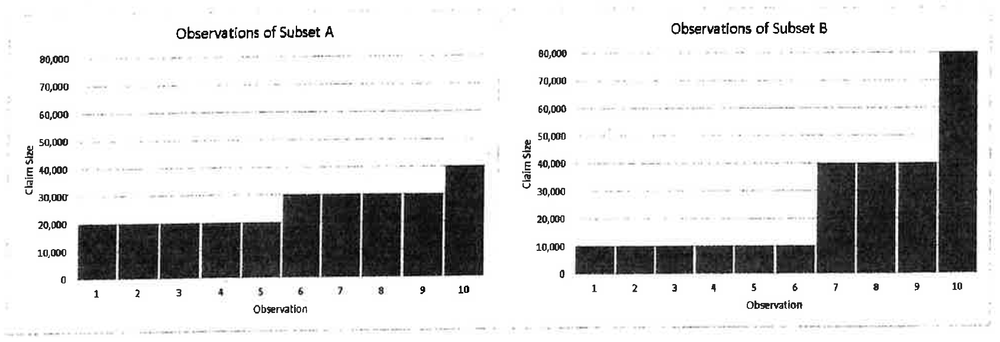
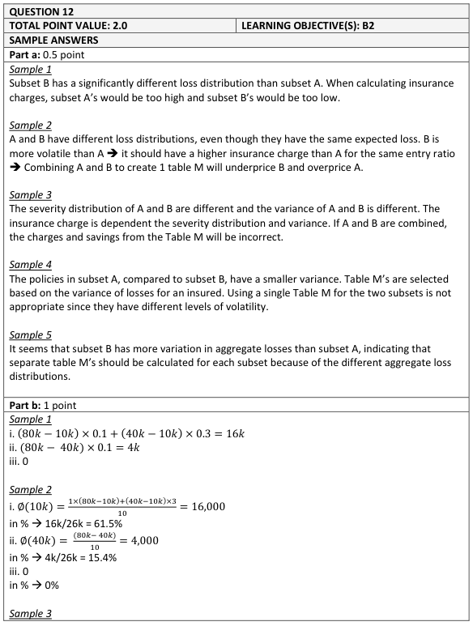
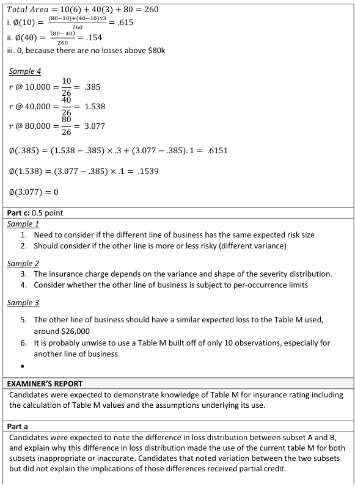
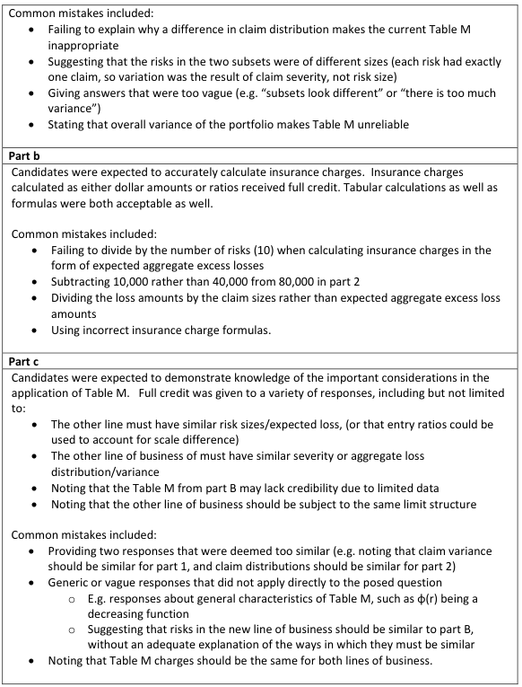

# 2019 Exam 8 - Q12

**Points:** 2

## Question

An actuary is assessing the current Table M underlying the pricing of a book of business. All policies within the book of business have identical expected losses and are expected to have exactly one claim during the policy period. The actuary divides the book of business into two subsets of policies, Subset A and Subset B, and finds the following distributions of aggregate losses:

**Two bar charts, "Observations of Subset A" and "Observations of Subset B".** Both plot Claim Size (vertical, 0 to 80,000) against Observation 1-10 (horizontal).

| Observation | Subset A | Subset B |
| --- | --- | --- |
| 1-5 | ~20,000 | ~10,000 |
| 6 | ~31,000 | ~10,000 |
| 7-9 | ~31,000 | ~40,000 |
| 10 | ~42,000 | ~80,000 |

Subset A is tightly clustered; Subset B is far more dispersed, with a single large observation at 80,000.

### Part a (0.50 pts)

Discuss why the current Table M may not be appropriate for this book of business.

### Part b (1.00 pts)

Using the observations in Subset B, calculate the insurance charges associated with the following claim sizes:

### Part i

10,000

### Part ii

40,000

### Part iii

80,000

### Part c (0.50 pts)

Briefly describe two considerations when using the Table M calculated in part (b) above to support the creation of a Table M for a different line of insurance.

## Solution

### Part a

The expected (aggregate) losses being the same across all policies is just a way of saying that all risks are the same size, which you would want for a particular Table M (different risk sizes should get different tables since their distributions would be expected to differ). The graphs show "claim size" on the vertical axis instead of aggregate loss amount, but with all policies having exactly 1 claim, the claim size and aggregate loss distributions will be the same. The 1 claim count consideration is only relevant for part (c), as it wouldn't make sense to apply this Table M to a book with a different aggregate loss distribution, which would almost certainly occur if that different book had a different expected frequency.

The Table M would be appropriate for the book if all policies in the book are expected to have the same aggregate loss distribution. The graphs show 2 subsets of policies with clearly different aggregate loss distributions, so it appears the same Table M distribution doesn't make sense to use for all risks in the book.

### Part b

It isn't clear if they are asking for the insurance charge in dollars or relative to expected loss, so I'll calculate both in my solutions.

| M | O |
| --- | --- |
| i. Charge in dollars | 16,000 |
| E[A] | 26,000 |

Formulas

- `O18` = `=(3/10)*(40000-C33)+(1/10)*(80000-C33)`
- `O19` = `=(6/10)*10000+(3/10)*40000+(1/10)*80000`

**Charge:** 0.615 — `=O18/O19`

**ii. Charge in dollars:** 4,000 — `=(1/10)*(80000-C34)`

**Charge:** 0.154 — `=O23/O19`

**iii. Charge:** 0

### Part c

Technically we didn't really create a Table M in part (b) as it wasn't required, but we do have all the relevant charges calculated. The question is really asking about using the aggregate distribution for Subset B for a new line of insurance.

Any 2 of:

- If the different line will have different frequency than 1 expected claim, then the Table M

likely won't be appropriate.

- If the severity distribution shape is different for the different line, then the Table M likely

won't be appropriate.

- If the severity distribution scale is different for the different line but the shape is the same,

then this Table M may be appropriate.

- If there is not enough data for the different line to create its own Table M, then using this

Table M may be appropriate.

- If risks for the new line have significantly different expected losses, then using the same

Table M won't be appropriate.

If you wanted to build the Table M it would be:

| L | r | # risks | # above | % above | Charge |
| --- | --- | --- | --- | --- | --- |
| 0 | 0 | 0 | 10 | 1 | 1 |
| 10,000 | 0.38 | 6 | 4 | 0.4 | 0.615 |
| 40,000 | 1.54 | 3 | 1 | 0.1 | 0.154 |
| 80,000 | 3.08 | 1 | 0 | 0 | 0 |

Formulas

- `U21` = `=U22+T22`
- `V21` = `=U21/10`
- `W21` = `=W22+(S22-S21)*V21`
- `R22` = `=C33`
- `S22` = `=R22/O$19`
- `U22` = `=U23+T23`
- `V22` = `=U22/10`
- `W22` = `=W23+(S23-S22)*V22`
- `R23` = `=C34`
- `S23` = `=R23/O$19`
- `U23` = `=U24+T24`
- `V23` = `=U23/10`
- `W23` = `=W24+(S24-S23)*V23`
- `R24` = `=C35`
- `S24` = `=R24/O$19`
- `V24` = `=U24/10`

## Examiner Report

Examiner Report Solutions and Comments:

