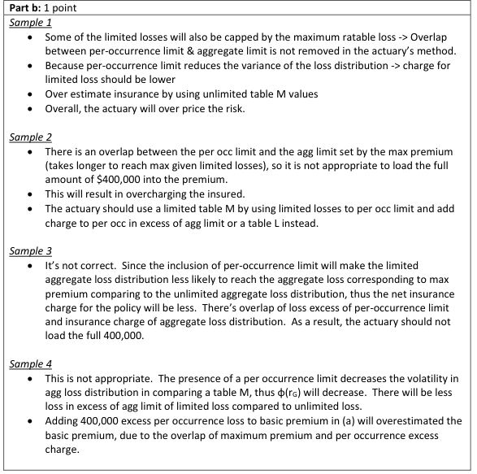
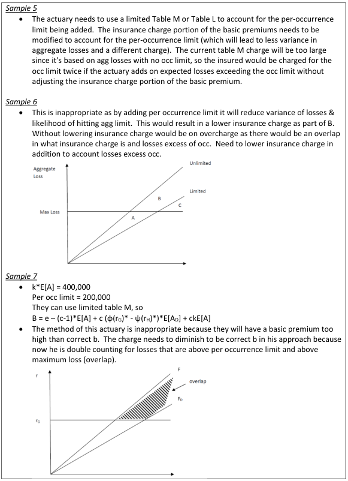
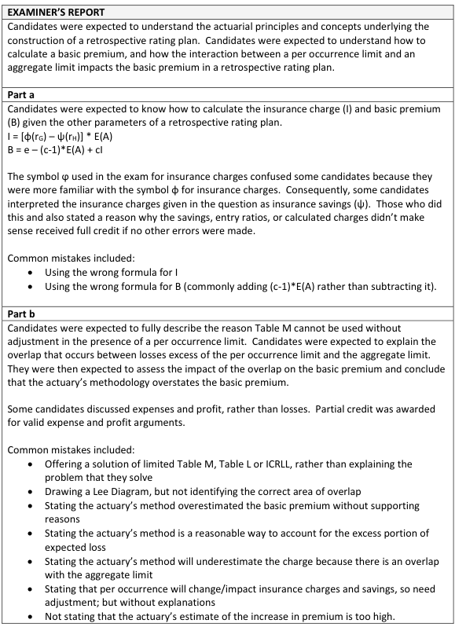

# 2019 Exam 8 - Q14

**Points:** 2

## Question

An insured is written under a retrospective rating plan with a minimum and a maximum premium with the following parameters:

| B | C |
| --- | --- |
| 1.07 | Loss Conversion Factor |
| $825,000 | Expected Loss |
| $20,000 | Expenses |
| 0.40 | φ(rG) |
| 0.80 | φ(rH) |
| 1.21 | rG |
| 0.50 | rH |

### Part a (1.00 pts)

Calculate the basic premium.

### Part b (1.00 pts)

Upon renewal, the insured requests that a per occurrence claim limit of $200,000 be added to the current policy. The pricing actuary estimates that, on average, the insured will have $400,000 of losses that exceed this per occurrence limit during the next policy period. To calculate the expected increase to the basic premium, the actuary loads the $400,000 for expenses and profit.

Fully discuss the appropriateness of the actuary's methodology.

## Solution

### Part a

In order to solve this, we need to assume the plan is balanced, but that didn't need to be stated. Furthermore, it isn't clear whether the expenses given include LAE or not. If the expenses do include LAE, then expected LAE needs to be subtracted out in the basic premium formula. If the expenses do not include LAE, then you would not subtract out (1.07 - 1)(825,000). Since (1.07 - 1)(825,000) = 57,750 > 20,000, the subtraction would mean the non-LAE expenses and profit are negative, which would be unusual (though not impossible if the target underwriting profit is negative, which can be true for a long-tailed line with significant investment income). The graders accepted both interpretations of expenses.

Solution 1: Assume expenses do not include expected LAE

I assume expenses do not include expected LAE. — i.e., I assume e - (c-1)E[A] = 20,000

| J | L |
| --- | --- |
| Savings at min | 0.30 |
| I | $82,500 |

Formulas

- `L14` = `=B11+B13-1`
- `L15` = `=(B10-L14)*B8`

B — $108,275 — `=B9+B7*L15` — The basic premium includes expenses and the converted net insurance charge.

Solution 2: Assume expenses do include expected LAE

| J | L |
| --- | --- |
| Savings at min | 0.30 |
| I | $82,500 |

Formulas

- `L22` = `=B11+B13-1`
- `L23` = `=(B10-L22)*B8`

**B:** $50,525 — `=B9-(B7-1)*B8+B7*L23`

### Part b

Note that the per-occurrence limit being discussed is a RATABLE limit used in the retro premium calculation, and not an actual coverage limit.

By introducing an occurrence limit in the retro premium calculation, it will impact the (limited) aggregate losses and thus the probabilities of hitting the maximum and minimum premiums. The actuary is proposing to add the expected excess losses without consideration of these impacts to the max/min premiums, which would be inappropriate and would be an overcharge. To properly account for the impact to the max/min premiums, the actuary could use a Limited Table M to obtain the charges and savings appropriate for the $200k occurrence limit being added.

## Examiner Report

Examiner Report Solutions for (b) and Comments:

