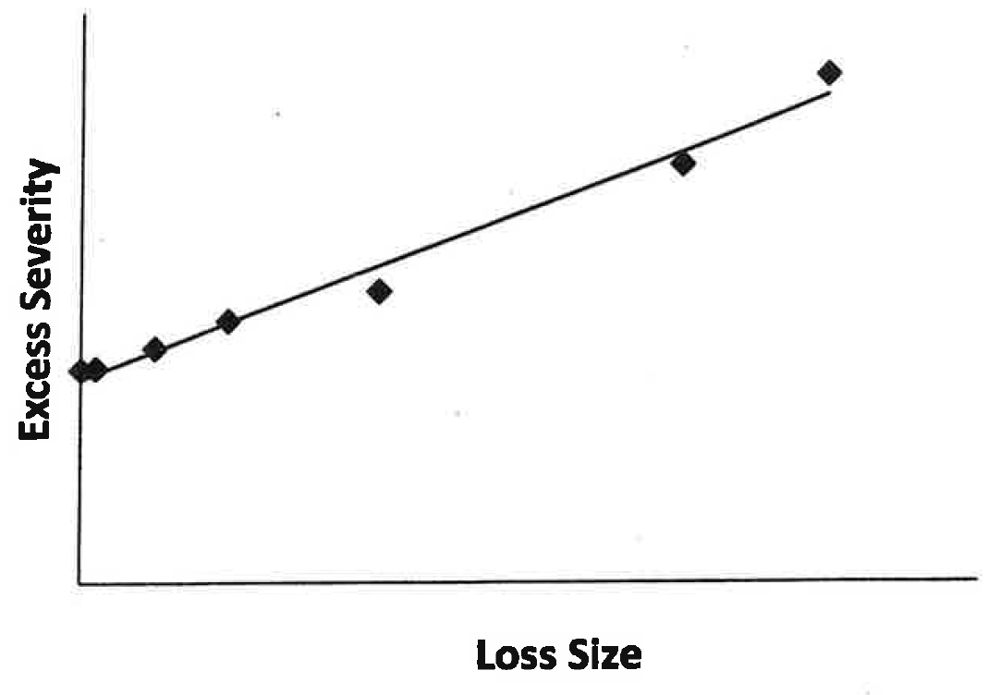
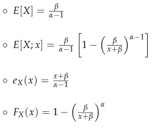
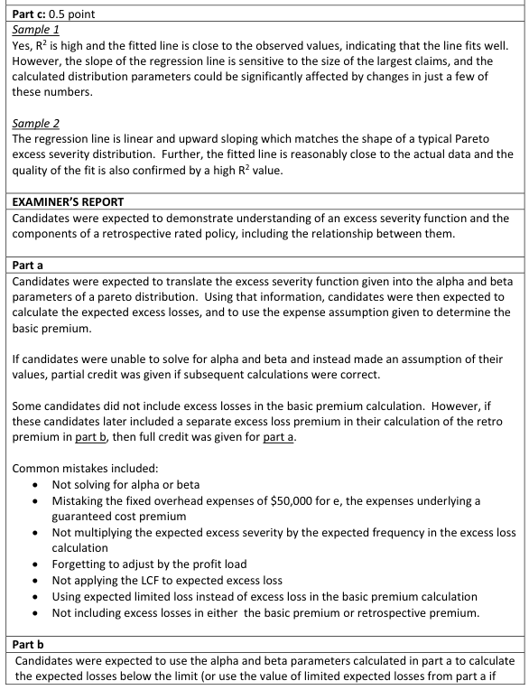
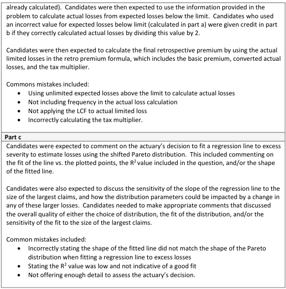

# 2019 Exam 8 - Q15 revised

**Points:** 3.5

## Question

An actuary is pricing a retrospectively rated policy with a per occurrence limit of 20,000 and no minimum or maximum ratable loss.

Using claim data from a group of similar policies, the actuary fit the following regression line to the excess severity to estimate losses using the shifted Pareto distribution. The fitted regression function is y = 0.4467x + 16112 with R2 = 0.9826.

## Solution

### Part a

The basic premium will include the fixed expenses, the charge for the occurrence limit, and the underwriting profit. The charge for the occurrence limit will be the expected aggregate losses in excess of the 20,000 occurrence limit, loaded for LAE.

e_x(0) — 16,112 — `=0.4467*0+16112` — from fitted regression line, noting that y=e_x(x), also equals E[X]

e_x(x) = (x + beta)/(alpha - 1) = 1/(alpha-1)x + beta/(alpha-1)

Alpha — 3.239 — `=1/0.4467+1` — Since 1/(alpha-1) = 0.4467

Beta — 36,068.950078 — `=N6*(N10-1)` — Since beta/(alpha-1) = e_x(0)

E[X;20000] — 10,110.621254 — `=N6*(1-(N12/(20000+N12))^(N10-1))` — from E[X;x] formula given

Exp agg loss — $90,021 — `=C43*(N6-N14)` — E[N](E[X] - E[X;20k])

**B:** $154,424 — `=G38+N16*(1+G35+G39)`

### Part b

| L | N | P | Q |
| --- | --- | --- | --- |
| Actual Lim Loss | 75,829.659409 | c | 1.10 |
|  |  | T | 1.20 |
| R | $286,550 | R | $286,550 |

Formulas

- `N20` = `=0.5*(C43*N14)`
- `Q20` = `=1+G35`
- `Q21` = `=1/(1-G36-G37)`
- `N22` = `=(N18+N20*(1+G35))/(1-G36-G37)`
- `Q22` = `=(N18+Q20*N20)*Q21`

### Part c

The theoretical excess severity for a shifted Pareto follows a straight line increasing with loss size. Since the fitted excess severity linear regression has a very high R^2 value, it seems like the shifted Pareto selection is appropriate.

## Examiner Report

Given the following:

Loss adjustment expenses as a percentage of loss Commission as a percentage of retrospective premium Premium tax as a percentage of retrospective premium Fixed overhead expenses Underwriting profit as a percentage of expected excess loss

- The number of claims for ground up losses is Poisson distributed with:

15 — λ for Poisson distribution

For the shifted Pareto distribution:

### Part a (2.00 pts)

Calculate the basic premium.

### Part b (1.00 pts)

Assuming that actual limited losses equal half the expected limited losses, calculate the retrospective premium.

### Part c (0.50 pts)

Assess the actuary's decision to use the shifted Pareto distribution to estimate excess severity.

Included in:

| G | H |
| --- | --- |
| 10% | Loss conversion factor |
| 9% | Tax multiplier |
| 8% | Tax multiplier |
| 50,000 | Basic premium |
| 6% | Basic premium |

Examiner Report Solutions for (c) and Comments:

