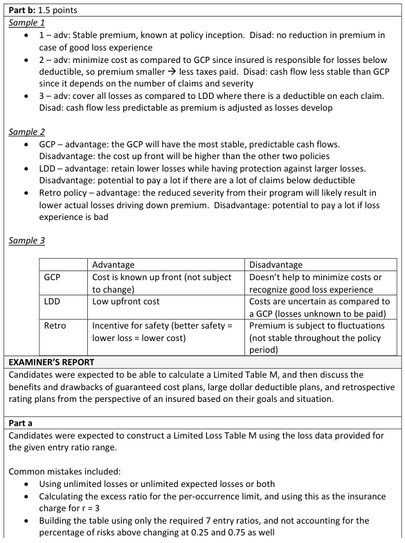
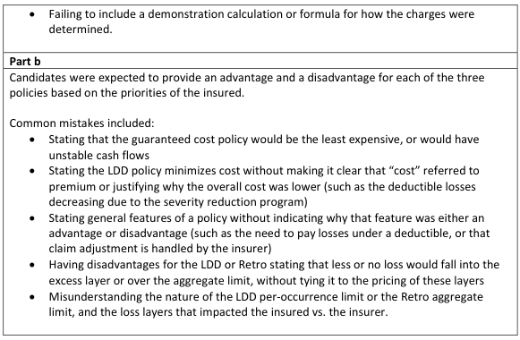

# 2019 Exam 8 - Q16

**Points:** 3

## Question

The loss experience of five similarly sized risks is shown in the table below:

| Risk | Aggregate Unlimited Loss | Aggregate Limited Loss |
| --- | --- | --- |
| 1 | 30,000 | 30,000 |
| 2 | 95,000 | 60,000 |
| 3 | 110,000 | 90,000 |
| 4 | 160,000 | 60,000 |
| 5 | 415,000 | 360,000 |
| Total | 810,000 | 600,000 |

Limited losses have a per-occurrence limit of 50,000 applied.

### Part a (1.50 pts)

Construct a Limited Loss Table M based on the experience above, displaying entry ratios ranging from 0 to 3 in increments of 0.5 and the corresponding insurance charges.

### Part b (1.50 pts)

## Solution

### Part a

**E[A_D]:** 120,000 — `=D12/5`

|   | r* | # above | % above | Lim Table M Charge |
| --- | --- | --- | --- | --- |
|  | 0 | 5 | 1 | 1 |
| r* | 0.250 | 4 | 0.8 | 0.75 |
| 0.25 | 0.5 | 2 | 0.4 | 0.55 |
| 0.5 | 0.750 | 1 | 0.2 | 0.45 |
| 0.75 | 1 | 1 | 0.2 | 0.4 |
| 0.5 | 1.5 | 1 | 0.2 | 0.3 |
| 3 | 2 | 1 | 0.2 | 0.2 |
|  | 2.5 | 1 | 0.2 | 0.1 |
|  | 3 | 0 | 0 | 0 |

Formulas

- `L5` = `=COUNTIF($H$7:$H$11,">"&K5)`
- `M5` = `=L5/5`
- `N5` = `=N6+(K6-K5)*M5`
- `K6` = `=H7`
- `L6` = `=COUNTIF($H$7:$H$11,">"&K6)`
- `M6` = `=L6/5`
- `N6` = `=N7+(K7-K6)*M6`
- `H7` = `=D7/M$2`
- `K7` = `=+K5+0.5`
- `L7` = `=COUNTIF($H$7:$H$11,">"&K7)`
- `M7` = `=L7/5`
- `N7` = `=N8+(K8-K7)*M7`
- `H8` = `=D8/M$2`
- `K8` = `=H9`
- `L8` = `=COUNTIF($H$7:$H$11,">"&K8)`
- `M8` = `=L8/5`
- `N8` = `=N9+(K9-K8)*M8`
- `H9` = `=D9/M$2`
- `K9` = `=+K7+0.5`
- `L9` = `=COUNTIF($H$7:$H$11,">"&K9)`
- `M9` = `=L9/5`
- `N9` = `=N10+(K10-K9)*M9`
- `H10` = `=D10/M$2`
- `K10` = `=+K9+0.5`
- `L10` = `=COUNTIF($H$7:$H$11,">"&K10)`
- `M10` = `=L10/5`
- `N10` = `=N11+(K11-K10)*M10`
- `H11` = `=D11/M$2`
- `K11` = `=+K10+0.5`
- `L11` = `=COUNTIF($H$7:$H$11,">"&K11)`
- `M11` = `=L11/5`
- `N11` = `=N12+(K12-K11)*M11`
- `K12` = `=+K11+0.5`
- `L12` = `=COUNTIF($H$7:$H$11,">"&K12)`
- `M12` = `=L12/5`
- `N12` = `=N13+(K13-K12)*M12`
- `K13` = `=+K12+0.5`
- `L13` = `=COUNTIF($H$7:$H$11,">"&K13)`
- `M13` = `=L13/5`

### Part b

I assume that it was a mistake in the question for the large dollar deductible policy to show a 50,000 per-occurrence limit instead of a 50,000 per-occurrence deductible. I'll assume it meant to say deductible instead of limit. The retrospectively rated policy aggregate limit would be a ratable limit, not a coverage limit. As for the claim severity reduction program, this should be accounted for in schedule rating for all of the potential policies, so in theory it shouldn't make a difference in the decision. But if it wasn't fully accounted for in schedule rating, then it would seem to be in the insured's benefit to retain more losses.

## Examiner Report

An insured similar to the risks above is evaluating three potential policies:

1. A guaranteed cost policy

2. A large dollar deductible policy with a 50,000 per-occurrence limit

3. A retrospectively rated policy with an underlying 200,000 aggregate limit and no

per-occurrence limit

Given the following:

- The insured would like to minimize cost
- Maintaining a stable, predictable cash flow is a priority for the insured
- The insured has recently implemented a successful claim severity reduction program

Briefly discuss one advantage and one disadvantage of each of the three policies from the perspective of this insured.

I'll show what I'd pick as advantages/disadvantages of each. See examiner report solutions for other options.

i. Guaranteed cost

- Advantage of stable, predictable cash flow since premium is known upfront
- Disadvantage of high expected cost

ii. LDD

- Advantage of lower potential cost if low retained losses (due to severity reduction)
- Disadvantage of uncertain cash flow of retained losses

iii. Retro

- Advantage of lower potential cost (premium) if low incurred losses (due to severity

reduction)

- Disadvantage of uncertain cash flow of retro premium adjustments

Examiner Report Solutions for (b) and Comments:

