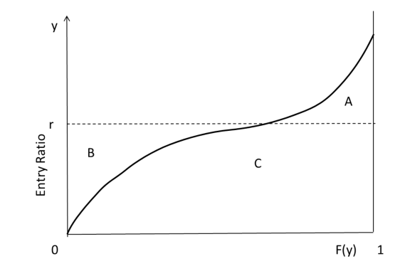

# Practice Problem 6 - Fisher Chapter 3 Q5

## Question

Label each of the three areas, A, B, and C in the Lee diagram below in terms of the Insurance Charge and the Insurance Savings.

## Solution

A = Table M Charge at r B = Table M Savings at r C = 1 - Table M Charge at r = r - Table M Savings at r
