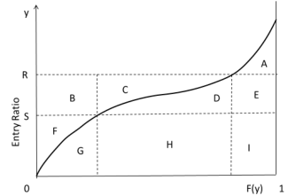

# Practice Problem 7 - Fisher Chapter 3 Q6

## Question

For the Lee diagram below, identify the areas associated with

**Entry-ratio diagram, single curve.** Vertical axis = Entry Ratio $y$, horizontal axis $F(y)$ from 0 to 1. One S-shaped cumulative curve rises to the right. Dashed horizontal lines mark $S$ (lower) and $R$ (upper); dashed vertical lines cut the width. Nine regions: **A** top right above the curve, **B** and **C** in the band between $S$ and $R$ above the curve, **D** and **E** to the right of that band, **F** at the far left below $S$, and **G**, **H**, **I** forming the area beneath the curve from left to right.

### Part a

Insurance Charge at R

### Part b

Insurance Charge at S

### Part c

Insurance Savings at R

### Part d

Insurance Savings at S

## Solution

### Part a

A

### Part b

A+D+E

### Part c

B+C+F

### Part d

F
