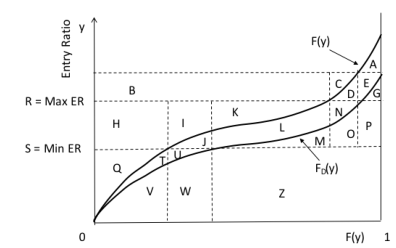

# Practice Problem 10 - Fisher Chapter 3 Q9

## Question

For the Lee diagram below, identify the areas associated with

**Table M / entry-ratio diagram.** Vertical axis = Entry Ratio, horizontal axis = $F(y)$ from 0 to 1. Two cumulative curves are drawn: $F(y)$ (upper, total losses) and $F_D(y)$ (lower, limited losses). Horizontal lines mark $R = \text{Max ER}$ and $S = \text{Min ER}$; dashed vertical lines subdivide the width. Labelled regions run A through Z: **A, C, D, E, G, N, O, P** cluster at the right where the curves rise; **B** spans the band above $R$; **H, I, J, K, L, M** lie between $S$ and $R$; **Q, T, U, V, W, Z** lie below $S$. Used to express the insurance charge and savings as sums of these areas.

### Part a

Limited Table M Charge at R

### Part b

Limited Table M Savings at S

### Part c

Per-occurrence excess charge at D

## Solution

Note: technically the answers below are incorrect, and this question as shown is essentially defective. Since the vertical axis is entry ratios here, technically a Limited Table M curve should have been plotted on a separate graph in which the entry ratios were relative to expected LIMITED loss (versus relative to expected UNLIMITED loss for the F(y) curve). If the vertical axis was aggregate loss dollars instead of entry ratios, and we were talking about the amounts in dollars, then the answers to this question would have been ok.

### Part a

G

### Part b

Q + T + U

### Part c

A + D + E + J + L + N + T + U
