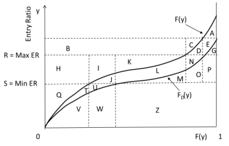

# Practice Problem 16 - Fisher Chapter 3 Q15

## Question

For the Lee diagram below, identify the areas associated with

**Table M / entry-ratio diagram** (same construction as the exhibit in Practice Problem 10). Vertical axis = Entry Ratio, horizontal axis = $F(y)$ from 0 to 1, with curves $F(y)$ (total) and $F_D(y)$ (limited), horizontal lines at $R = \text{Max ER}$ and $S = \text{Min ER}$, and regions labelled A through Z.

### Part a

Table L Charge at R

### Part b

Table L Savings at S

## Solution

### Part a

A+D+E+G+J+L+N+T+U

### Part b

Q+T+U
