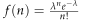

# Practice Problem 24

**Points:** 6.25

## Question

For a particular risk, you are given that claim counts have a Poisson distribution with mean and that claim size has the following distribution:

| Claim Size | Probability |
| --- | --- |
| $250,000 | 40% |
| $500,000 | 30% |
| $750,000 | 20% |
| $1,000,000 | 10% |

Poisson claim-count density:

$$f(n) = \frac{\lambda^n e^{-\lambda}}{n!}$$

- For the Poisson distribution:

### Part a (3.75 pts)

Calculate the probabilities of aggregate losses being equal to:

$0

$250,000

$500,000

$750,000

$1,000,000

### Part b (0.25 pts)

Calculate the expected aggregate loss where aggregate losses are limited to

### Part c (2.25 pts)

Using the distribution above and given the following additional information, calculate the actual retrospective premium. Assume the retrospective rating plan is balanced.

| B | C |
| --- | --- |
| $100,000 | Expenses Exclusive of Taxes |
| 1.15 | Loss Conversion Factor |
| 1.025 | Tax Multiplier |
| $750,000 | Actual Losses |
| $1,000,000 | Maximum Ratable Loss |
| $250,000 | Minimum Ratable Loss |

1

$250,000

## Solution

0.25 points for getting f_S(0) = f_N(0) based on given Poisson distribution correctly 0.5 points for getting f_S(250k) correctly 0.75 points for getting f_S(500k) correctly 1 point for getting f_S(750k) correctly 1.25 points for getting f_S(1M) correctly Part (b):

0.25 points for calculating E[A;250k] correctly Part (c):

0.25 points for calculating E[A] correctly 0.5 points for getting the savings at 250k correctly 0.75 points for calculating the charge at 1M correctly 0.25 points for using correct formula for the basic premium 0.25 points for mentioning or showing that 750k in actual loss is between 250k and 1M loss caps 0.25 points for using correct formula for retro premium

### Part a

Here we can use Panjer's recursive algorithm, or we could calculate aggregate loss probabilities by looking at all possible ways to get each aggregate loss amount. Note that the only possible aggregate loss sizes are multiples of 250k.

Solution 1: Using Logic

First, we can calculate the probability of up to 4 claim counts, since 4 counts of 250k can still get us to 1M in aggregate loss.

| N | f(N) | Alternatively, using the given f(N): |
| --- | --- | --- |
| 0 | 0.36788 | 0.36788 |
| 1 | 0.36788 | 0.36788 |
| 2 | 0.18394 | 0.18394 |
| 3 | 0.06131 | 0.06131 |
| 4 | 0.01533 | 0.01533 |

Formulas

- `K28` = `=POISSON.DIST(J28,G$4,FALSE)`
- `M28` = `=($G$4^J28*EXP(-$G$4))/FACT(J28)`
- `K29` = `=POISSON.DIST(J29,G$4,FALSE)`
- `M29` = `=($G$4^J29*EXP(-$G$4))/FACT(J29)`
- `K30` = `=POISSON.DIST(J30,G$4,FALSE)`
- `M30` = `=($G$4^J30*EXP(-$G$4))/FACT(J30)`
- `K31` = `=POISSON.DIST(J31,G$4,FALSE)`
- `M31` = `=($G$4^J31*EXP(-$G$4))/FACT(J31)`
- `K32` = `=POISSON.DIST(J32,G$4,FALSE)`
- `M32` = `=($G$4^J32*EXP(-$G$4))/FACT(J32)`

| A | Pr(A) | Comment |
| --- | --- | --- |
| $0 | 0.36788 | f(N)=0 |
| $250,000 | 0.14715 | The only way to get 250k losses is if N = 1 and X = 250k. |
| $500,000 | 0.13979 | There are 2 ways to get $500k losses: if N = 2 and X1 = X2 = 250k, or if N = 1 and X = 500k. |
| $750,000 | 0.12165 | There are 3 ways to get $750k losses: if N = 3 and X1 = X2 = X3 = 250k, if N = 2 with claims of 250k and 500k in either order (2 ways), or if N = 1 and X = 750k. |
| $1,000,000 | 0.09199 | There are 4 ways to get $1M losses: if N = 4 and X1 = X2 = X3 = X4 = 250k, if N = 3 with 2 claims of 250k and 1 claim of 500k in any order (3 ways), if N = 2 with claims of 500k, if N = 2 with claims of 750k and 250k in any order (2 ways), or if N = 1 and X = 1M. |

Formulas

- `J35` = `=C18`
- `K35` = `=K28`
- `J36` = `=C19`
- `K36` = `=K29*C8`
- `J37` = `=C20`
- `K37` = `=K30*C8^2+K29*C9`
- `J38` = `=C21`
- `K38` = `=K31*C8^3+K30*C8*C9*2+K29*C10`
- `J39` = `=C22`
- `K39` = `=K32*C8^4+K31*(C8^2)*C9*3+K30*C9^2+K30*C8*C10*2+K29*C11`

Solution 2: Using Panjer's Recursive Algorithm

f_S(0) = f_N(0) — 0.367879 — `=POISSON.DIST(0,G$4,FALSE)` — 0.367879 — `=($G$4^0*EXP(-$G$4))/FACT(0)` — <-- using f(N) given

f_s(mh) = Sum from k=1 to m of [(1/m*k)*f_X(kh)*f_S(mh-kh)]

h — $250,000 — `=B8` — Each claim size option is an integer multiple of this.

k

| J | K | L | M | N | O | P |
| --- | --- | --- | --- | --- | --- | --- |
| m | mh | f_S(mh) | 1 | 2 | 3 | 4 |
| 0 | $0 | 0.36788 |  |  |  |  |
| 1 | $250,000 | 0.14715 | 0.14715 |  |  |  |
| 2 | $500,000 | 0.13979 | 0.02943 | 0.11036 |  |  |
| 3 | $750,000 | 0.12165 | 0.01864 | 0.02943 | 0.07358 |  |
| 4 | $1,000,000 | 0.09199 | 0.01216 | 0.02097 | 0.02207 | 0.03679 |

Formulas

- `K51` = `=J51*K$47`
- `L51` = `=L43`
- `K52` = `=J52*K$47`
- `L52` = `=SUM(M52:P52)`
- `M52` = `=($G$4/$J52)*M$50*VLOOKUP(M$50*$K$47,$B$8:$C$11,2,FALSE)*VLOOKUP($K52-M$50*$K$47,$K$51:$L$55,2,FALSE)`
- `K53` = `=J53*K$47`
- `L53` = `=SUM(M53:P53)`
- `M53` = `=($G$4/$J53)*M$50*VLOOKUP(M$50*$K$47,$B$8:$C$11,2,FALSE)*VLOOKUP($K53-M$50*$K$47,$K$51:$L$55,2,FALSE)`
- `N53` = `=($G$4/$J53)*N$50*VLOOKUP(N$50*$K$47,$B$8:$C$11,2,FALSE)*VLOOKUP($K53-N$50*$K$47,$K$51:$L$55,2,FALSE)`
- `K54` = `=J54*K$47`
- `L54` = `=SUM(M54:P54)`
- `M54` = `=($G$4/$J54)*M$50*VLOOKUP(M$50*$K$47,$B$8:$C$11,2,FALSE)*VLOOKUP($K54-M$50*$K$47,$K$51:$L$55,2,FALSE)`
- `N54` = `=($G$4/$J54)*N$50*VLOOKUP(N$50*$K$47,$B$8:$C$11,2,FALSE)*VLOOKUP($K54-N$50*$K$47,$K$51:$L$55,2,FALSE)`
- `O54` = `=($G$4/$J54)*O$50*VLOOKUP(O$50*$K$47,$B$8:$C$11,2,FALSE)*VLOOKUP($K54-O$50*$K$47,$K$51:$L$55,2,FALSE)`
- `K55` = `=J55*K$47`
- `L55` = `=SUM(M55:P55)`
- `M55` = `=($G$4/$J55)*M$50*VLOOKUP(M$50*$K$47,$B$8:$C$11,2,FALSE)*VLOOKUP($K55-M$50*$K$47,$K$51:$L$55,2,FALSE)`
- `N55` = `=($G$4/$J55)*N$50*VLOOKUP(N$50*$K$47,$B$8:$C$11,2,FALSE)*VLOOKUP($K55-N$50*$K$47,$K$51:$L$55,2,FALSE)`
- `O55` = `=($G$4/$J55)*O$50*VLOOKUP(O$50*$K$47,$B$8:$C$11,2,FALSE)*VLOOKUP($K55-O$50*$K$47,$K$51:$L$55,2,FALSE)`
- `P55` = `=($G$4/$J55)*P$50*VLOOKUP(P$50*$K$47,$B$8:$C$11,2,FALSE)*VLOOKUP($K55-P$50*$K$47,$K$51:$L$55,2,FALSE)`

### Part b

Note we are talking about limiting aggregate losses, not individual claims. We can use Pr(A=0) from part (a) to answer this. Any aggregate loss bigger than 250k we cap at 250k.

**E[A;250k]:** $158,030 — `=J35*K35+(1-K35)*G25`

### Part c

We can start with calculating the basic premium.

B = e - (c - 1)E[A] + cI

**E[A]:** $500,000 — `=G4*SUMPRODUCT(B8:B11,C8:C11)`

**Savings for 250k min:** $91,970 — `=B36-K60`

**E[A;1M]:** $421,448 — `=SUMPRODUCT(J35:J38,K35:K38)+(1-SUM(K35:K38))*B35`

**Charge for 1M max:** $78,552 — `=L66-L70`

**I:** $-13,418 — `=L72-L68`

**B:** $9,569 — `=B31-(B32-1)*L66+B32*L74`

Since 750k actual loss is between max and min loss caps, use 750k in R:

R — $893,871 — `=(L76+B32*B34)*B33` — R = (B + cL)T
