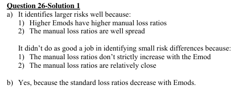
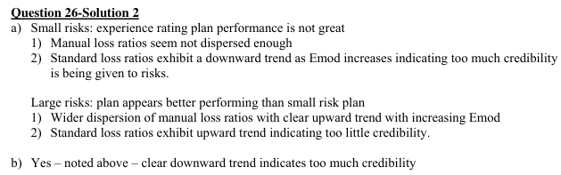

# 2005 Exam 9 - Q26 revised

**Points:** 2

## Question

An actuary completed a test of the experience rating plan performance prior to the submission of the most recent rate filing for State M. All experience rated risks for State M were separated into quintiles by experience modification factors and then further separated into small and large risks. The manual and standard loss ratios for each grouping were as follows:

|   | Manual Loss Ratio |   | Standard Loss Ratio |   |
| --- | --- | --- | --- | --- |
|  | Small Risks | Large Risks | Small Risks | Large Risks |
| Lowest Mods | 0.71 | 0.56 | 0.84 | 0.74 |
| Next Lowest | 0.80 | 0.65 | 0.84 | 0.77 |
| Middle | 0.79 | 0.80 | 0.79 | 0.79 |
| Next Highest | 0.83 | 0.92 | 0.79 | 0.80 |
| Highest Mods | 0.87 | 1.05 | 0.76 | 0.81 |

### Part a (1.00 pts)

How well does the experience rating plan identify risk differences? Explain.

### Part b (1.00 pts)

Does the experience rating plan give too much weight to the individual experience of the small risks? Explain.

## Solution

### Part a

The manual loss ratios are quite dispersed for large risks, so the plan does a good job of identify risk differences for large risks. The manual loss ratios are not very dispersed for small risks, so the plan does a poor job of identifying risk differences for small risks.

### Part b

Yes, the plan gives too much credibility to the experience of small risks since there is a downward trend in the standard loss ratios for small risks.

## Examiner Report

Examiner report solutions:

