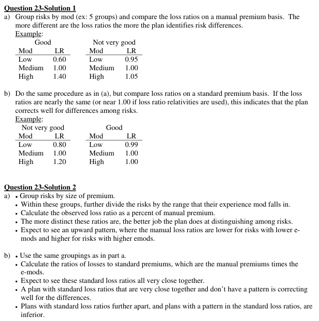
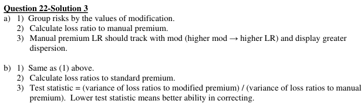

# 2006 Exam 9 - Q23

**Points:** 2

## Question

### Part a (1.00 pts)

Describe one way to test the effectiveness of an experience rating plan's ability to identify risk differences.

### Part b (1.00 pts)

Describe one way to test how well an experience rating plan corrects for differences it has identified among risks.

## Solution

### Part a

Group risks by size, and perform the following steps for each size group:

i. Sort the risks by their mods in increasing order.

ii. Group the sorted risks into several subdivisions (e.g., quintiles) and calculate manual loss ratios for each

subdivision.

iii. The greater the dispersion in the manual loss ratios, the greater job the plan does of

identifying risk differences.

### Part b

While the graders did accept discussing the Efficiency Test here, that test is only useful when comparing multiple plans, so it really isn't the best answer here since the wording of the question only involves a single plan.

Group risks by size, and perform the following steps for each size group:

i. Sort the risks by their mods in increasing order.

ii. Group the sorted risks into several subdivisions and calculate standard loss ratios for each

subdivision.

iii. The flatter the standard loss ratios across groups, the greater job the plan does of correcting

for risk differences.

## Examiner Report

Examiner report solutions:

<--- this should say question 23, it's a typo in the report
