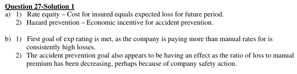
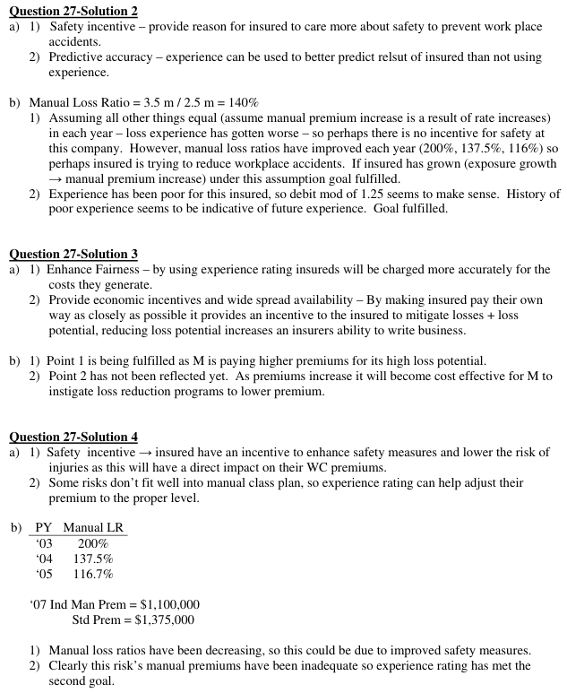
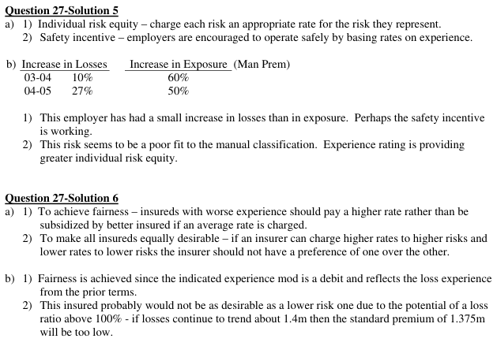

# 2006 Exam 9 - Q27

**Points:** 2

## Question

### Part a (1.00 pts)

Identify and explain two goals of experience rating.

### Part b (1.00 pts)

Given the following workers compensation information for Construction M Company:

| Policy Year | Loss Experience | Manual Premium |
| --- | --- | --- |
| 2,003 | $1,000,000 | $500,000 |
| 2,004 | $1,100,000 | $800,000 |
| 2,005 | $1,400,000 | $1,200,000 |

Assume:

- The policy period being rated is January 1, 2007 to January 1, 2008

| B | C |
| --- | --- |
| $1,100,000 | 2007 indicated manual premium |
| 1.25 | 2007 experience modification factor |

Discuss whether each of the two goals identified in part (a) above are fulfilled.

## Solution

### Part a

Any 2 of:

i. Greater risk equity - The degree of the charge based on past experience should be the

degree to which it is predictive of future losses.

ii. Safety incentive - By charging insureds a higher premium for prior losses, insureds have a

financial incentive for loss control.

iii. Enhance market competition - Insurers will be willing to insure more risks since experience rating

helps guarantee an equal profit potential on all risks after the application of the experience mod.

### Part b

Lots of different ways to answer this. Just by looking at the numbers, the manual loss ratios have all been above 100%, but they have been declining over time.

Solution 1: Argue that the plan is working since manual LRs have come down perhaps due to the safety incentive, and the mod is a debit based on the poor experience.

i. The insured has had consistently high loss ratios. This seems to indicate the debit mod is

justified, and the goal of greater equity is fulfilled.

ii. The manual loss ratios have declined from 2003 to 2005, so it may be that the safety

incentive is working.

Solution 2: Argue that the plan is working since mod is a debit based on the poor experience, but it hasn't done enough to enhance market competition.

i. The insured has had consistently high loss ratios. This seems to indicate the debit mod is

justified, and the goal of greater equity is fulfilled.

iii. Since the loss ratios are still very high, the risk is still unprofitable and insurers will not want to insure this risk.

So the goal of enhancing market competition has not yet been achieved.

## Examiner Report

Examiner report solutions:

