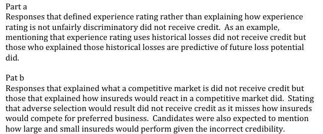

# 2012 Exam 8 - Q11

**Points:** 2

## Question

The fourth principle of Property and Casualty Insurance Ratemaking states:

A rate is reasonable and not excessive, inadequate, or unfairly discriminatory if it is an actuarially sound estimate of the expected value of all future costs associated with an individual risk transfer.

### Part a (1.00 pts)

Defend the assertion that experience rating supports the principle that a rate should not be unfairly discriminatory.

### Part b (1.00 pts)

Suppose the industry experience rating plan assigns too much credibility to individual experience for large insureds and assigns too little credibility to individual experience for small insureds. Argue that in a competitive insurance market, rates will not be unfairly discriminatory.

## Solution

### Part a

The main goal of experience rating is individual risk equity. Experience rating recognizes that each risk has a different loss potential, so by modifying rates appropriately, the expected profit potential for each risk can be made equal. This ensures that equity is achieved and rates are not unfairly discriminatory. Otherwise, risks with lower loss potential within the class would subsidize other higher loss potential risks.

### Part b

Large risks with credit mods will have worse experience than expected. Similarly, small risks with credit mods will have better experience than expected. Forces of supply and demand in a competitive market will push rates down for large debit and small credit risks. All risks now pay rates commensurate for their exposure to loss so rates are not unfairly discriminatory.

## Examiner Report

Examiner report comments:

