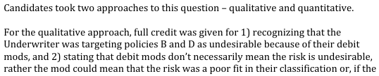
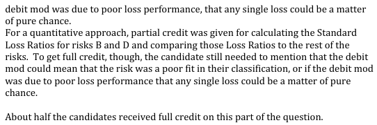
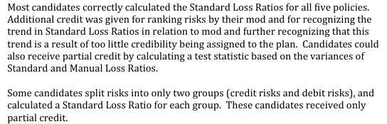

# 2012 Exam 8 - Q16 revised

**Points:** 1.5

## Question

An actuary has experience rated five policies and presented the resulting modification factors to the underwriter. The results are as follows:

| Policy | Experience Mod Factor | Manual Premium | Losses |
| --- | --- | --- | --- |
| A | 0.97 | $40,000 | $39,000 |
| B | 1.40 | $10,000 | $14,500 |
| C | 0.95 | $25,000 | $23,500 |
| D | 1.33 | $15,000 | $20,500 |
| E | 0.81 | $45,000 | $33,000 |

### Part a (0.50 pts)

The underwriter targets Policies B and D and states they should not be written because they are undesirable risks. Evaluate the validity of this statement.

### Part b (1.00 pts)

Assess whether the plan used to calculate the experience modification factors demonstrates premium equity.

## Solution

### Part a

Solution 1: Assume underwriter is targeting those risks due to high mods

The underwriter appears to be targeting Policies B and D due to their debit mods. However, debit mods do not mean that a risk is a bad risk. If the experience rating plan is designed appropriately, debit and credit risks are equally desirable. The debit mod could mean that the risk is a poor fit in their classification or that any single loss impacting the debit mod was pure chance.

Solution 2: Assume underwriter is targeting those risks due to high standard loss ratios

Sort by mod

| Policy | Experience Mod Factor | Manual Premium | Losses | Std LR |
| --- | --- | --- | --- | --- |
| E | 0.81 | $45,000 | $33,000 | 90.5% |
| C | 0.95 | $25,000 | $23,500 | 98.9% |
| A | 0.97 | $40,000 | $39,000 | 100.5% |
| D | 1.33 | $15,000 | $20,500 | 102.8% |
| B | 1.40 | $10,000 | $14,500 | 103.6% |

Formulas

- `J14` = `={SORT(B8:E12,2)}`
- `O14` = `=M14/(L14*K14)`
- `O15` = `=M15/(L15*K15)`
- `O16` = `=M16/(L16*K16)`
- `O17` = `=M17/(L17*K17)`
- `O18` = `=M18/(L18*K18)`

Risks B and D have the highest standard loss ratios, so the underwriter has a valid point. However, these loss ratios are not that much higher than the other policies. Also, these risks might be poor fits in their class, or that any single loss impacting their mod was pure chance.

### Part b

Corresponding with solution 1 above:

Sort by mod

| Policy | Experience Mod Factor | Manual Premium | Losses | Std LR |
| --- | --- | --- | --- | --- |
| E | 0.81 | $45,000 | $33,000 | 90.5% |
| C | 0.95 | $25,000 | $23,500 | 98.9% |
| A | 0.97 | $40,000 | $39,000 | 100.5% |
| D | 1.33 | $15,000 | $20,500 | 102.8% |
| B | 1.40 | $10,000 | $14,500 | 103.6% |

Formulas

- `J28` = `={SORT(B8:E12,2)}`
- `O28` = `=M28/(L28*K28)`
- `O29` = `=M29/(L29*K29)`
- `O30` = `=M30/(L30*K30)`
- `O31` = `=M31/(L31*K31)`
- `O32` = `=M32/(L32*K32)`

Equity is not achieved since credit risks are performing better than debit risks, as can be seen by an increasing trend in the standard loss ratios. The plan doesn't apply enough credibility.

Corresponding with solution 2 above:

Equity is not achieved since credit risks are performing better than debit risks, as can be seen by an increasing trend in the standard loss ratios. The plan doesn't apply enough credibility.

## Examiner Report

Examiner report comments for part (a):

Examiner report comments for part (b):

<--- I think this was wrong of the graders, since the test isn't supposed to be performed on individual risks, as their loss ratios are too volatile. Grouping risks (e.g., into quintiles) is what you would do here in reality.
