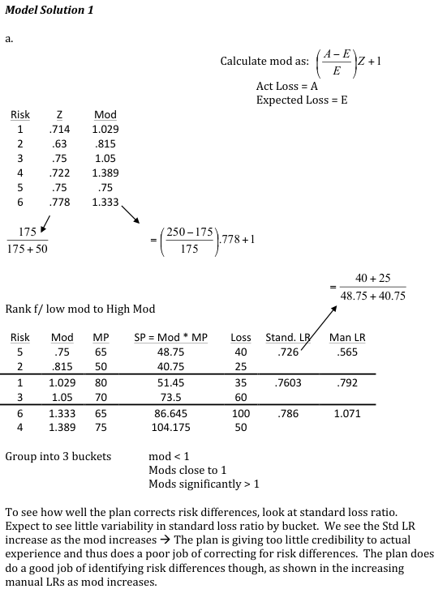
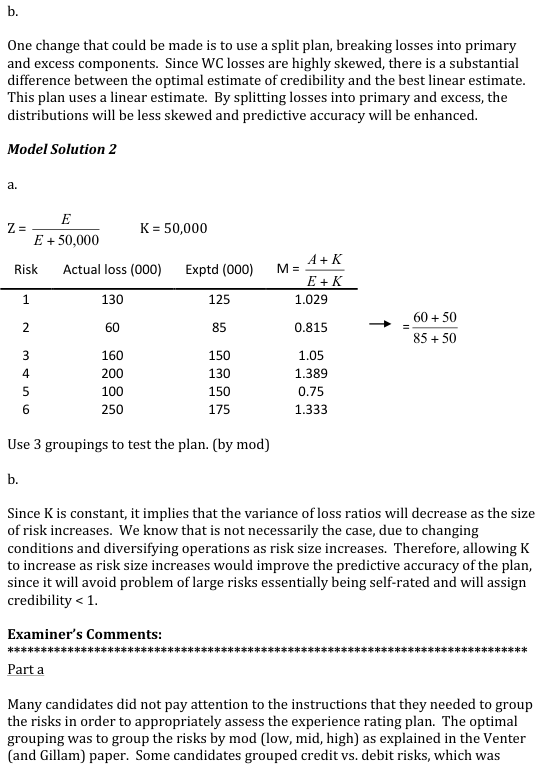
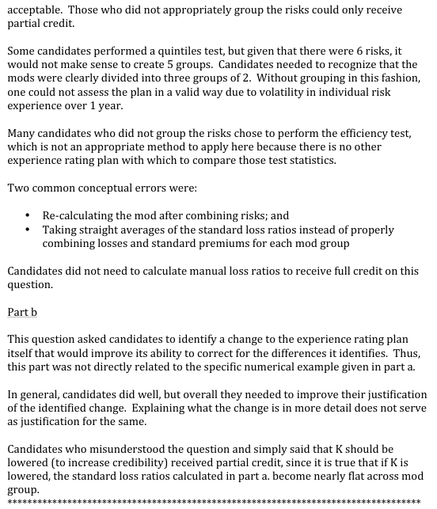

# 2013 Exam 8 - Q9

**Points:** 4.5

## Question

Suppose that workers compensation risks are subject to a no-split experience rating plan under which credibility, as a function of expected loss, is calculated as follows:

During the experience rating period, a group of homogeneous risks had the following experience:

| Risk | Actual Loss | Expected Loss |
| --- | --- | --- |
| 1 | $130,000 | $125,000 |
| 2 | $60,000 | $85,000 |
| 3 | $160,000 | $150,000 |
| 4 | $200,000 | $130,000 |
| 5 | $100,000 | $150,000 |
| 6 | $250,000 | $175,000 |

After the experience modifications were applied, the same group had the following experience:

| Risk | Manual Premium | Actual Loss |
| --- | --- | --- |
| 1 | $50,000 | $35,000 |
| 2 | $50,000 | $25,000 |
| 3 | $70,000 | $60,000 |
| 4 | $75,000 | $50,000 |
| 5 | $65,000 | $40,000 |
| 6 | $65,000 | $100,000 |

### Part a (3.75 pts)

Assess how effectively the experience rating plan corrected for the differences it identified for these particular workers compensation risks. Group the risks as appropriate.

### Part b (0.75 pts)

Propose and justify a change to the plan that would improve its ability to correct the differences it identifies.

## Solution

### Part a

To assess the plan, we can perform the Quintile Test (using fewer groups than 5 in this case) by calculating the mods for each risk, sorting the mods in increasing order, grouping risks together based on mods, and then looking at the pattern in standard loss ratios. Note that we will use the top table given in the problem to calculate the Mods, and then the bottom table to test the Mods. We can calculate mods using Mod = [ZA + (1-Z)E] / E

| Z | Risk | Mod |
| --- | --- | --- |
| 0.71 | 1 | 1.03 |
| 0.63 | 2 | 0.81 |
| 0.75 | 3 | 1.05 |
| 0.72 | 4 | 1.39 |
| 0.75 | 5 | 0.75 |
| 0.78 | 6 | 1.33 |

Formulas

- `I14` = `=E14/(E14+50000)`
- `K14` = `=(I14*D14+(1-I14)*E14)/E14`
- `I15` = `=E15/(E15+50000)`
- `K15` = `=(I15*D15+(1-I15)*E15)/E15`
- `I16` = `=E16/(E16+50000)`
- `K16` = `=(I16*D16+(1-I16)*E16)/E16`
- `I17` = `=E17/(E17+50000)`
- `K17` = `=(I17*D17+(1-I17)*E17)/E17`
- `I18` = `=E18/(E18+50000)`
- `K18` = `=(I18*D18+(1-I18)*E18)/E18`
- `I19` = `=E19/(E19+50000)`
- `K19` = `=(I19*D19+(1-I19)*E19)/E19`

Based on the mods, I'll group risks 2 and 5, 1 and 3, and 4 and 6 together into 3 groups.

Sort by mod

| Risk | Mod | Manual Premium | Actual Loss | Std Prem | Manual LR | Std LR |
| --- | --- | --- | --- | --- | --- | --- |
| 5 | 0.75 | $65,000 | $40,000 | $48,750 |  |  |
| 2 | 0.81 | $50,000 | $25,000 | $40,741 | 56.521739% | 72.633213% |
| 1 | 1.03 | $50,000 | $35,000 | $51,429 |  |  |
| 3 | 1.05 | $70,000 | $60,000 | $73,500 | 79.166667% | 76.043453% |
| 6 | 1.33 | $65,000 | $100,000 | $86,667 |  |  |
| 4 | 1.39 | $75,000 | $50,000 | $104,167 | 107.142857% | 78.60262% |

Formulas

- `I25` = `={SORT(J14:K19,2)}`
- `K25` = `=VLOOKUP($I25,$C$24:$E$29,2,FALSE)`
- `L25` = `=VLOOKUP($I25,$C$24:$E$29,3,FALSE)`
- `M25` = `=J25*K25`
- `K26` = `=VLOOKUP($I26,$C$24:$E$29,2,FALSE)`
- `L26` = `=VLOOKUP($I26,$C$24:$E$29,3,FALSE)`
- `M26` = `=J26*K26`
- `N26` = `=SUM(L25:L26)/SUM(K25:K26)`
- `P26` = `=SUM(L25:L26)/SUM(M25:M26)`
- `K27` = `=VLOOKUP($I27,$C$24:$E$29,2,FALSE)`
- `L27` = `=VLOOKUP($I27,$C$24:$E$29,3,FALSE)`
- `M27` = `=J27*K27`
- `K28` = `=VLOOKUP($I28,$C$24:$E$29,2,FALSE)`
- `L28` = `=VLOOKUP($I28,$C$24:$E$29,3,FALSE)`
- `M28` = `=J28*K28`
- `N28` = `=SUM(L27:L28)/SUM(K27:K28)`
- `P28` = `=SUM(L27:L28)/SUM(M27:M28)`
- `K29` = `=VLOOKUP($I29,$C$24:$E$29,2,FALSE)`
- `L29` = `=VLOOKUP($I29,$C$24:$E$29,3,FALSE)`
- `M29` = `=J29*K29`
- `K30` = `=VLOOKUP($I30,$C$24:$E$29,2,FALSE)`
- `L30` = `=VLOOKUP($I30,$C$24:$E$29,3,FALSE)`
- `M30` = `=J30*K30`
- `N30` = `=SUM(L29:L30)/SUM(K29:K30)`
- `P30` = `=SUM(L29:L30)/SUM(M29:M30)`

Based on the large positive trend in manual loss ratios, the plan does a great job of identifying risk differences. However, since the standard loss ratios still have a positive trend, the plan seems to be under-correcting for these differences by applying too little credibility to actual experience.

### Part b

Any 1 of:

- Based on the trend in standard loss ratios identified in part (a), we could increase the

credibility given to actual experience by lowering the constant of 50,000 in the credibility formula. This would help equalize the standard loss ratios across groups, resulting in a more accurate plan.

- Change the plan to a split plan, which would split losses into primary and excess

components. This will better separate the process and parameter risk for Work Comp, resulting in more accurate predictions.

## Examiner Report

Examiner report solutions and comments:

