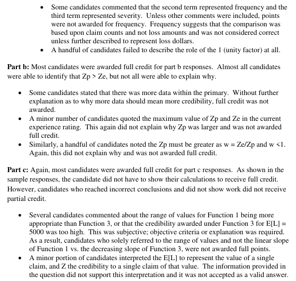
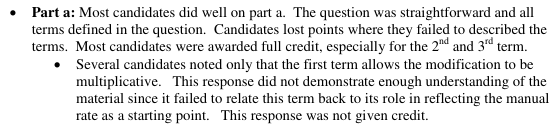

# 2015 Exam 8 - Q10

**Points:** 3

## Question

One common expression for the experience modification for a single-split plan is:

where:

- M is the modification factor
- Zp and Ze are credibility constants
- Ap is the actual primary loss
- Ae is the actual excess loss
- Ep is the expected primary loss
- Ee is the expected excess loss
- E is the expected total loss.

### Part a (0.75 pts)

In the right-hand side of the equation above, there are three terms separated by '+' signs. Briefly

## Solution

### Part a

Unity is the manual rate The 2nd term is the charge if the actual primary losses are greater than expected. The 3rd term is the charge if the actual excess losses are greater than expected.

### Part b

Zp is typically larger since primary losses are more common and predictable, while excess losses are less frequent and more volatile. Primary losses are related to frequency and excess losses are related to severity, and frequency is typically much more predictable than severity.

### Part c

Credibility needs to satisfy 3 criteria:

i. 0 <= Z <= 1

ii. d/dE (Z) >= 0

iii. d/dE (Z/E) <0

Function 2 fails criteria 1 (105%). Function 4 fails criteria 2 (it is decreasing). Function 1 fails criteria 3 (since credibility more than doubles when E doubles from 1k to 2k).

Function 3 satisfies all criteria, and is thus most appropriate.

## Examiner Report

describe the role that each term serves in computing the experience mod.

### Part b (0.50 pts)

Of the two credibility constants, Zp and Ze , identify which of the two is typically the larger in magnitude, and explain why.

### Part c (1.75 pts)

Determine the effectiveness of each of the following credibility functions and select which function is the most appropriate.

Credibility

| Expected Loss | Function 1 | Function 2 | Function 3 | Function 4 |
| --- | --- | --- | --- | --- |
| 1,000 | 15% | 65% | 55% | 80% |
| 2,000 | 35% | 75% | 63% | 75% |
| 3,000 | 55% | 85% | 70% | 62% |
| 4,000 | 75% | 95% | 76% | 53% |
| 5,000 | 95% | 105% | 81% | 40% |

Examiner report comments:

