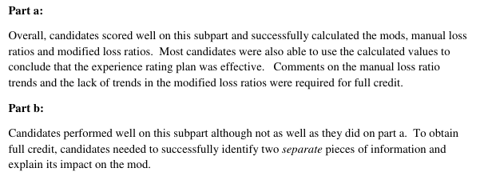

# 2015 Exam 8 - Q11

**Points:** 2.5

## Question

An underwriter and an actuary are discussing the effectiveness of the current experience rating plan. The following table contains experience from five experience rated risks (all of similar size):

| Risk | Manual Premium | Modified Premium | Actual Losses |
| --- | --- | --- | --- |
| 1 | 400,000 | 360,000 | 300,000 |
| 2 | 600,000 | 840,000 | 690,000 |
| 3 | 800,000 | 560,000 | 440,000 |
| 4 | 900,000 | 1,080,000 | 860,000 |
| 5 | 1,000,000 | 800,000 | 650,000 |

### Part a (1.50 pts)

Evaluate whether the experience rating plan is effective or not and explain why.

### Part b (1.00 pts)

The underwriter argues that the modification factor for risk 4 is too high. Propose two additional pieces of information the actuary could request regarding risk 4 in order to support or disprove the underwriter's argument and explain why the information would be useful.

## Solution

other. This seems to be contradictory. Also, it isn't appropriate to compare risks of significantly different size since the variance in loss ratios would naturally vary by risk size. Nevertheless, we can ignore these issues and pretend they won't impact the answer.

Sorted by mod:

| Mod | Man LR | Mod LR | Mod | Man LR | Mod LR |
| --- | --- | --- | --- | --- | --- |
| 0.9 | 0.75 | 0.83 | 0.7 | 0.55 | 0.79 |
| 1.4 | 1.15 | 0.82 | 0.8 | 0.65 | 0.81 |
| 0.7 | 0.55 | 0.79 | 0.9 | 0.75 | 0.83 |
| 1.2 | 0.96 | 0.80 | 1.2 | 0.96 | 0.80 |
| 0.8 | 0.65 | 0.81 | 1.4 | 1.15 | 0.82 |

Formulas

- `I8` = `=D8/C8`
- `J8` = `=E8/C8`
- `K8` = `=E8/D8`
- `M8` = `={SORT(I8:K12,1)}`
- `I9` = `=D9/C9`
- `J9` = `=E9/C9`
- `K9` = `=E9/D9`
- `I10` = `=D10/C10`
- `J10` = `=E10/C10`
- `K10` = `=E10/D10`
- `I11` = `=D11/C11`
- `J11` = `=E11/C11`
- `K11` = `=E11/D11`
- `I12` = `=D12/C12`
- `J12` = `=E12/C12`
- `K12` = `=E12/D12`

The manual loss ratios are quite dispersed and show an increasing trend, so the plan is good at identifying risk differences. The modified loss ratios are relatively flat across risks, so the plan is good at correcting for risk differences. As such, this plan appears to be very effective.

### Part b

It isn't entirely clear here, but I assume the actuary is requesting this information from the underwriter, and not from an industry group like the NCCI that might be calculating the mods.

Any 2 of:

- Asking the underwriter whether the risk is a good fit in the class. If the risk is not a good fit

because it is higher risk, it could explain why the mod is high relative to the other risks in the class.

- Asking the underwriter whether the risk appears to have poor safety habits. If so, then the

high mod would make sense.

- Asking the underwriter whether the risk has significantly changed their operation and/or

management since the experience period. If there has been a significant change, then the past poor experience may no longer be relevant.

- Asking for the risk's loss history to see if a large random loss (not expected to occur again)

was driving the mod.

## Examiner Report

Examiner report comments:

