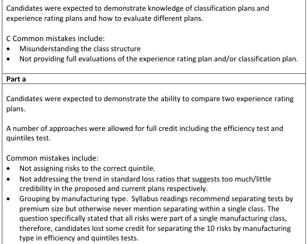
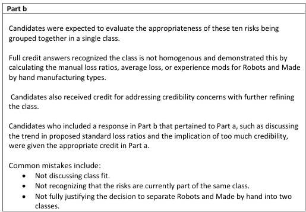

# 2016 Exam 8 - Q11

**Points:** 3.75

## Question

Given the following information about 10 risks for a manufacturing class:

| Risk | Type of Manufacturing | Manual Premium | Losses | Current Modification | Proposed Modification |
| --- | --- | --- | --- | --- | --- |
| 1 | Uses Robots | 1,000 | 500 | 0.65 | 0.50 |
| 2 | Uses Robots | 1,000 | 600 | 0.75 | 0.55 |
| 3 | Made by hand | 1,000 | 700 | 0.70 | 0.70 |
| 4 | Uses Robots | 1,000 | 800 | 1.00 | 0.75 |
| 5 | Uses Robots | 1,000 | 900 | 0.90 | 0.95 |
| 6 | Made by hand | 1,000 | 1,100 | 1.15 | 1.05 |
| 7 | Uses Robots | 1,000 | 1,200 | 1.10 | 1.25 |
| 8 | Made by hand | 1,000 | 1,500 | 1.25 | 1.50 |
| 9 | Made by hand | 1,000 | 1,600 | 1.20 | 1.75 |
| 10 | Made by hand | 1,000 | 1,800 | 1.30 | 2.00 |

### Part a (3.00 pts)

Evaluate the proposed experience rating plan compared to the current plan.

### Part b (0.75 pts)

Evaluate the classification plan for this class.

## Solution

| Sort by curr mod |   |   |   |   |   |   | Sort by prop mod |   |   |   |   |   |   |
| --- | --- | --- | --- | --- | --- | --- | --- | --- | --- | --- | --- | --- | --- |
| Risk | Type of Manufacturing | Manual Premium | Losses | Current Modification | Proposed Modification | Std Prem | Risk | Type of Manufacturing | Manual Premium | Losses | Current Modification | Proposed Modification | Std Prem |
| 1 | Uses Robots | 1,000 | 500 | 0.65 | 0.50 | 650 | 1 | Uses Robots | 1,000 | 500 | 0.65 | 0.50 | 500 |
| 3 | Made by hand | 1,000 | 700 | 0.70 | 0.70 | 700 | 2 | Uses Robots | 1,000 | 600 | 0.75 | 0.55 | 550 |
| 2 | Uses Robots | 1,000 | 600 | 0.75 | 0.55 | 750 | 3 | Made by hand | 1,000 | 700 | 0.70 | 0.70 | 700 |
| 5 | Uses Robots | 1,000 | 900 | 0.90 | 0.95 | 900 | 4 | Uses Robots | 1,000 | 800 | 1.00 | 0.75 | 750 |
| 4 | Uses Robots | 1,000 | 800 | 1.00 | 0.75 | 1,000 | 5 | Uses Robots | 1,000 | 900 | 0.90 | 0.95 | 950 |
| 7 | Uses Robots | 1,000 | 1,200 | 1.10 | 1.25 | 1,100 | 6 | Made by hand | 1,000 | 1,100 | 1.15 | 1.05 | 1,050 |
| 6 | Made by hand | 1,000 | 1,100 | 1.15 | 1.05 | 1,150 | 7 | Uses Robots | 1,000 | 1,200 | 1.10 | 1.25 | 1,250 |
| 9 | Made by hand | 1,000 | 1,600 | 1.20 | 1.75 | 1,200 | 8 | Made by hand | 1,000 | 1,500 | 1.25 | 1.50 | 1,500 |
| 8 | Made by hand | 1,000 | 1,500 | 1.25 | 1.50 | 1,250 | 9 | Made by hand | 1,000 | 1,600 | 1.20 | 1.75 | 1,750 |
| 10 | Made by hand | 1,000 | 1,800 | 1.30 | 2.00 | 1,300 | 10 | Made by hand | 1,000 | 1,800 | 1.30 | 2.00 | 2,000 |

Formulas

- `J7` = `={SORT(B7:G16,5)}`
- `P7` = `=N7*L7`
- `R7` = `={SORT(B7:G16,6)}`
- `X7` = `=W7*T7`
- `P8` = `=N8*L8`
- `X8` = `=W8*T8`
- `P9` = `=N9*L9`
- `X9` = `=W9*T9`
- `P10` = `=N10*L10`
- `X10` = `=W10*T10`
- `P11` = `=N11*L11`
- `X11` = `=W11*T11`
- `P12` = `=N12*L12`
- `X12` = `=W12*T12`
- `P13` = `=N13*L13`
- `X13` = `=W13*T13`
- `P14` = `=N14*L14`
- `X14` = `=W14*T14`
- `P15` = `=N15*L15`
- `X15` = `=W15*T15`
- `P16` = `=N16*L16`
- `X16` = `=W16*T16`

### Part a

Here we will want to use either the Quintile Test or the Efficiency Test for the plans. Even though it wasn't at all obvious based on the question wording and similar past exam questions, the graders required you comment on the trend in standard loss ratios even when using the Efficiency Test solution in order to receive full credit. So I'll include that here as well.

SOLUTION 1: Quintile Test

| Curr Plan |   |   | Prop Plan |   |   |
| --- | --- | --- | --- | --- | --- |
| Risks | Man LR | Std LR | Risks | Man LR | Std LR |
| 1,3 | 0.60 | 0.89 | 1,2 | 0.55 | 1.05 |
| 2,5 | 0.75 | 0.91 | 3,4 | 0.75 | 1.03 |
| 4,7 | 1.00 | 0.95 | 5,6 | 1.00 | 1.00 |
| 6,9 | 1.35 | 1.15 | 7,8 | 1.35 | 0.98 |
| 8,10 | 1.65 | 1.29 | 9,10 | 1.70 | 0.91 |

Formulas

- `C33` = `=SUM(M7:M8)/SUM(L7:L8)`
- `D33` = `=SUM(M7:M8)/SUM(P7:P8)`
- `G33` = `=SUM(U7:U8)/SUM(T7:T8)`
- `H33` = `=SUM(U7:U8)/SUM(X7:X8)`
- `C34` = `=SUM(M9:M10)/SUM(L9:L10)`
- `D34` = `=SUM(M9:M10)/SUM(P9:P10)`
- `G34` = `=SUM(U9:U10)/SUM(T9:T10)`
- `H34` = `=SUM(U9:U10)/SUM(X9:X10)`
- `C35` = `=SUM(M11:M12)/SUM(L11:L12)`
- `D35` = `=SUM(M11:M12)/SUM(P11:P12)`
- `G35` = `=SUM(U11:U12)/SUM(T11:T12)`
- `H35` = `=SUM(U11:U12)/SUM(X11:X12)`
- `C36` = `=SUM(M13:M14)/SUM(L13:L14)`
- `D36` = `=SUM(M13:M14)/SUM(P13:P14)`
- `G36` = `=SUM(U13:U14)/SUM(T13:T14)`
- `H36` = `=SUM(U13:U14)/SUM(X13:X14)`
- `C37` = `=SUM(M15:M16)/SUM(L15:L16)`
- `D37` = `=SUM(M15:M16)/SUM(P15:P16)`
- `G37` = `=SUM(U15:U16)/SUM(T15:T16)`
- `H37` = `=SUM(U15:U16)/SUM(X15:X16)`

Both plans do a good job of identifying risk differences due to the spread in manual LRs, but the proposed plan does a better job due to slightly greater spread. The proposed plan has flatter standard loss ratios compared to the current plan, so it does a better job of correcting for risk differences. However, both plans have a trend in standard loss ratios, so the current plan gives too little credibility to actual experience and the proposed plan gives too much credibility.

SOLUTION 2: Efficiency Test

| Curr Plan |   |   | Prop Plan |   |   |
| --- | --- | --- | --- | --- | --- |
| Risks | Man LR | Std LR | Risks | Man LR | Std LR |
| 1,3 | 0.60 | 0.89 | 1,2 | 0.55 | 1.05 |
| 2,5 | 0.75 | 0.91 | 3,4 | 0.75 | 1.03 |
| 4,7 | 1.00 | 0.95 | 5,6 | 1.00 | 1.00 |
| 6,9 | 1.35 | 1.15 | 7,8 | 1.35 | 0.98 |
| 8,10 | 1.65 | 1.29 | 9,10 | 1.70 | 0.91 |

Formulas

- `C49` = `=C33`
- `D49` = `=D33`
- `G49` = `=G33`
- `H49` = `=H33`
- `C50` = `=C34`
- `D50` = `=D34`
- `G50` = `=G34`
- `H50` = `=H34`
- `C51` = `=C35`
- `D51` = `=D35`
- `G51` = `=G35`
- `H51` = `=H35`
- `C52` = `=C36`
- `D52` = `=D36`
- `G52` = `=G36`
- `H52` = `=H36`
- `C53` = `=C37`
- `D53` = `=D37`
- `G53` = `=G37`
- `H53` = `=H37`

Var — 0.1858 — `=VAR.S(C49:C53)` — 0.0310 — `=VAR.S(D49:D53)` — 0.2133 — `=VAR.S(G49:G53)` — 0.0031 — `=VAR.S(H49:H53)`

Eff Test Stat — 0.167 — `=D55/C55` — 0.014 — `=H55/G55`

Proposed plan's efficiency test stat is lower so the proposed plan is superior. However, both plans have a trend in standard loss ratios, so the current plan gives too little credibility to actual experience and the proposed plan gives too much credibility.

### Part b

Clearly, we are going to want to compare the experience of robot manufacturing with hand made manufacturing to decide whether each group belongs in a separate class (they are both currently in the same class). Since class ratemaking would ideally be expected to equalize manual loss ratios across classes, the most appropriate measure to use here would be to compare manual loss ratios. The graders also accepted comparing average losses, but that only works in this case because all risks have the same manual premium. Alternatively, we could look at the average mods for each group as that would indicate the experience rating plan is recognizing and trying to correct for the differences in manual loss ratios between groups.

Solution 1: Compare manual loss ratios (preferred)

| B | D |
| --- | --- |
| Man LR for robots | 0.8 |
| Man LR for hand made | 1.34 |

Formulas

- `D74` = `=SUMIF($C$7:$C$16,"Uses Robots",$E$7:$E$16)/SUMIF($C$7:$C$16,"Uses Robots",$D$7:$D$16)`
- `D75` = `=SUMIF($C$7:$C$16,"Made by hand",$E$7:$E$16)/SUMIF($C$7:$C$16,"Made by hand",$D$7:$D$16)`

Since the manual loss ratios are significantly different between hand made risks and robots risks, it would be best to split them into different classes, as this difference between groups of risks is best addressed by class ratemaking.

Solution 2: Compare mods

| B | D |
| --- | --- |
| Avg Curr Mod for robots | 0.88 |
| Avg Curr Mod for hand made | 1.12 |

Formulas

- `D83` = `=SUMIF($C$7:$C$16,"Uses Robots",$F$7:$F$16)/COUNTIF($C$7:$C$16,"Uses Robots")`
- `D84` = `=SUMIF($C$7:$C$16,"Made by hand",$F$7:$F$16)/COUNTIF($C$7:$C$16,"Made by hand")`

Risks that use robots consistently have lower mods than made by hand risks. Class may not be granular enough. Should consider splitting into two classes by manufacturing type if there is enough credibility to have two smaller classes.

## Examiner Report

Examiner report comments:

