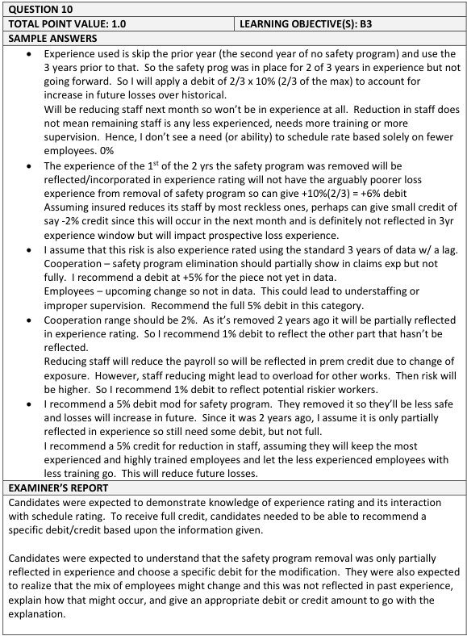
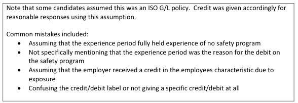

# 2017 Exam 8 - Q10

**Points:** 1

## Question

An actuary is evaluating a risk to determine the appropriateness of applying any schedule credits or debits. In order to reduce expenses the insured removed a safety program 2 years ago and in the next month will be reducing its staff.

Range of Modifications:

| Risk Characteristic | Description | Credit |   | Debit |
| --- | --- | --- | --- | --- |
| Cooperation | Safety Program | 10% | to | 10% |
| Employees | Selection, training, supervision, experience | 5% | to | 5% |

Recommend and defend an appropriate schedule modification.

## Solution

While these schedule rating categories are also in the ISO plan with different ranges of values, I don't think this question has anything to do with the ISO plan, so I don't think any commentary about the ranges here being higher or lower than the ISO plan would be worth points. The key here is about discussing what is reflected in experience rating or not. The actual amount of a credit/debit isn't important; only the relative amount and discussion matters. I assume the risk has been around for many years, so this isn't a new risk.

The safety program should get a debit to offset the partial benefit it will get from the program being partially reflected in experience rating. I think you could answer the employee piece differently depending on which staff are impacted (more/less experienced).

Solution 1: Assume more costly, experience employees are being laid off

Safety program: Since the safety program will be partially reflected in the experience period for experience rating, the insured might receive a lower experience mod. However, since the safety program is no longer in place, a schedule debit might be appropriate here to offset the lower experience mod. Since it is only partially reflected in experience rating, a partial debit of perhaps 5% might make sense.

Employees: The change in staff will not be reflected in experience. Assuming the company is letting go of more costly senior employees and keeping younger employees, and also that now less supervision and training will take place due to the lower staff, this would warrant a debit of perhaps 5%.

Final schedule mod = 5% + 5% = 10% debit

Solution 2: Assume newer, inexperienced employees are being laid off

Safety program: Since the safety program will be partially reflected in the experience period for experience rating, the insured might receive a lower experience mod. However, since the safety program is no longer in place, a schedule debit might be appropriate here to offset the lower experience mod. Since it is only partially reflected in experience rating, a partial debit of perhaps 5% might make sense.

Employees: The change in staff will not be reflected in experience. Assuming the company is letting go of less experienced employees and keeping experienced employees, this would warrant a small schedule credit, perhaps -3%.

Final schedule mod = 5% - 3% = 2% debit

Solution 3: Assume layoff impacts all employees equally

Safety program: Since the safety program will be partially reflected in the experience period for experience rating, the insured might receive a lower experience mod. However, since the safety program is no longer in place, a schedule debit might be appropriate here to offset the lower experience mod. Since it is only partially reflected in experience rating, a partial debit of perhaps 5% might make sense.

Employees: The change in staff will not be reflected in experience. The change in staffing doesn't necessarily mean any change in the employees level of experience, supervision, or training. So no need for a schedule credit/debit. Select 0%.

Final schedule mod = 5% + 0% = 5% debit

## Examiner Report

Examiner report solutions and comments:

