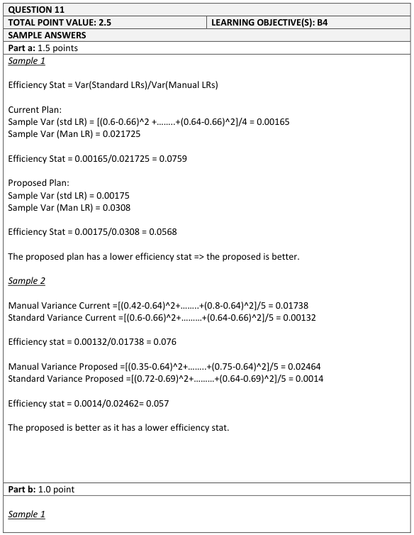
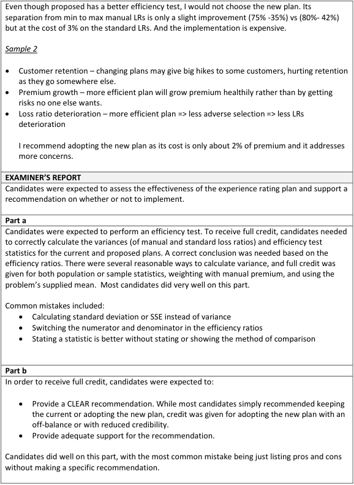

# 2017 Exam 8 - Q11

**Points:** 2.5

## Question

A workers' compensation insurer is facing an increasingly competitive market. Its management is concerned about customer retention, premium growth, and loss ratio deterioration. The insurer's actuaries have proposed an updated experience rating plan. After grouping insureds for the purposes of an efficiency test, the projected impact of this proposal is below (values in thousands):

Current Plan

| Quintile | Manual Premium | Loss | Standard Premium | Loss Ratio to Manual | Loss Ratio to Standard |
| --- | --- | --- | --- | --- | --- |
| A | 4,750 | 1,978 | 3,278 | 42% | 60% |
| B | 4,825 | 2,824 | 4,005 | 59% | 71% |
| C | 4,450 | 2,915 | 4,450 | 66% | 66% |
| D | 4,845 | 3,608 | 5,378 | 74% | 67% |
| E | 4,400 | 3,520 | 5,500 | 80% | 64% |
| Total | 23,270 | 14,845 | 22,610 | 64% | 66% |

Proposed Plan

| Quintile | Manual Premium | Loss | Standard Premium | Loss Ratio to Manual | Loss Ratio to Standard |
| --- | --- | --- | --- | --- | --- |
| A | 4,220 | 1,494 | 2,068 | 35% | 72% |
| B | 5,100 | 2,922 | 4,233 | 57% | 69% |
| C | 4,150 | 3,088 | 4,109 | 74% | 75% |
| D | 4,950 | 3,689 | 5,346 | 75% | 69% |
| E | 4,850 | 3,652 | 5,723 | 75% | 64% |
| Total | 23,270 | 14,845 | 21,478 | 64% | 69% |

It is estimated that the upfront cost to adopt the new rating plan will be $500,000.

### Part a (1.50 pts)

Perform an efficiency test and evaluate the proposed experience rating plan relative to the current plan.

### Part b (1.00 pts)

In light of management's concerns, evaluate the merits of adopting the new rating plan versus keeping the current plan, and provide a recommendation.

## Solution

Note that Workers' Compensation experience rating in practice is implemented at the industry level, not the company level, and it is run by bureaus like the NCCI. Running this at an industry level allows for more data to be used in determining the experience rating plan (among other benefits). So this question about a company changing its experience rating plan for Workers' Compensation might be a bit unrealistic.

### Part a

Note that ideally the Manual Premium would be equal in each quintile, though they are not equal in this case (they aren't equal in the source paper either, but that example was dealing with a small number of risks).

|   | Current Plan |   | Proposed Plan |   |
| --- | --- | --- | --- | --- |
|  | Man LR | Std LR | Man LR | Std LR |
| Variances | 0.0217 | 0.0016 | 0.0307 | 0.0017 |

Formulas

- `L12` = `=VAR.S(F11:F15)`
- `M12` = `=VAR.S(G11:G15)`
- `O12` = `=VAR.S(F20:F24)`
- `P12` = `=VAR.S(G20:G24)`

Eff Stat — 0.075 — `=M12/L12` — 0.054 — `=P12/O12`

Since 0.054 < 0.075, the Proposed Plan is better.

### Part b

This question doesn't seem to be clearly related to anything in the source material, so I'll improvise based on my observations of the information given in the question. It seems that this answer might need to discuss the $500k cost of implementing the new plan, though it really doesn't seem that relevant in the long run. I also see that the total Standard Premium would be significantly lower using the proposed experience rating plan compared to the current plan, and this would run contrary to management's goal of premium growth. On the other hand, since the proposed plan is more efficient, it would do a better job at equalizing loss ratios across all risks.

The proposed plan does a better job of equalizing loss ratios across quintiles, so it would be better for profitability. However, the total standard premium under the proposed plan is significantly lower than the total standard premium under the current plan. To offset this premium reduction and still benefit from the new plan's performance, I would recommend that management implements the proposed plan and increases manual rates to offset the standard premium reduction from moving to the proposed plan. This could hurt retention, but only for risks that were previously unprofitable, and it would benefit risks that were profitable. Over the long run, the benefits of this change would greatly exceed the $500k implementation cost.

## Examiner Report

Examiner report solutions and comments:

