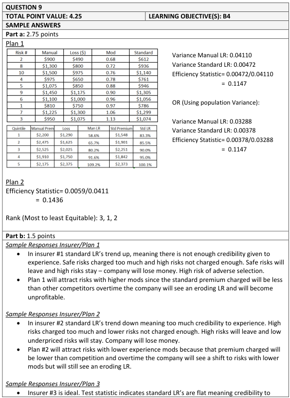
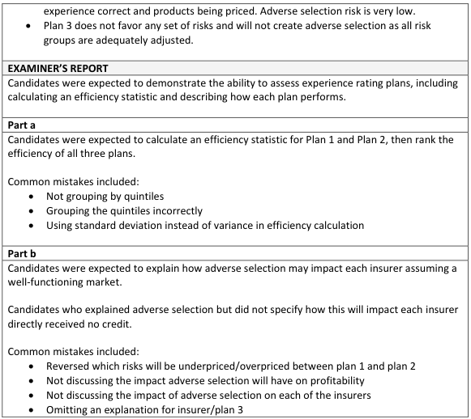

# 2018 Exam 8 - Q9

**Points:** 4.25

## Question

Three insurers are using experience rating to determine premiums for a specific class of business. The same ten risks were rated using the experience plan of each insurer. Information related to each rating plan is given below:

Insurer 1's Plan — Insurer 2's Plan

| Risk # | Manual Premium | Loss | Mod | Standard Premium | Quintile | Manual Loss Ratio | Standard Loss Ratio |
| --- | --- | --- | --- | --- | --- | --- | --- |
| 1 | $810 | $750 | 0.97 | $786 | 1 | 58.6% | 94.5% |
| 2 | $900 | $490 | 0.68 | $612 | 2 | 65.7% | 90.0% |
| 3 | $950 | $1,075 | 1.13 | $1,074 | 3 | 80.2% | 85.3% |
| 4 | $975 | $650 | 0.78 | $761 | 4 | 91.6% | 79.7% |
| 5 | $1,075 | $850 | 0.88 | $946 | 5 | 109.2% | 75.3% |
| 6 | $1,100 | $1,000 | 0.96 | $1,056 | Sample Variance | 0.0411 | 0.0059 |
| 7 | $1,225 | $1,300 | 1.06 | $1,299 |  |  |  |
| 8 | $1,300 | $800 | 0.72 | $936 |  |  |  |
| 9 | $1,450 | $1,175 | 0.90 | $1,305 |  |  |  |
| 10 | $1,500 | $975 | 0.76 | $1,140 |  |  |  |

Insurer 3's Plan

Efficiency Test Statistic

0.0000

### Part a (2.75 pts)

Rank each of the insurers' rating plans from most to least equitable using the Efficiency Test as described by Fisher et al.

### Part b (1.50 pts)

Explain how adverse selection may affect each of the three insurers in a well-functioning insurance market. Assume that no adjustments are made to the experience rating plans over time.

## Solution

### Part a

So the premise of this question is a bit odd since we have different insurers with different rating plans. This introduces some practical questions about the experience rating plans, such as what happens when an insured switches companies - does the new insurer know the insured's prior experience with other carriers, or is that experience hidden to the new insurer?

More important for this exam question though is whether each insurer is using the same manual rating plan, for which the answer is presumably no since they are different insurers after all. In that case, the whole premise of this question would be flawed, as the experience rating plans wouldn't really be comparable. For example, suppose insurer A has a very strong manual classification plan and insurer B has a weak manual classification plan. Based on that, we would expect insurer A to have much less variance in manual loss ratios compared to insurer B. That would leave little room for insurer A's experience rating plan to further reduce the variance in loss ratios, while insurer B's experience rating plan would have the opportunity to have a much bigger impact. This could result in insurer B's Efficiency Test statistic being lower than insurer A's statistic, even though insurer A may have the overall better rating plan (driven by their better manual rating plan). The lower Efficiency Test statistic for insurer B does NOT mean that insurer A should then adopt insurer B's experience rating plan, as the insurer B experience rating plan only appears to perform better relative to insurer B's poor manual rating plan. So again, the experience rating plans in this problem are not comparable if you assume that manual rates vary by insurer.

All that said, I'll solve this question as the question writer likely intended, which would be appropriate if all insurers used the same manual rates. Furthermore, I assume the losses for these same 10 risks are the same for each insurer, even though those losses only show under the insurer 1 table. Even though the question says to rank the insurer's "rating plans," really we are being asked to rank their experience rating plans based on the Efficiency Test. If we were ranking their actual full rating plans (based on both manual and experience rating combined), we could just look at which insurer has the lowest variance in standard loss ratios.

We can already tell insurer 3's plan will be the most equitable, since you can't beat an efficiency test score of 0. For insurer 2, we can quickly calculate the Efficiency Test statistic based on the given info. For insurer 1, we need to first sort risks by mod and group risks in quintiles before calculating the test statistic.

**Insurer 2 Efficiency Test stat:** 0.144 — `=J16/I16`

Sort by mod for insurer 1

| Risk # | Manual Premium | Loss | Mod | Standard Premium |   | Man LR | Std LR |
| --- | --- | --- | --- | --- | --- | --- | --- |
| 2 | $900 | $490 | 0.68 | $612 |  | 0.59 | 0.83 |
| 8 | $1,300 | $800 | 0.72 | $936 |  |  |  |
| 10 | $1,500 | $975 | 0.76 | $1,140 |  | 0.66 | 0.85 |
| 4 | $975 | $650 | 0.78 | $761 |  |  |  |
| 5 | $1,075 | $850 | 0.88 | $946 |  | 0.80 | 0.90 |
| 9 | $1,450 | $1,175 | 0.90 | $1,305 |  |  |  |
| 6 | $1,100 | $1,000 | 0.96 | $1,056 |  | 0.92 | 0.95 |
| 1 | $810 | $750 | 0.97 | $786 |  |  |  |
| 7 | $1,225 | $1,300 | 1.06 | $1,299 |  | 1.09 | 1.00 |
| 3 | $950 | $1,075 | 1.13 | $1,074 |  |  |  |
|  |  |  |  |  | var | 0.0411 | 0.0047 |

Formulas

- `N39` = `={SORT(B11:F20,4)}`
- `T39` = `=SUM(P39:P40)/SUM(O39:O40)`
- `U39` = `=SUM(P39:P40)/SUM(R39:R40)`
- `T41` = `=SUM(P41:P42)/SUM(O41:O42)`
- `U41` = `=SUM(P41:P42)/SUM(R41:R42)`
- `T43` = `=SUM(P43:P44)/SUM(O43:O44)`
- `U43` = `=SUM(P43:P44)/SUM(R43:R44)`
- `T45` = `=SUM(P45:P46)/SUM(O45:O46)`
- `U45` = `=SUM(P45:P46)/SUM(R45:R46)`
- `T47` = `=SUM(P47:P48)/SUM(O47:O48)`
- `U47` = `=SUM(P47:P48)/SUM(R47:R48)`
- `T49` = `=VAR.S(T39:T47)`
- `U49` = `=VAR.S(U39:U47)`

**Insurer 1 Eff Test Stat:** 0.115 — `=U49/T49`

Based on smallest to largest test statistics, insurer 3's plan is the most equitable, followed by insurer 1, and insurer 2's plan is the least equitable.

### Part b

This may have to do with the practical issue comments I mentioned in part (a). However, I'll assume that the insurers do share a common set of loss experience (e.g., via an industry database), so this answer will be based solely on the experience rating plans themselves. As before, I'll have to continue to assume that all insurers use the same manual rates. While possibly not required for full credit, I think the dynamic can be better explained if we look at the loss ratios by quintile for insurers 1 and 2.

Based on the downward trend in standard loss ratios, insurer 2 seems to give too high a debit to risks with high manual loss ratios, and too low a credit for risks with low manual loss ratios. By contrast, insurer 1 seems to be giving not enough credit to risks with low manual loss ratios and not enough of a debit to risks with high manual loss ratios. Insurer 3 is perfectly priced across all risks.

As a result, risks with high manual loss ratios will be attracted to insurer 1, where they will be underpriced. Risks with low manual loss ratios will be attracted to insurer 2, where they will be underpriced. Both insurers 1 and 2 will continue to grow in these segments and will become unprofitable. Insurer 3 will remain profitable, but may face revenue issues in the short-term if many risks leave to seek a lower rate in insurers 1 and 2.

## Examiner Report

Examiner report solutions and comments:

