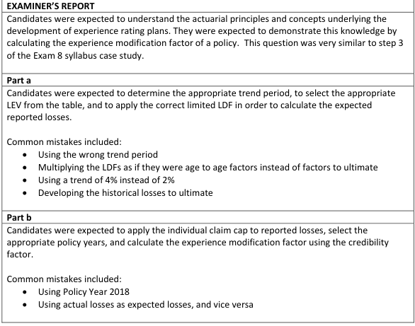

# 2018 Exam 8 - Q10

**Points:** 2.25

## Question

An actuary is analyzing an experience rating plan using three years of experience that has the following information:

| C | F |
| --- | --- |
| Policy effective date | 2019-01-01 |
| Policy term | One Year |
| Annual loss trend | 2% |
| Cap for individual claims | 100,000 |
| Credibility factor | 0.60 |
| Expected ultimate loss before modification | 500,000 |

Reported Losses on Individual Claims by Policy Year as of June 30, 2018

| C | D | E | F |
| --- | --- | --- | --- |
| 2,015 | 2,016 | 2,017 | 2,018 |
| 3,450 | 2,389 | 456 | 5,694 |
| 5,000 | 345 | 126,890 | 99,832 |
| 234 | 1,236,806 | 2,345 | 76,532 |
| 98,000 |  | 1,874 |  |
| 324,789 |  | 690 |  |

26,986

The actuary has determined limited loss development factors (LDFs) and limited expected values using aggregate data from similar policies as follows:

| Maturity to Ultimate | Limited LDFs | Limit | Limited Expected Value |
| --- | --- | --- | --- |
| 18 months | 1.50 | 100,000 | 17,500 |
| 30 months | 1.23 | 500,000 | 28,567 |
| 42 months | 1.20 | 1,000,000 | 43,393 |
|  |  | Unlimited | 85,504 |

### Part a (1.25 pts)

Calculate the expected reported losses for this plan for the three years of experience combined.

### Part b (1.00 pts)

Calculate the experience modification factor for this policy.

## Solution

### Part a

We aren't told whether the actual vs expected loss comparison will be based on losses at historical loss trend levels or at the prospective loss trend level. We also aren't told what the experience period will be for this plan (e.g., 3 years lagged 1 year). All that said, we are told at least that the comparison will be based on reported losses and not ultimate losses, as the question asks for expected reported losses. In any case, this was clearly intended to be a copy of the Fisher Excel case study example, so that's what I'll base my solution upon. That case study assumes the comparison will be based on historical loss levels, for 3 years of experience lagged 1 year.

I'll assume the expected ultimate loss before mod is an annual number and is at the prospective level. I assume the loss trend given is really a limited (to 100k) loss trend.

**Prospective expected losses limited to 100k:** 102,334 — `=F12*(F27/F30)`

| PY | Exp lim loss | Loss trend | Lim LDF | Exp Detrended Rept Lim Loss |
| --- | --- | --- | --- | --- |
| 2,017 | 102,334 | 1.040 | 1.50 | $65,574 |
| 2,016 | 102,334 | 1.061 | 1.23 | $78,400 |
| 2,015 | 102,334 | 1.082 | 1.20 | $78,784 |
| Total |  |  |  | $222,758 |

Formulas

- `K16` = `=N$13`
- `L16` = `=(1+$F$9)^(2019-J16)`
- `M16` = `=C27`
- `N16` = `=K16/(L16*M16)`
- `K17` = `=N$13`
- `L17` = `=(1+$F$9)^(2019-J17)`
- `M17` = `=C28`
- `N17` = `=K17/(L17*M17)`
- `K18` = `=N$13`
- `L18` = `=(1+$F$9)^(2019-J18)`
- `M18` = `=C29`
- `N18` = `=K18/(L18*M18)`
- `N19` = `=SUM(N16:N18)`

### Part b

Here we need to cap the historical losses at 100k, and sum them up. We can ignore the 2018 year since it isn't part of the experience period.

Cap losses at 100k:

| J | K | L |
| --- | --- | --- |
| 2,015 | 2,016 | 2,017 |
| 3,450 | 2,389 | 456 |
| 5,000 | 345 | 100,000 |
| 234 | 100,000 | 2,345 |
| 98,000 |  | 1,874 |
| 100,000 |  | 690 |

Formulas

- `J27` = `=MIN(C16,$F$10)`
- `K27` = `=MIN(D16,$F$10)`
- `L27` = `=MIN(E16,$F$10)`
- `J28` = `=MIN(C17,$F$10)`
- `K28` = `=MIN(D17,$F$10)`
- `L28` = `=MIN(E17,$F$10)`
- `J29` = `=MIN(C18,$F$10)`
- `K29` = `=MIN(D18,$F$10)`
- `L29` = `=MIN(E18,$F$10)`
- `J30` = `=MIN(C19,$F$10)`
- `L30` = `=MIN(E19,$F$10)`
- `J31` = `=MIN(C20,$F$10)`
- `L31` = `=MIN(E20,$F$10)`

26,986 — `=MIN(E21,$F$10)`

**Total:** 441,769 — `=SUM(J27:L32)`

Mod — 1.59 — `=(F11*L34+(1-F11)*N19)/N19` — Mod = [ZA + (1-Z)E]/E

## Examiner Report

Examiner report comments:

