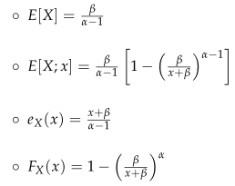
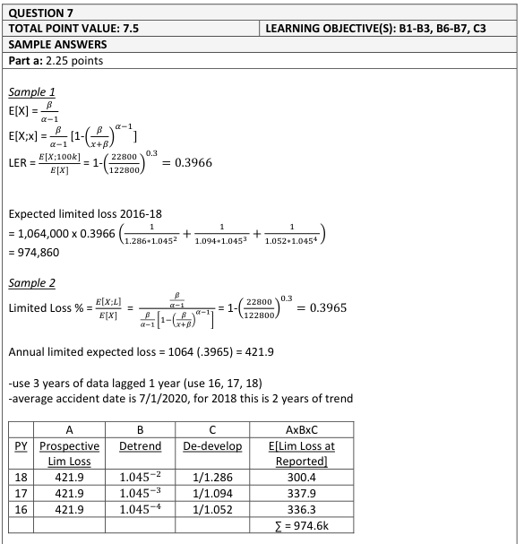
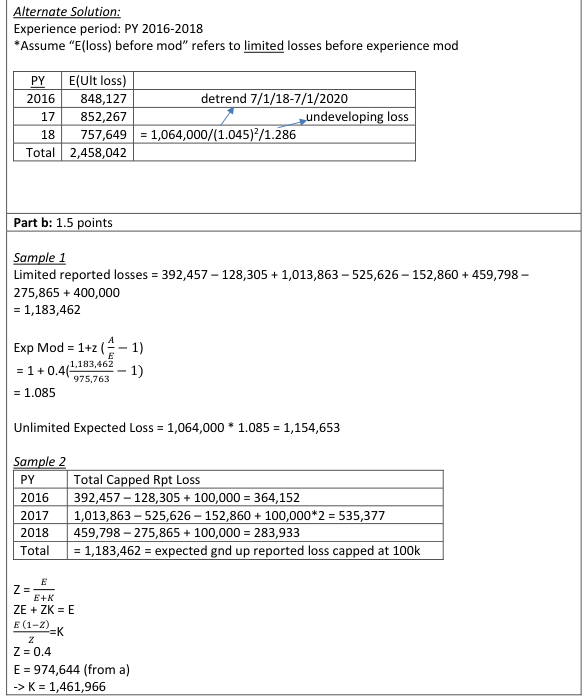
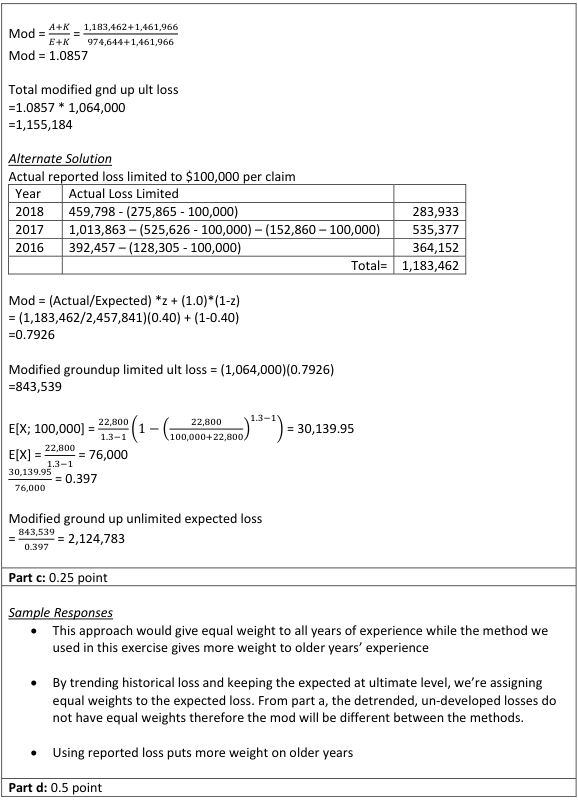
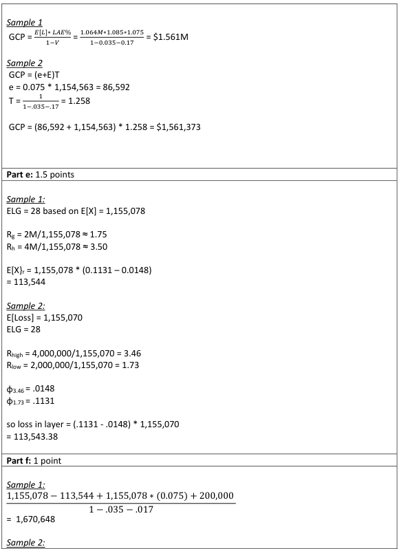
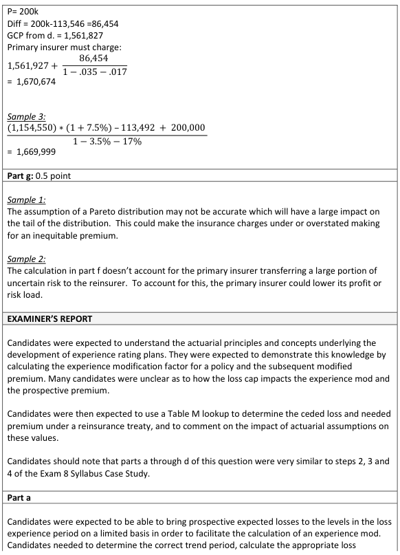
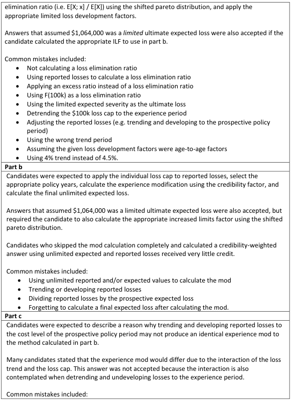
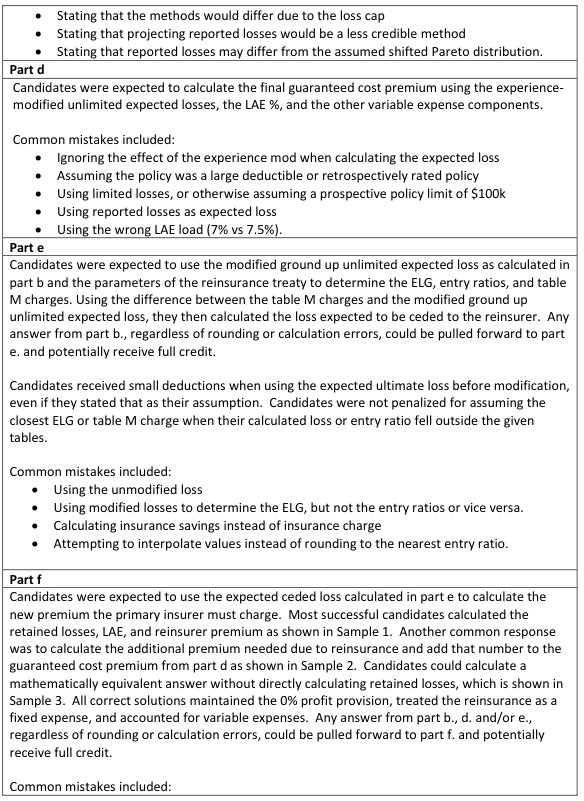
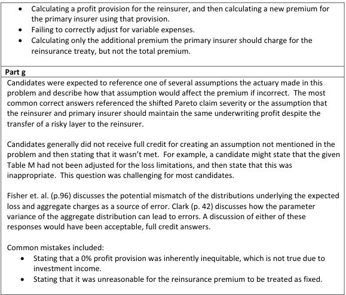

# 2019 Exam 8 - Q7 revised

**Points:** 7.5

## Question

An actuary is pricing a workers compensation policy. Given the following:

| B | C |
| --- | --- |
| 2020-01-01 | Policy Effective Date |
| One year | Policy Term |
| 4.5% | Annual Loss Trend |
| $100,000 | Cap for individual claims |
| 0.40 | Credibility factor |
| $1,064,000 | Expected ultimate loss before modification |

As of June 30, 2019, ground up reported losses are:

| Policy Year | Total Reported Loss | Individual Claims over $100,000 |   |
| --- | --- | --- | --- |
| 2,016 | $392,457 | $128,305 |  |
| 2,017 | $1,013,863 | $525,626 | $152,860 |
| 2,018 | $459,798 | $275,865 |  |
| 2,019 | $181,325 | None |  |

The following limited loss development (LDFs) apply to this policy:

| Maturity to Ultimate | Limited LDF |
| --- | --- |
| 42 months | 1.052 |
| 30 months | 1.094 |
| 18 months | 1.286 |

Based on an internal study, the actuary believes that claim severity follows a shifted Pareto distribution with:

| B | C |
| --- | --- |
| 1.3 | α for shifted Pareto distribution |
| 22,800 | β for shifted Pareto distribution |

For the shifted Pareto distribution:

Pareto formulas supplied with the question:

$$E[X] = \frac{\beta}{\alpha-1}$$
$$E[X; x] = \frac{\beta}{\alpha-1}\left[1 - \left(\frac{\beta}{x+\beta}\right)^{\alpha-1}\right]$$
$$e_X(x) = \frac{x+\beta}{\alpha-1} \qquad F_X(x) = 1 - \left(\frac{\beta}{x+\beta}\right)^{\alpha}$$

The following expenses apply to this policy:

| B | C |
| --- | --- |
| 7.5% | Loss Adjustment Expense (LAE) as % of loss |
| 3.5% | Taxes and Fees as % of gross premium |
| 17% | Acquisition as % of gross premium |
| 0% | Profit and Contingencies as % of gross premium |

### Part a (2.25 pts)

Calculate the expected ground up reported loss limited to $100,000 per claim for this insured for the three years of experience combined.

### Part b (1.50 pts)

Calculate the total modified ground up unlimited expected loss for this policy.

### Part c (0.25 pts)

Alternatively, the actuary could have trended and developed reported losses to the cost level of the prospective policy period. Briefly explain why this approach would not produce an identical modification factor.

### Part d (0.50 pts)

Calculate the guaranteed cost premium for this insured.

The insurer's management is concerned about capacity on risks of this type. To address these concerns, they are requiring facultative reinsurance to support this account. Under the treaty, the reinsurer would assume all aggregate losses between $2,000,000 and $4,000,000. The primary insurer will retain all LAE.

The primary insurer's actuary believes the following Table M and the associated expected loss groupings (ELGs) are appropriate for risks of this type:

| ELG | Loss Range |   | ELG |   |   |   |   |   |
| --- | --- | --- | --- | --- | --- | --- | --- | --- |
| 31 | $730,000 - 820,000 | Entry Ratio | 31 | 30 | 29 | 28 | 27 | 26 |
| 30 | $820,001 - 930,000 | 1.50 | 0.1876 | 0.1764 | 0.1649 | 0.1529 | 0.1442 | 0.1343 |
| 29 | $930,001 - 1,090,000 | 1.75 | 0.1490 | 0.1376 | 0.1257 | 0.1131 | 0.1048 | 0.0963 |
| 28 | $1,090,001 - 1,280,000 | 2.00 | 0.1195 | 0.1083 | 0.0964 | 0.0838 | 0.0762 | 0.0692 |
| 27 | $1,280,001 - 1,515,000 | 2.25 | 0.0968 | 0.0859 | 0.0745 | 0.0623 | 0.0555 | 0.0497 |
| 26 | $1,515,001 - 1,844,000 | 2.50 | 0.0791 | 0.0687 | 0.0579 | 0.0465 | 0.0404 | 0.0357 |
|  |  | 2.75 | 0.0652 | 0.0554 | 0.0453 | 0.0347 | 0.0295 | 0.0257 |
|  |  | 3.00 | 0.0541 | 0.0450 | 0.0356 | 0.0260 | 0.0215 | 0.0185 |
|  |  | 3.25 | 0.0452 | 0.0367 | 0.0282 | 0.0196 | 0.0157 | 0.0133 |
|  |  | 3.50 | 0.0380 | 0.0302 | 0.0224 | 0.0148 | 0.0115 | 0.0096 |
|  |  | 3.75 | 0.0321 | 0.0250 | 0.0179 | 0.0111 | 0.0084 | 0.0069 |
|  |  | 4.00 | 0.0273 | 0.0207 | 0.0144 | 0.0084 | 0.0062 | 0.0050 |

### Part e (1.50 pts)

Calculate the loss expected to be ceded to the reinsurer under this treaty. Round to the nearest entry ratio (i.e., do not interpolate).

### Part f (1.00 pts)

A reinsurer has quoted a premium of $200,000 for this treaty. Calculate the premium the primary insurer must charge in order to maintain the same underwriting profit.

### Part g (0.50 pts)

Explain how the assumptions of the primary insurer's actuary may have resulted in an inequitable premium calculated in part (f) above.

## Solution

### Part a

We aren't told whether the actual vs expected loss comparison will be based on losses at historical loss trend levels or at the prospective loss trend level. We also aren't told what the experience period will be for this plan (e.g., 3 years lagged 1 year). All that said, we are told at least that the comparison will be based on reported losses and not ultimate losses, as the question asks for expected reported losses. In any case, this was clearly intended to be a copy of the Fisher Excel case study example, so that's what I'll base my solution upon. That case study assumes the comparison will be based on historical loss levels, for 3 years of experience lagged 1 year.

I'll assume the expected ultimate loss before mod is an annual number and is at the prospective level. I assume the loss trend given is really a limited (to 100k) loss trend.

| B | D |
| --- | --- |
| E[X] | 76,000 |
| E[X;100k] | 30,139.948686 |
| Lim loss % | 0.40 |

Formulas

- `D119` = `=B32/(B31-1)`
- `D120` = `=D119*(1-(B32/(100000+B32))^(B31-1))`
- `D121` = `=D120/D119`

**Prospective expected losses limited to 100k:** $421,959 — `=B11*D121`

| PY | Exp Lim Loss | Trend | LDF | Exp De-trended Lim Rept Loss |
| --- | --- | --- | --- | --- |
| 2,018 | $421,959 | 1.092 | 1.286 | $300,467 |
| 2,017 | $421,959 | 1.141 | 1.094 | $337,990 |
| 2,016 | $421,959 | 1.193 | 1.052 | $336,349 |
| Total |  |  |  | $974,806 |

Formulas

- `C126` = `=D$123`
- `D126` = `=(1+B$8)^(2020-B126)`
- `E126` = `=D26`
- `F126` = `=C126/(D126*E126)`
- `C127` = `=D$123`
- `D127` = `=(1+B$8)^(2020-B127)`
- `E127` = `=D25`
- `F127` = `=C127/(D127*E127)`
- `C128` = `=D$123`
- `D128` = `=(1+B$8)^(2020-B128)`
- `E128` = `=D24`
- `F128` = `=C128/(D128*E128)`
- `F129` = `=SUM(F126:F128)`

### Part b

Now we need to finish calculating the experience mod and apply it to the original expected ultimate loss. We first need to get actual reported losses limited to $100k per occurrence. We only need PYs 2016-2018 to correspond with the experience period used in part (a).

| PY | Capped Rept at 100k |
| --- | --- |
| 2,016 | $364,152 |
| 2,017 | $535,377 |
| 2,018 | $283,933 |
| Total | $1,183,462 |

Formulas

- `C136` = `=C16-D16+100000`
- `C137` = `=C17-(D17+E17)+100000*2`
- `C138` = `=C18-D18+100000`
- `C139` = `=SUM(C136:C138)`

Mod — 1.09 — `=(B10*C139+(1-B10)*F129)/F129` — Mod = [ZA + (1-Z)E]/E

**Mod Exp Loss:** $1,155,099 — `=C141*B11`

### Part c

That approach would give different weights to each historical year, resulting in a different mod.

### Part d

Here we need to use the modified expected losses as a starting point (since those are risk-specific expected losses for the prospective period. Then we can load for all other costs.

**Prem:** $1,561,926 — `=(C143*(1+B50))/(1-B51-B52-B53)`

### Part e

Even though this question mentions reinsurance and reinsurance pricing has been moved to exam 9, this is definitely still testable as-is in my opinion since it doesn't require any knowledge about reinsurance that isn't already directly mentioned in the question. Note that we should use the modified expected loss we obtained in part (b) here as the expected loss for this risk.

Lookup Mod Exp Loss — ELG — 28 — `=B85`

If you used interpolation:

| B | D | E | F | H |
| --- | --- | --- | --- | --- |
| Entry ratio at 2M | 1.73 | charge at 1.75 (closest) | 0.1131 | 0.1161 |
| Entry ratio at 4M | 3.46 | charge at 3.50 (closest) | 0.0148 | 0.0155 |

Formulas

- `D159` = `=2000000/C$143`
- `F159` = `=I84`
- `H159` = `=FORECAST(D159,I83:I84,E83:E84)`
- `D160` = `=4000000/C$143`
- `F160` = `=I91`
- `H160` = `=FORECAST(D160,I90:I91,E90:E91)`

Really, it would have been more appropriate to use linear interpolation to get the charges above instead of rounding the entry ratios. However, the graders actually considered this is a mistake, which I completely disagree with.

**Expected ceded loss:** $113,546 — `=(F159-F160)*C143`

### Part f

Note that the question says LAE isn't ceded, so it needs to relate to ground-up loss.

| B | D |
| --- | --- |
| Net Loss | $1,041,553 |
| LAE | $86,632 |

Formulas

- `D169` = `=C143-D165`
- `D170` = `=C143*B50`

**Premium:** $1,670,673 — `=(D169+D170+200000)/(1-B52-B51-B53)`

### Part g

It isn't clear what assumption the question is talking about, and there are several to choose from:

That the aggregate distribution in the Table M is appropriate for this risk. That claim severity follows a shifted Pareto distribution. To me, the obvious choice was the first one above about Table M since that is most directly related to this question.

## Examiner Report

But surprisingly, the examiner report was mostly focused on either the Pareto assumption, or whether the profit provision should be the same on a gross vs net basis, even though it this was never stated as an assumption made by the actuary. So I'll show what I believe is the most obvious answer.

If the assumed aggregate distribution is inappropriate for this risk, then the calculated expected ceded loss will be incorrect. This will cause an incorrect net loss to be used in the premium formula from (f), which will cause premium to be inaccurate.

Examiner report solutions and comments:

