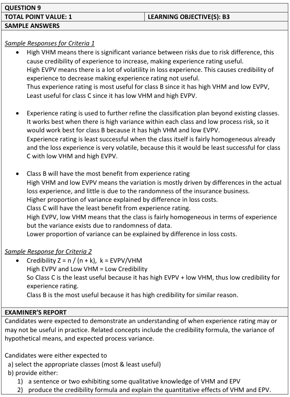
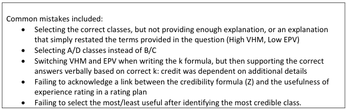

# 2019 Exam 8 - Q9

**Points:** 1

## Question

An insurer's risk classification system contains four classes (A, B, C, and D). The insurer is considering using experience rating to rate all four classes.

Given the following:

| B | C | D |
| --- | --- | --- |
|  | Low Variance of Hypothetical Means within Class | High Variance of Hypothetical Means within Class |
| Low Expected Value of Process Variance | Class A | Class B |
| High Expected Value of Process Variance | Class C | Class D |

From the insurer's perspective, briefly explain the class for which experience rating is expected to be the most useful and the class for which experience rating is expected to be the least useful.

## Solution

This could be answered either descriptively or in reference to the experience rating credibility formula. I'll show both.

Solution 1: Refer to the credibility formula

Experience rating credibility Z = n / (n + EPV/VHM)

So experience rating credibility will be highest (most useful) when EPV is low and VHM is high. This is class B.

Experience rating credibility will be lowest (least useful) when EPV is high and VHM is low. This is class C.

Solution 2: Describe EPV and VHM

VHM represents the variance between risks within a class, while EPV represents the variance in loss experience for any given risk over time. Individual risk experience rating serves to differentiate individual risks within a class, so it works best when VHM is high and EPV is low (and worst when VHM is low and EPV is high).

As such, experience rating credibility will be highest (most useful) for class B, and will be lowest (least useful) for class C.

## Examiner Report

Examiner report solution and comments:

