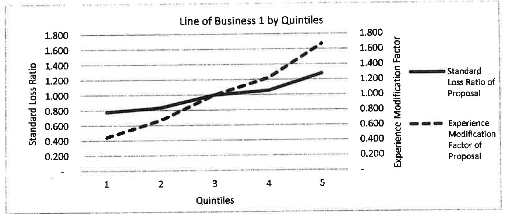
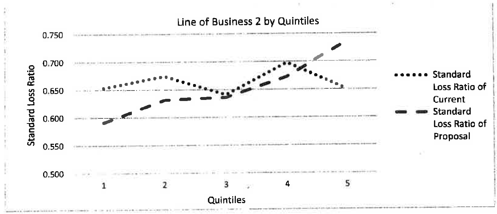
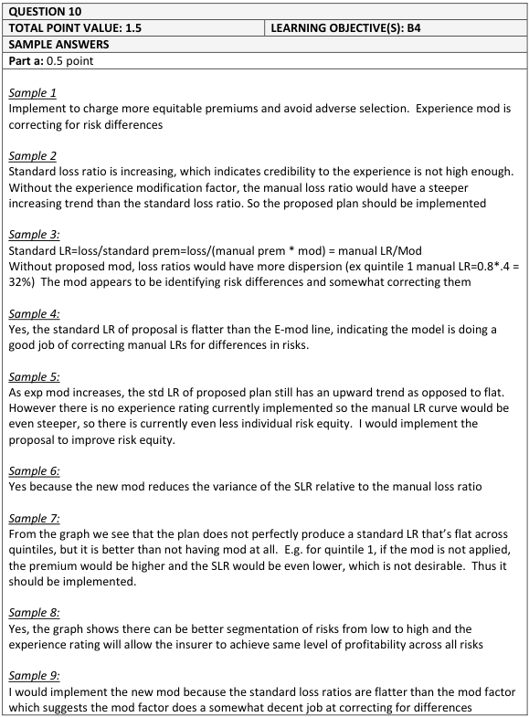
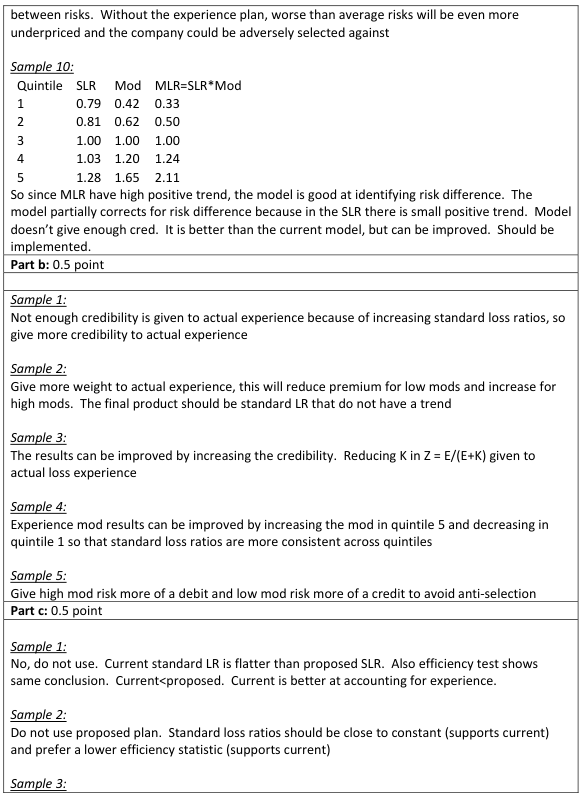
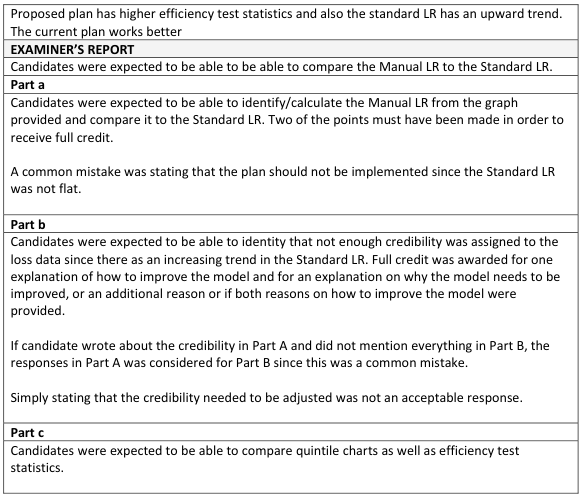

# 2019 Exam 8 - Q10

**Points:** 1.5

## Question

An actuary has created new models to calculate the experience modification factor for two lines of business.

Given the following:

- Line of business 1 (currently does not use experience rating)

## Solution

### Part a

The LOB 1 graph would have the quintiles based on the proposed experience mods sorted in increasing order, which can be seen in the dashed curve in the graph. Basically, we would want to implement experience rating if the standard loss ratio curve is flatter than the manual loss ratio curve (which we could obtain by multiplying standard loss ratios by the mods). We can tell this is the case already because the standard loss ratio curve is flatter than the mod factor curve.

Since the proposed standard LRs are flatter than the experience mod factor curve, the standard LRs will reduce the variance in the manual LRs. As such, experience rating should be implemented and will result in greater risk equity.

### Part b

Since there is a positive trend in the standard LRs, the plan gives too little credibility to actual experience. By increasing the credibility given to actual experience, the standard LR curve will become even flatter and variance in the standard LRs between risks will reduce.

### Part c

The standard LRs of the current plan are flatter (less variance) than the proposed plan. The efficiency test stat for the current plan is also lower, indicated lower variance. As such, the current plan should be kept as it is superior to the proposed plan.

## Examiner Report

- Line of business 2 (currently uses experience rating)

| Line of Business 2 | Efficiency Test |
| --- | --- |
| Current Plan | 0.0346 |
| Proposed Plan | 0.1184 |

For both lines of business, assume that the cost of implementation is negligible.

### Part a (0.50 pts)

For line of business 1, evaluate whether the new experience modification should be implemented.

### Part b (0.50 pts)

For line of business 1, describe a way to improve the results of the experience modification.

### Part c (0.50 pts)

For line of business 2, evaluate whether the proposed plan should be used.

Examiner report solutions and comments:

