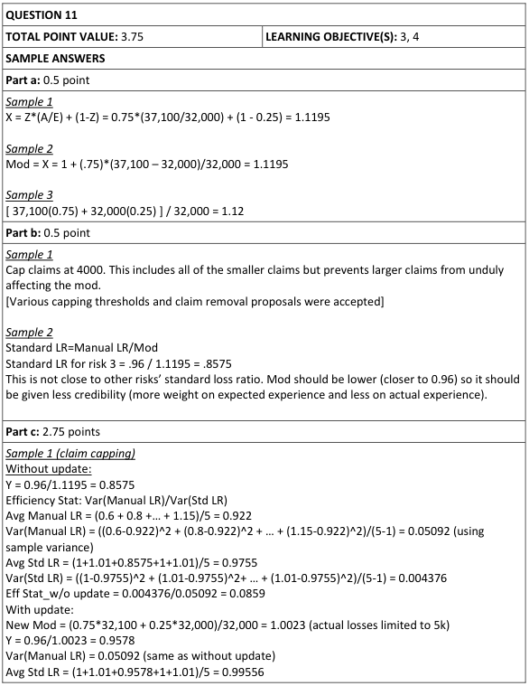
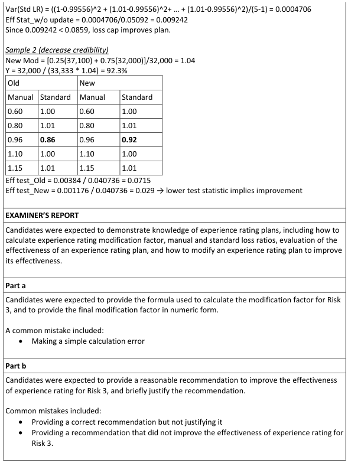
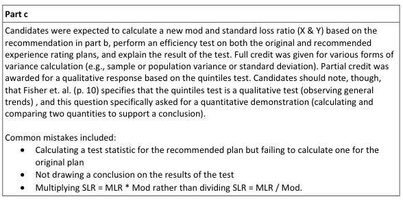

# 2019 Exam 8 - Q11

**Points:** 3.75

## Question

Consider the following sample of five insurance risks which have been experience rated:

| Risk | Mod | Manual Loss Ratio | Standard Loss Ratio |
| --- | --- | --- | --- |
| 1 | 0.60 | 0.60 | 1.00 |
| 2 | 0.79 | 0.80 | 1.01 |
| 3 | X | 0.96 | Y |
| 4 | 1.10 | 1.10 | 1.00 |
| 5 | 1.14 | 1.15 | 1.01 |

The actual claims for Risk 3 in the experience period are as follows:

| Claim # | Incurred Loss Amount |
| --- | --- |
| 001 | 3,200 |
| 002 | 3,000 |
| 003 | 2,800 |
| 004 | 2,700 |
| 005 | 3,300 |
| 006 | 2,900 |
| 007 | 10,000 |
| 008 | 3,100 |
| 009 | 3,000 |
| 010 | 3,100 |
| Total | 37,100 |

| B | C |
| --- | --- |
| 32,000 | Expected Losses for Risk 3 in the experience period |
| 0.75 | Credibility factor |

### Part a (0.50 pts)

Calculate the modification factor, X, for Risk 3.

### Part b (0.50 pts)

Provide a recommendation to improve the effectiveness of experience rating for Risk 3 and briefly justify.

### Part c (2.75 pts)

Show, quantitatively, that the recommendation in part (b) above improves the plan. Assume no other risks are impacted by the recommendation.

## Solution

### Part a

We aren't really given any information about how the experience mod calculation works for this hypothetical plan (e.g., are losses limited). As such, we can assume it is just a basic calculation.

Mod — 1.12 — `=(B29*D26+(1-B29)*B28)/B28` — Mod = [ZA + (1-Z)E]/E

### Part b

**Std LR for risk 3 with curr mod:** 0.86 — `=E9/L5`

Our choice here is important given that part (c) is worth 2.75 points and relates to this answer. The choice of what to do isn't obvious, but it likely has to relate to the fact that we are given the actual claim level detail for risk 3. Furthermore, the standard loss ratio of 0.86 for risk 3 is not in-line with the other flat standard loss ratios around 1. So we will want to end up with a lower experience mod for risk 3, so the risk 3 standard LR will be close to 1. So a seemingly natural choice would be to cap individual claims, as that would reduce the actual loss for the 10,000 claim, which would bring the mod and standard LR closer to what we would want. However, really this would be inappropriate unless we also made a corresponding adjustment to the expected losses, and we have no way to do that in this problem. This cap should then also apply to the other risks, but we don't know their claim detail so we don't know how this will impact their mods and standard loss ratios. Also, it feels odd to consider a 10,000 claim to be large, but relative to the other claims, it is clearly an outlier. Either way, the choice of a cap level here seems somewhat arbitrary, so I'll choose 3,500 as it doesn't impact any other claims. The graders also accepted answers about reducing credibility, though in my opinion, that is even more arbitrary a choice, and ignores that we are given the claim level detail for risk 3.

The mod for risk 3 is too large, and results in too low a Standard LR. As such, cap the outlier claim of 10,000 at a cap level of 3,500, as this should produce a more reasonable result.

### Part c

**Actual losses capped at 3,500 per claim:** 30,600 — `=D26-(D22-3500)`

Assume no impact to expected losses from cap

**Mod:** 0.97 — `=(B29*N28+(1-B29)*B28)/B28`

**New standard LR for risk 3:** 0.99 — `=E9/N32`

While it is already obvious that this has improved the plan by flattening the standard LRs (assuming the cap had no impact on the other risks), given the point value and the question prompt to show the improvement quantitatively, I'll calculate the variance in standard LRs before and after to show the improvement.

Assume the cap had no impact on the std LRs for the other risks.

| J | P |
| --- | --- |
| Sample variance of standard LRs with old risk 3 mod | 0.00438 |
| Sample variance of standard LRs with new risk 3 mod | 0.00006 |

Formulas

- `P42` = `=VAR.S(N7,F7,F8,F10,F11)`
- `P43` = `=VAR.S(N34,F7,F8,F10,F11)`

The new standard LR is much closer to 1 and is much more in-line with the other risks, so this reduces the variance in the standard loss ratios and thus improves the plan performance.

## Examiner Report

Examiner report solutions and comments:

