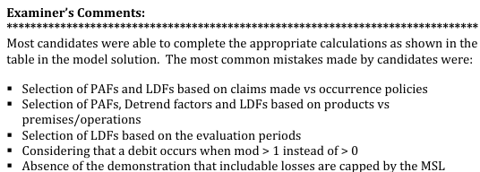

# 2012 Exam 8 - Q14

**Points:** 4

## Question

The following information applies for a commercial general liability insured:

- All historical policies were effective January 1 to December 31.
- All historical policies were written on an occurrence basis.
- The policy effective January 1, 2013 will be on a claims made basis.
- The risk is products/completed operations only.
- Experience is being evaluated as of June 30, 2012.
- A large loss is defined as $250,000 or more in combined basic limit indemnity and ALAE.

| B | C |
| --- | --- |
| $100,000 | Annual basic limits premium |
| 70% | Expected loss ratio |

Assuming all losses that occurred in the experience period meet the requirements to be defined as large losses, calculate the minimum number of large losses that must have occurred to trigger a debit modification for policy year 2013.

## Solution

**BLEL:** $70,000 — `=B13*B14`

The new policy will be a first year claims-made and only has products/completed operations coverage. All historical policies were on an occurrence basis. Use Detrend factors for products/completed operations by year.

Lookup the LDFs from the manual for products/completed operations. Note that we measure from the start of each policy term in the historical period to the evaluation date of 6/30/2012. As such, the appropriate LDFs are for 18 months (1/1/2011 - 6/30/2012), 30 months (1/1/2010 - 6/30/2012), and 42 months (1/1/2009 - 6/30/2012).

| Year | BLEL | PAF 13B | PAF 13C | Detrend | CSLC | EER | LDF | Expected Dev |
| --- | --- | --- | --- | --- | --- | --- | --- | --- |
| Latest | $70,000 | 2.39 | 1 | 0.882 | $147,559 | 0.958 | 0.701 | 99,094.158299 |
| 2nd | $70,000 | 2.39 | 1 | 0.828 | $138,524 | 0.958 | 0.543 | 72,059.561734 |
| 3rd | $70,000 | 2.39 | 1 | 0.777 | $129,992 | 0.958 | 0.390 | 48,567.648402 |
| Total |  |  |  |  | $416,075 |  |  | $219,721 |

Formulas

- `J13` = `=J$2`
- `N13` = `=PRODUCT(J13:M13)`
- `O13` = `=L$20`
- `Q13` = `=PRODUCT(N13:P13)`
- `J14` = `=J$2`
- `N14` = `=PRODUCT(J14:M14)`
- `O14` = `=L$20`
- `Q14` = `=PRODUCT(N14:P14)`
- `J15` = `=J$2`
- `N15` = `=PRODUCT(J15:M15)`
- `O15` = `=L$20`
- `Q15` = `=PRODUCT(N15:P15)`
- `N16` = `=SUM(N13:N15)`
- `Q16` = `=SUM(Q13:Q15)`

Lookup CLSC of 416,075 in Table 16 to get:

| K | L |
| --- | --- |
| Z | 0.54 |
| EER | 0.958 |
| MSL | 216,150 |

Note that a debit mod (Mod > 0) occurs when the AER is greater than the EER (i.e., AER - EER > 0) Since AER = (Actual basic limits losses and ALAE limited by MSL + Expected Development) / CSLC, we have (Actual basic limits losses and ALAE limited by MSL + Expected Development) / CSLC - EER > 0 So Actual basic limits losses and ALAE limited by MSL > EER * CSLC - Expected Development

**For a debit mod, Actual basic limits losses and ALAE limited by MSL >:** $178,879 — `=L20*N16-Q16`

Therefore, only 1 large loss ($250k+, that will be limited at the MSL of $216,150) is sufficient to trigger a debit mod.

## Examiner Report

Examiner report comments:

