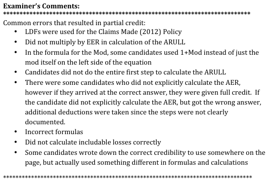

# 2013 Exam 8 - Q8

**Points:** 2.75

## Question

Given the following information for a general liability policy, determine the value of X that yields an experience modification of +4.5%.

- Effective period of the policy: January 1 to December 31, 2014.
- Type of policy being rated: Claims-made

Loss Experience

| Policy period | Type of Policy | Includable Losses in Experience Period (Limited by MSL) |
| --- | --- | --- |
| January 1, 2012, to December 31, 2012 | Claims-made | X |
| January 1, 2011, to December 31, 2011 | Occurrence | $72,234 |
| January 1, 2010, to December 31, 2010 | Occurrence | $30,484 |
| Total |  | $102,718 + X |

| Policy Period | Coverage | Company Subject Loss Cost |
| --- | --- | --- |
| Latest Policy Year | Prem/Ops | $32,160 |
|  | Products | $6,679 |
| Prior Policy Year | Prem/Ops | $42,832 |
|  | Products | $14,137 |
| Next Prior Policy Year | Prem/Ops | $38,695 |
|  | Products | $13,327 |
| Total |  | $147,830 |

| Subject Loss Cost | Credibility | Expected Experience Ratio | Maximum Single Loss |
| --- | --- | --- | --- |
| $138,763 - $145,183 | 0.33 | 0.866 | $109,200 |
| $145,184 - $151,800 | 0.34 | 0.870 | $111,400 |
| $151,801 - $158,621 | 0.35 | 0.874 | $113,700 |
| $158,622 - $165,658 | 0.36 | 0.878 | $116,050 |
| $165,659 - $172,920 | 0.37 | 0.882 | $118,450 |

## Solution

We are given that the Mod = 0.045, and we are also given the total Company Subject Loss Cost of $147,830, which we can use to lookup the values of Z and EER in the table given in the problem.

Lookup CSLC = 147,830 to get

| J | K |
| --- | --- |
| Z | 0.34 |
| EER | 0.870 |

Formulas

- `K6` = `=D28`
- `K7` = `=E28`

Mod = Z * (AER - EER)/EER. Solve for AER = (Mod/Z)*EER + EER

**AER:** 0.985 — `=0.045/K6*K7+K7`

Now we can calculate the Expected Development. Note that since the 2012 policy was a claims-made policy, we have LDFs of 0 for that year instead of the LDFs given in the table.

| EER | LDF | Expected Dev |
| --- | --- | --- |
| 0.870 | 0 | $0 |
| 0.870 | 0 | $0 |
| 0.870 | 0.338 | $12,595 |
| 0.870 | 0.637 | $7,835 |
| 0.870 | 0.198 | $6,666 |
| 0.870 | 0.528 | $6,122 |

Formulas

- `I18` = `=K$7`
- `K18` = `=E18*I18*J18`
- `I19` = `=K$7`
- `K19` = `=E19*I19*J19`
- `I20` = `=K$7`
- `J20` = `=E35`
- `K20` = `=E20*I20*J20`
- `I21` = `=K$7`
- `J21` = `=E36`
- `K21` = `=E21*I21*J21`
- `I22` = `=K$7`
- `J22` = `=F35`
- `K22` = `=E22*I22*J22`
- `I23` = `=K$7`
- `J23` = `=F36`
- `K23` = `=E23*I23*J23`

**Total:** $33,217 — `=SUM(K18:K23)`

AER = (102718+X + 33217)/147830 = 0.985

**X:** $9,699 — `=J11*E24-K25-SUM(E13:E14)`

## Examiner Report

Loss Development Factors

| Subline | Latest Policy Year | Prior Policy Year | Next Prior Policy Year |
| --- | --- | --- | --- |
| Prem/Ops | 0.519 | 0.338 | 0.198 |
| Products | 0.766 | 0.637 | 0.528 |

Examiner report comments:

