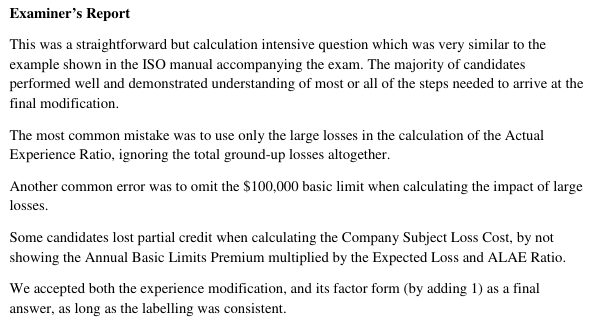

# 2015 Exam 8 - Q9

**Points:** 3.25

## Question

Given the following Premises/Operations General Liability loss experience evaluated as of September 1, 2013:

| Policy Effective Date | Policy Type | Total Ground-Up Incurred Loss | Total Ground-Up Incurred ALAE |
| --- | --- | --- | --- |
| March 1, 2010 to February 28, 2011 | Occurrence | 1,500,000 | 600,000 |
| March 1, 2011 to February 29, 2012 | Occurrence | 400,000 | 400,000 |
| March 1, 2012 to February 28, 2013 | Occurrence | 350,000 | 2,000,000 |
| March 1, 2013 to February 28, 2014 | Occurrence | 150,000 | 20,000 |

- The insured has experienced the following ground-up large losses:

| Accident Date | Incurred Loss | Incurred ALAE |
| --- | --- | --- |
| 2010-06-30 | 700,000 | 500,000 |
| 2011-12-31 | 150,000 | 200,000 |
| 2012-04-05 | 55,000 | 60,000 |

| B | C |
| --- | --- |
| $800,000 | Annual Basic Limits Premium |
| 80% | Expected Loss and ALAE Ratio |

A new policy will become effective March 1, 2014 to February 28, 2015 and will be written on an occurrence basis.

Using the ISO Commercial General Liability Experience and Schedule Rating Plan, calculate the experience modification factor used to price this policy.

## Solution

I assume that other than the large losses listed, all claims have a loss component below the basic loss limit of $100k and a basic limits loss + ALAE below the MSL. We need to consider the losses 1 year at a time to properly account for the large losses potentially being capped by basic limits and the MSL.

PY 2012 large loss on 4/5/2012 is below basic limit loss and MSL, so use PY 2012 totals directly:

PY 2012 loss+ALAE

While it is hard to believe that the PY 2012 ALAE of $2M is not due to a large claim that needs to be capped by the MSL, no such large claim is given, so we must assume that the $2M was caused by many claims that would each fall below the MSL.

PY 2011 large loss on 12/31/2011 needs to be capped by the basic limit of $100k, and then the totals need to be adjusted for this by removing the uncapped large claim amount and adding the capped amount back in.

12/31/2011 basic limit loss + ALAE capped by MSL PY 2011 loss + ALAE

PY 2010 large loss on 6/30/2010 needs to be capped by the basic limit of $100k and then by the MSL.

6/30/2010 basic limit loss + ALAE capped by MSL PY 2010 loss + ALAE

Total loss + ALAE from experience

The new policy is effective 3/1/2014, so the experience period will be from 3/1/2010 to 2/28/2013. The 3/1/2013 policy data is irrelevant and is not used.

**BLEL:** $640,000 — `=B20*B21`

The PAFs are both 1 since all policies are occurrence. Detrend factors are for prem/ops. LDFs are based on 3/1/201X to 9/1/2013, so 3/1/2012 is at 18 months as of 9/1/2013.

| PY | BLEL | PAF 13B | PAF 13C | Detrend | CSLC | EER | LDF | Expected Dev |
| --- | --- | --- | --- | --- | --- | --- | --- | --- |
| 2,012 | $640,000 | 1 | 1 | 0.916 | 586,240 | 0.995 | 0.570 | 332,486 |
| 2,011 | $640,000 | 1 | 1 | 0.876 | 560,640 | 0.995 | 0.355 | 198,032 |
| 2,010 | $640,000 | 1 | 1 | 0.839 | 536,960 | 0.995 | 0.187 | 99,909 |
| Total |  |  |  |  | $1,683,840 |  |  | 630,428 |

Formulas

- `C39` = `=C$33`
- `G39` = `=PRODUCT(C39:F39)`
- `H39` = `=D$46`
- `J39` = `=PRODUCT(G39:I39)`
- `C40` = `=C$33`
- `G40` = `=PRODUCT(C40:F40)`
- `H40` = `=D$46`
- `J40` = `=PRODUCT(G40:I40)`
- `C41` = `=C$33`
- `G41` = `=PRODUCT(C41:F41)`
- `H41` = `=D$46`
- `J41` = `=PRODUCT(G41:I41)`
- `G42` = `=SUM(G39:G41)`
- `J42` = `=SUM(J39:J41)`

Lookup CSLC of 1,683,840 to get:

| C | D |
| --- | --- |
| Z | 0.83 |
| EER | 0.995 |
| MSL | 599,050 |

**AER:** 3.106 — `=(M24+J42)/G42`

Mod — 1.76 — `=D45*(D49-D46)/D46` — Mod = Z * (AER - EER)/EER

**Factor:** 2.76 — `=1+D51`

2,350,000 — `=E10+F10`

300,000 — `=MIN(MIN(D17,100000)+E17,D47)`

750,000 — `=SUM(E9:F9)-SUM(D17:E17)+M16`

599,050 — `=MIN(MIN(D16,100000)+E16,D47)`

1,499,050 — `=SUM(E8:F8)-SUM(D16:E16)+M21`

4,599,050 — `=M7+M17+M22`

## Examiner Report

Examiner report comments:

