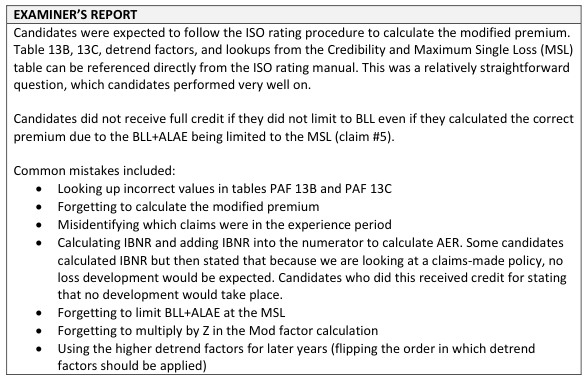

# 2017 Exam 8 - Q9

**Points:** 3.25

## Question

Consider the following claims-made commercial general liability policy:

- The insurance contract was originally written January 1, 2011, and has been renewed annually

as a claims-made policy.

- Loss experience is evaluated as of June 30, 2016.
- There is no products exposure.

| B | C |
| --- | --- |
| $200,000 | Annual Premises/Operations basic limits manual premium |
| 70% | Expected loss ratio |

| Claim Number | Policy Year | Indemnity | ALAE |
| --- | --- | --- | --- |
| 1 | 2,011 | $5,000 | $5,000 |
| 2 | 2,012 | $15,000 | $25,000 |
| 3 | 2,013 | $58,000 | $0 |
| 4 | 2,013 | $20,000 | $85,000 |
| 5 | 2,014 | $118,000 | $82,000 |
| 6 | 2,015 | $8,000 | $5,000 |

Calculate the experience modified premium for the policy effective January 1, 2017.

## Solution

Basic Loss — Basic Loss+ALAE Lim by MSL

Outside of experience period Outside of experience period

| I | J | K |
| --- | --- | --- |
| $58,000 |  | $58,000 |
| $20,000 |  | $105,000 |
| $100,000 |  | $182,000 |
| $8,000 |  | $13,000 |
|  | Total | $358,000 |

Formulas

- `I17` = `=MIN(E17,100000)`
- `K17` = `=MIN(I17+F17,E$44)`
- `I18` = `=MIN(E18,100000)`
- `K18` = `=MIN(I18+F18,E$44)`
- `I19` = `=MIN(E19,100000)`
- `K19` = `=MIN(I19+F19,E$44)`
- `I20` = `=MIN(E20,100000)`
- `K20` = `=MIN(I20+F20,E$44)`
- `K21` = `=SUM(K17:K20)`

Although not explicitly said, we clearly need to use the ISO manual to solve this problem. The 2011 would be the 1st year claims-made, 2012 would be 2nd year, 2013 would be 3rd year, 2014 would be 4th year, and 2015 and later would be mature.

Experience period: PYs 2013, 2014, 2015

**BLEL:** $140,000 — `=B11*B12`

Since all policies are claims-made, no expected development.

| PY | CM Year | BLEL | PAF 13B | PAF 13C | Detrend | CSLC |
| --- | --- | --- | --- | --- | --- | --- |
| 2,015 | Mature | $140,000 | 1.05 | 0.94 | 0.916 | $126,573 |
| 2,014 | 4th | $140,000 | 1.05 | 0.84 | 0.876 | $108,168 |
| 2,013 | 3rd | $140,000 | 1.05 | 0.78 | 0.839 | $96,200 |
| Total |  |  |  |  |  | $330,941 |

Formulas

- `D36` = `=C$31`
- `H36` = `=PRODUCT(D36:G36)`
- `D37` = `=C$31`
- `H37` = `=PRODUCT(D37:G37)`
- `D38` = `=C$31`
- `H38` = `=PRODUCT(D38:G38)`
- `H39` = `=SUM(H36:H38)`

Lookup 330,941 in Table 16 to get

| D | E |
| --- | --- |
| Z | 0.48 |
| EER | 0.944 |
| MSL | 188,550 |

**AER:** 1.082 — `=K21/H39`

Mod — 0.07 — `=E42*(C46-E43)/E43` — Mod = Z * (AER - EER)/EER

Now, the modified premium would be the modification in factor form times the premium for the 2017 policy. The only 2017 premium we have is BASIC LIMITS premium of 200k, though there is no indication that the policy we are rating has basic limits. As such, the only reasonable option here is to assume the 200k applies to the 2017 policy, which is the same thing as assuming the 2017 policy has selected basic limits. I don't think this assumption needs to be stated for full credit, as I think it is a minor oversight on the part of the question writer.

**Modified Prem:** $214,010 — `=(1+C48)*B11`

## Examiner Report

Examiner report comments:

