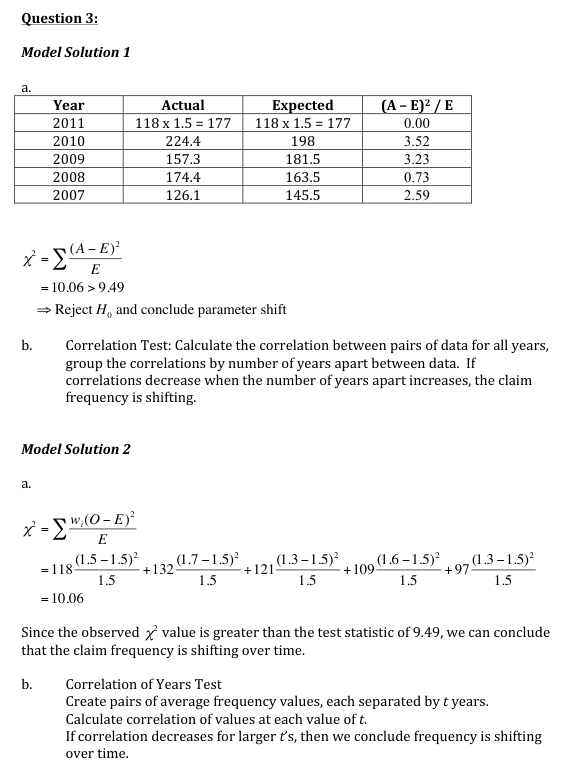
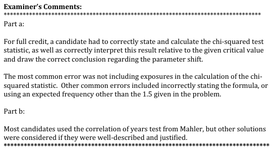

# 2012 Exam 8 - Q3

**Points:** 1.75

## Question

The table below shows property claim frequency by year for the last five years.

| Year | Exposures | Frequency |
| --- | --- | --- |
| 2,011 | 118 | 1.5 |
| 2,010 | 132 | 1.7 |
| 2,009 | 121 | 1.3 |
| 2,008 | 109 | 1.6 |
| 2,007 | 97 | 1.3 |

| B | C |
| --- | --- |
| 1.5 | Assume that claim frequencies are Poisson distributed with a mean of 1.5. |
| 9.49 | The critical value for the relevant chi-squared distribution |

### Part a (1.25 pts)

Calculate the chi-squared test statistic for whether the claim frequency is shifting over time. Interpret the result.

### Part b (0.50 pts)

Describe a second method for testing whether the claim frequency is shifting over time.

## Solution

### Part a

| Year | Actual Counts | Expected Counts | Chi-squared |
| --- | --- | --- | --- |
| 2,011 | 177 | 177 | 0 |
| 2,010 | 224.4 | 198 | 3.52 |
| 2,009 | 157.3 | 181.5 | 3.226667 |
| 2,008 | 174.4 | 163.5 | 0.726667 |
| 2,007 | 126.1 | 145.5 | 2.586667 |
| Total |  |  | 10.06 |

Formulas

- `C25` = `=D7*E7`
- `D25` = `=D7*B$13`
- `F25` = `=(C25-D25)^2/D25`
- `C26` = `=D8*E8`
- `D26` = `=D8*B$13`
- `F26` = `=(C26-D26)^2/D26`
- `C27` = `=D9*E9`
- `D27` = `=D9*B$13`
- `F27` = `=(C27-D27)^2/D27`
- `C28` = `=D10*E10`
- `D28` = `=D10*B$13`
- `F28` = `=(C28-D28)^2/D28`
- `C29` = `=D11*E11`
- `D29` = `=D11*B$13`
- `F29` = `=(C29-D29)^2/D29`
- `F30` = `=SUM(F25:F29)`

Since the observed chi-squared test statistic of 10.06 is greater than the table value of 9.49, we can conclude that the claim frequency is shifting over time.

Note: the table value of 9.49 represents the chi-squared value with 4 degrees of freedom and α = 0.05. Since we didn't have to estimate the expected frequency from the sample data, technically we should have used the table value based on 5 degrees of freedom, which would have been 11.07, in which case we wouldn't have been able to conclude that frequency was shifting over time.

### Part b

Correlation Test

Calculate the correlation for t = 1, i.e., the correlation between the insurer's history and the insurer's history lagged 1 year. Repeat the prior step for all values of t. Now look at whether the correlations decrease for larger values of t, and if so, then we conclude frequency is shifting over time.

## Examiner Report

Examiner report solutions and comments:

