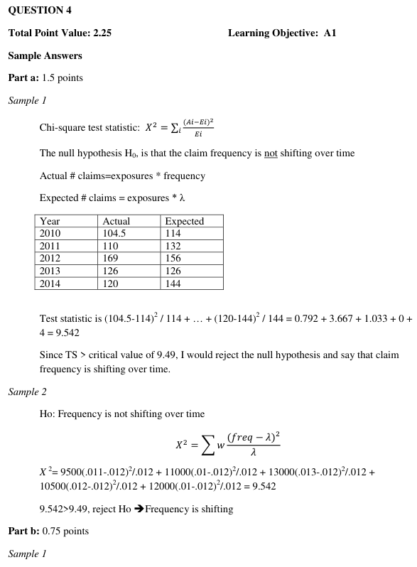
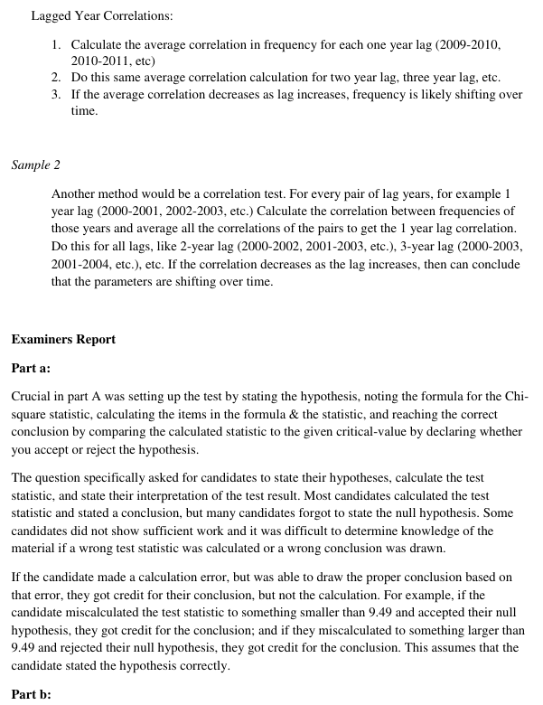
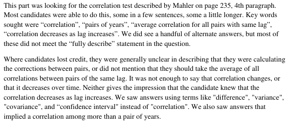

# 2015 Exam 8 - Q4

**Points:** 2.25

## Question

An actuary is reviewing an account that has been with the company for over ten years. Given the following:

The recorded frequency for the last five years is as follows:

| Year | Exposures | Frequency |
| --- | --- | --- |
| 2,010 | 9,500 | 0.011 |
| 2,011 | 11,000 | 0.010 |
| 2,012 | 13,000 | 0.013 |
| 2,013 | 10,500 | 0.012 |
| 2,014 | 12,000 | 0.010 |

| B | C |
| --- | --- |
| 0.012 | The claim frequency for this account follows a Poisson distribution, with λ = 0.012 |
| 9.49 | The critical value for the relevant Chi-squared distribution |

### Part a (1.50 pts)

Use the Chi-squared test to evaluate whether the claim frequency is shifting over time. Include the hypothesis, test statistic, and provide an interpretation of the result.

### Part b (0.75 pts)

Fully describe another method for determining whether claim frequency is shifting over time.

## Solution

### Part a

Null hypothesis: Each of the years was drawn from a distribution with the same mean frequency.

Reject this if Chi-squared test statistic > 9.49

| Year | Actual Counts | Expected Counts | Chi-squared |
| --- | --- | --- | --- |
| 2,011 | 104.5 | 114 | 0.791667 |
| 2,010 | 110 | 132 | 3.666667 |
| 2,009 | 169 | 156 | 1.083333 |
| 2,008 | 126 | 126 | 0 |
| 2,007 | 120 | 144 | 4 |
| Total |  |  | 9.541667 |

Formulas

- `C33` = `=D10*E10`
- `D33` = `=D10*B$16`
- `F33` = `=(C33-D33)^2/D33`
- `C34` = `=D11*E11`
- `D34` = `=D11*B$16`
- `F34` = `=(C34-D34)^2/D34`
- `C35` = `=D12*E12`
- `D35` = `=D12*B$16`
- `F35` = `=(C35-D35)^2/D35`
- `C36` = `=D13*E13`
- `D36` = `=D13*B$16`
- `F36` = `=(C36-D36)^2/D36`
- `C37` = `=D14*E14`
- `D37` = `=D14*B$16`
- `F37` = `=(C37-D37)^2/D37`
- `F38` = `=SUM(F33:F37)`

Since the observed chi-squared test statistic of 9.54 is greater than the table value of 9.49, we can conclude that the claim frequency is shifting over time.

Note: the table value of 9.49 represents the chi-squared value with 4 degrees of freedom and α = 0.05. Since we didn't have to estimate the expected frequency from the sample data, technically we should have used the table value based on 5 degrees of freedom, which would have been 11.07, in which case we wouldn't have been able to conclude that frequency was shifting over time.

### Part b

Correlation Test

Calculate the correlation for t = 1, i.e., the correlation between the account's history and the account's history lagged 1 year. Repeat the prior step for all values of t. Now look at whether the correlations decrease for larger values of t, and if so, then we conclude frequency is shifting over time.

## Examiner Report

Examiner report solutions and comments:

