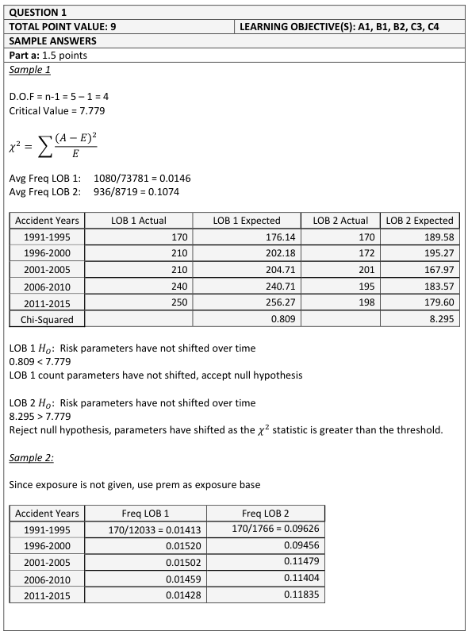
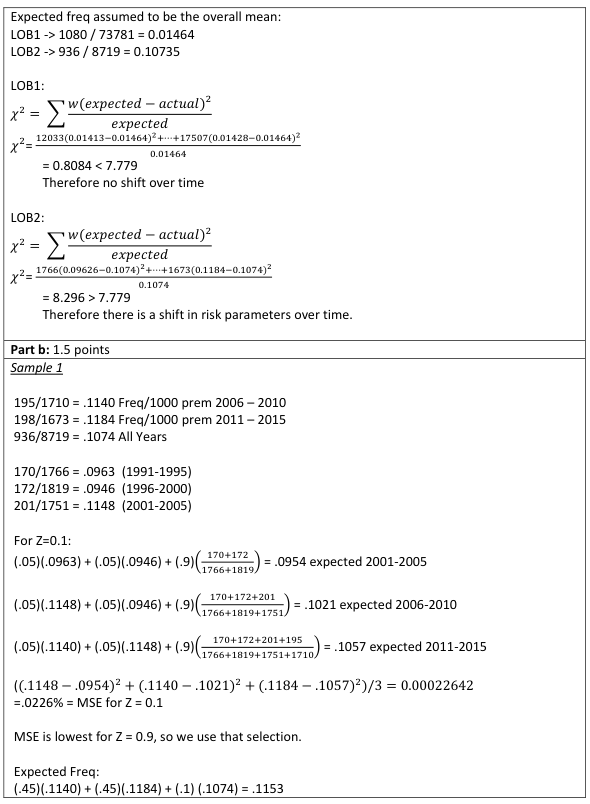
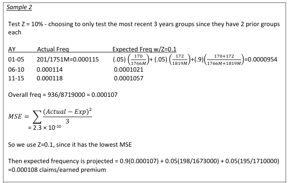
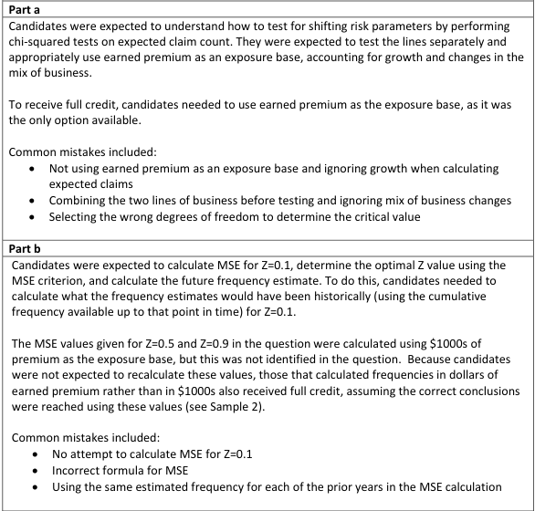
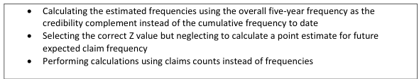

# 2018 Exam 8 - Q1a-b

**Points:** 3

## Question

An insurance company is planning to expand into a new territory and has decided to review its historical loss experience in order to determine whether it will require additional capital to support the expansion.

The insurance company has engaged an actuarial consultant to provide insights into a prospective loss ratio for the new territory. The following table outlines the insurance company's historical experience for two long-tailed lines of business (LOB):

|   | Earned Premiums |   | Ultimate Losses |   | Ultimate Claim Counts |   |
| --- | --- | --- | --- | --- | --- | --- |
| Accident Years | LOB 1 | LOB 2 | LOB 1 | LOB 2 | LOB 1 | LOB 2 |
| 1991-1995 | $12,033,000 | $1,766,000 | $2,329,000 | $1,236,000 | 170 | 170 |
| 1996-2000 | $13,812,000 | $1,819,000 | $2,762,000 | $1,273,000 | 210 | 172 |
| 2001-2005 | $13,985,000 | $1,751,000 | $2,797,000 | $1,506,000 | 210 | 201 |
| 2006-2010 | $16,444,000 | $1,710,000 | $3,288,000 | $1,471,000 | 240 | 195 |
| 2011-2015 | $17,507,000 | $1,673,000 | $3,350,000 | $1,439,000 | 250 | 198 |
| Total | $73,781,000 | $8,719,000 | $14,526,000 | $6,925,000 | 1,080 | 936 |

### Part a (1.50 pts)

Conduct chi-square tests with an α value of 0.10 on actual vs. expected claim counts to confirm whether or not risk parameters have shifted over time. Use the following table of critical values:

| Degrees of Freedom | Critical Value  α = 0.10 |
| --- | --- |
| 1 | 2.706 |
| 2 | 4.605 |
| 3 | 6.251 |
| 4 | 7.779 |
| 5 | 9.236 |
| 6 | 10.645 |

### Part b (1.50 pts)

To select an expected future claim frequency for LOB 2, the actuarial consultant has decided to assign equal weight (Z/2) to each of the most recent two groups of accident years and the remaining weight (1-Z) to the overall mean frequency.

Calculate the expected future claim frequency for LOB 2 by first using the mean-squared-error (MSE) criterion to determine the optimal value for Z from the following three choices:

| Z value | MSE |
| --- | --- |
| 0.10 | Not provided |
| 0.50 | 0.0190% |
| 0.90 | 0.0164% |

Accident Years 1991-1995 1996-2000 2001-2005 2006-2010 2011-2015 Total

## Solution

general, it would make more sense to look at each line separately). Furthermore, I assume the expected claim counts will be different for each line. As for how to determine those expected counts for each bucket, really we should recognize that the volume of business (Premium) has changed over time, and this will naturally result in changing expected claim counts in each bucket. The source text (Mahler) doesn't have this issue because it uses baseball data and the same number of games are played each year. Since we have 5 buckets of data, we will compare against a chi-square table with 4 degrees of freedom.

| M | Q | R |
| --- | --- | --- |
| LOB 1 expected freq per 1k prem | 1.46% | I'll show these per 1k prem for readability, otherwise the numbers are small. |
| LOB 2 expected freq per 1k prem | 10.74% | You could have also used a straight average instead of a weighted average. |

Formulas

- `Q9` = `=G19/C19*1000`
- `Q10` = `=H19/D19*1000`

Expected Counts

|   | LOB 1 | LOB 2 | LOB 1 chi-square | LOB 2 chi-square |
| --- | --- | --- | --- | --- |
|  | 176 | 190 | 0.214 | 2.023 |
|  | 202 | 195 | 0.303 | 2.774 |
|  | 205 | 188 | 0.137 | 0.903 |
|  | 241 | 184 | 0.002 | 0.711 |
|  | 256 | 180 | 0.153 | 1.885 |
| Total | 1,080 | 936 | 0.808 | 8.296 |

Formulas

- `M14` = `=Q$9*C14/1000`
- `N14` = `=Q$10*D14/1000`
- `O14` = `=(G14-M14)^2/M14`
- `R14` = `=(H14-N14)^2/N14`
- `M15` = `=Q$9*C15/1000`
- `N15` = `=Q$10*D15/1000`
- `O15` = `=(G15-M15)^2/M15`
- `R15` = `=(H15-N15)^2/N15`
- `M16` = `=Q$9*C16/1000`
- `N16` = `=Q$10*D16/1000`
- `O16` = `=(G16-M16)^2/M16`
- `R16` = `=(H16-N16)^2/N16`
- `M17` = `=Q$9*C17/1000`
- `N17` = `=Q$10*D17/1000`
- `O17` = `=(G17-M17)^2/M17`
- `R17` = `=(H17-N17)^2/N17`
- `M18` = `=Q$9*C18/1000`
- `N18` = `=Q$10*D18/1000`
- `O18` = `=(G18-M18)^2/M18`
- `R18` = `=(H18-N18)^2/N18`
- `M19` = `=SUM(M14:M18)`
- `N19` = `=SUM(N14:N18)`
- `O19` = `=SUM(O14:O18)`
- `R19` = `=SUM(R14:R18)`

**4 degrees of freedom, so table value:** 7.779 — `=C29`

Since 0.808 < 7.779, conclude LOB 1 risk parameters have not shifted over time

Since 8.296 > 7.779, conclude LOB 2 risk parameters have shifted over time

To be technically precise for LOB 1, you would say that there isn't enough evidence to conclude that risk parameters have shifted.

### Part b

Although it isn't stated anywhere in the question, the MSE values seem to be based on LOB 2 only and are based on comparing frequency per $1k of Earned Premium. You would have needed to figure that out based on the MSE magnitudes because otherwise your comparison for the MSE for Z=0.10 to the given MSE values wouldn't be appropriate. The source text uses data from all teams to find the optimal credibility, so the natural assumption here would have been to use both LOBs to find the optimal credibility. However, given the immense amount of time required for this, I'll only use LOB 2 (though as it turns out here, the SSE contribution from LOB 1 is practically 0, so including/excluding LOB 1 doesn't make a significant difference numerically).

First, I'll calculate the MSE for Z = 0.10. In the source material, the overall mean frequency would really be the expected frequency of the class containing the risk that we are experience rating. In this context, we are using an entirely different meaning, i.e., the cumulative frequency for the risk (LOB 2 in this case) since the beginning of time. Note that it wouldn't make sense to use the overall mean frequency that includes data from yet unseen years when calculating historical estimated frequencies for use in getting the MSE.

Since question unclear, use LOB 2 only to obtain MSE for Z = 0.10

Mean Freq per 1k — Actual Freq per 1k — Z of 0.1 estimate — SSE

9.63% — `=H14/D14*1000`

9.46% — `=H15/D15*1000`

| M | N | P | R |
| --- | --- | --- | --- |
| 9.54% | 11.48% | 9.54% | 0.0376% |
| 10.18% | 11.40% | 10.21% | 0.0144% |
| 10.47% | 11.84% | 10.57% | 0.0160% |

Formulas

- `M51` = `=SUM(H$14:H15)/SUM(D$14:D15)*1000`
- `N51` = `=H16/D16*1000`
- `P51` = `=0.1/2*N50+0.1/2*N49+(1-0.1)*M51`
- `R51` = `=(N51-P51)^2`
- `M52` = `=SUM(H$14:H16)/SUM(D$14:D16)*1000`
- `N52` = `=H17/D17*1000`
- `P52` = `=0.1/2*N51+0.1/2*N50+(1-0.1)*M52`
- `R52` = `=(N52-P52)^2`
- `M53` = `=SUM(H$14:H17)/SUM(D$14:D17)*1000`
- `N53` = `=H18/D18*1000`
- `P53` = `=0.1/2*N52+0.1/2*N51+(1-0.1)*M53`
- `R53` = `=(N53-P53)^2`

0.0679% — `=SUM(R51:R53)`

**MSE:** 0.0226% — `=R54/COUNT(R51:R53)`

This MSE for low credibility being the highest makes sense given the shifting risk parameters for LOB 2 from part (a). With shifting risk parameters, old years are less related to future years than more recent years, so relatively more credibility should be given to more recent years.

Since Z of 0.9 MSE of 0.0164% is lowest, use Z = 0.90.

**Future LOB 2 freq estimate to $1k EP:** 11.53% — `=0.9/2*N53+0.9/2*N52+(1-0.9)*Q10`

## Examiner Report

Examiner report solution and comments:

