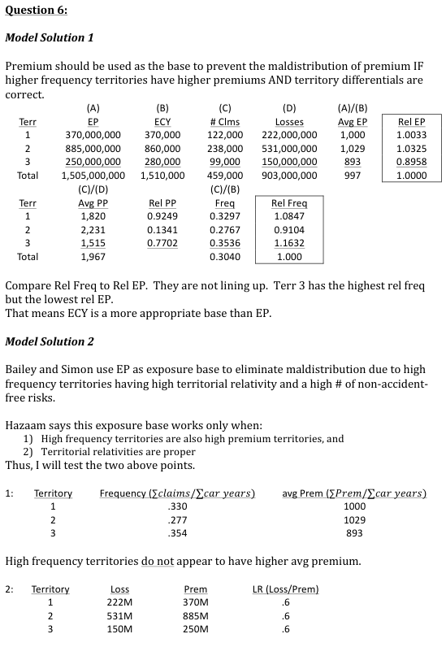
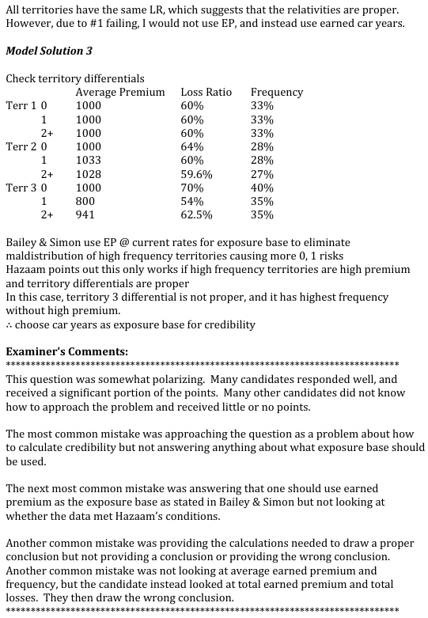

# 2012 Exam 8 - Q6

**Points:** 2.5

## Question

An insurance company has a private passenger auto book of business with the following claims experience:

| Territory | Years Since Last Accident | Earned Premium at Present Rates for Two Years Since Last Accident | Earned Car Years | Number of Claims | Incurred Loss |
| --- | --- | --- | --- | --- | --- |
| 1 | 0 | $15,000,000 | 15,000 | 5,000 | $9,000,000 |
| 1 | 1 | $125,000,000 | 125,000 | 41,000 | $75,000,000 |
| 1 | 2+ | $230,000,000 | 230,000 | 76,000 | $138,000,000 |
| 2 | 0 | $25,000,000 | 25,000 | 7,000 | $16,000,000 |
| 2 | 1 | $310,000,000 | 300,000 | 84,000 | $187,000,000 |
| 2 | 2+ | $550,000,000 | 535,000 | 147,000 | $328,000,000 |
| 3 | 0 | $10,000,000 | 10,000 | 4,000 | $7,000,000 |
| 3 | 1 | $80,000,000 | 100,000 | 35,000 | $43,000,000 |
| 3 | 2+ | $160,000,000 | 170,000 | 60,000 | $100,000,000 |

Choose an appropriate exposure base for calculating credibility. Justify the selection.

## Solution

The graders were looking for a solution here based on the text, so they wanted you to check how frequency correlates with premiums and whether loss ratios were flat. Based on that, they wanted you to conclude that you should use car-years as the base. That said, so long as territory relativities are proper, it would be fine to use premium as the base, though the graders didn't give credit for that.

Premium should be used as the exposure base to prevent the maldistribution of premium if higher frequency territories have higher premiums and territory relativities are proper. Testing this with the data shows:

| Territory | Freq | avg Prem | Loss Ratio |
| --- | --- | --- | --- |
| 1 | 0.330 | 1,000 | 0.6 |
| 2 | 0.277 | 1,029.069767 | 0.6 |
| 3 | 0.354 | 892.857143 | 0.6 |

Formulas

- `K12` = `=SUMIF($B$8:$B$16,$J12,$F$8:$F$16)/SUMIF($B$8:$B$16,$J12,$E$8:$E$16)`
- `L12` = `=SUMIF($B$8:$B$16,$J12,$D$8:$D$16)/SUMIF($B$8:$B$16,$J12,$E$8:$E$16)`
- `M12` = `=SUMIF($B$8:$B$16,$J12,$G$8:$G$16)/SUMIF($B$8:$B$16,$J12,$D$8:$D$16)`
- `K13` = `=SUMIF($B$8:$B$16,$J13,$F$8:$F$16)/SUMIF($B$8:$B$16,$J13,$E$8:$E$16)`
- `L13` = `=SUMIF($B$8:$B$16,$J13,$D$8:$D$16)/SUMIF($B$8:$B$16,$J13,$E$8:$E$16)`
- `M13` = `=SUMIF($B$8:$B$16,$J13,$G$8:$G$16)/SUMIF($B$8:$B$16,$J13,$D$8:$D$16)`
- `K14` = `=SUMIF($B$8:$B$16,$J14,$F$8:$F$16)/SUMIF($B$8:$B$16,$J14,$E$8:$E$16)`
- `L14` = `=SUMIF($B$8:$B$16,$J14,$D$8:$D$16)/SUMIF($B$8:$B$16,$J14,$E$8:$E$16)`
- `M14` = `=SUMIF($B$8:$B$16,$J14,$G$8:$G$16)/SUMIF($B$8:$B$16,$J14,$D$8:$D$16)`

All territories have the same Loss Ratio, which suggests the territory relativities are proper. However, higher frequency territories do not have higher average premiums. Therefore, it is advisable to use earned car years as the exposure base instead of earned premium.

## Examiner Report

Examiner report solutions and comments:

