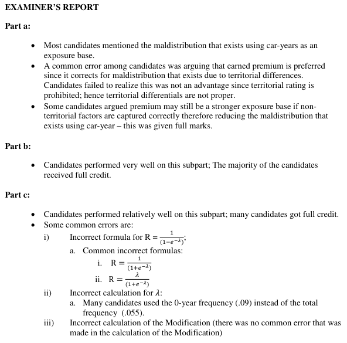

# 2015 Exam 8 - Q1

**Points:** 2.5

## Question

An actuary is evaluating a merit rating plan for private passenger cars. Given the following:

| Number of Accident-Free Years | Earned Car Years | Number of Claims Incurred |
| --- | --- | --- |
| 2 or More | 500,000 | 20,000 |
| 1 | 200,000 | 15,000 |
| 0 | 100,000 | 9,000 |
| Total | 800,000 | 44,000 |

- Frequency varies by territory.
- State law prohibits reflecting territory differences in rating.
- Annual claims for an individual driver follow a Poisson distribution.
- Claim cost distributions are similar across all drivers.

### Part a (0.50 pts)

Identify one potential issue with the exposure base used. Briefly explain whether or not earned premium would be a better choice for the exposure base.

### Part b (1.00 pts)

Calculate the credibility of one driver with one or more year's accident-free experience.

### Part c (1.00 pts)

Calculate the credibility of one driver with 0 Accident-Free years.

## Solution

### Part a

We would want to use earned premium as an exposure base if there is exposure correlation between territory and number of years accident-free and territory relativities are properly priced. There may be correlation since frequency varies by territory, but since territories are not properly priced due to not being allowed in rating, premium will not be an improvement over earned car years as an exposure base.

To clarify, assuming merit rating is the only rating variable (since we are told territory is not used for rating and we aren't told about any other rating variables), using either exposures or premium would work equally well in this case since there would be no exposure correlation with other rating variables (as there are none with this assumption). However, if there are additional variables in the rating plan that do have exposure correlation with merit rating, then using premium would definitely be an improvement over using exposures.

### Part b

1+ yrs R = 0 by definition since 1+ years accident free. That means Mod = Relative Frequency = 1 - Z.

| J | K |
| --- | --- |
| 1+ Freq | 0.05 |
| Total Freq | 0.055 |

Formulas

- `K15` = `=SUM(D7:D8)/SUM(C7:C8)`
- `K16` = `=D10/C10`

| J | K |
| --- | --- |
| 1+ Mod | 0.909 |
| 1+ Cred | 0.091 |

Formulas

- `K18` = `=K15/K16`
- `K19` = `=1-K18`

### Part c

**0 yrs R:** 18.686401 — `=1/(1-EXP(-K16))`

**0 yrs Freq:** 0.09 — `=D9/C9`

**0 yrs Mod:** 1.636364 — `=K23/K16`

**0 yrs Cred:** 0.0360 — `=(K25-1)/(K21-1)`

## Examiner Report

Examiner report comments:

