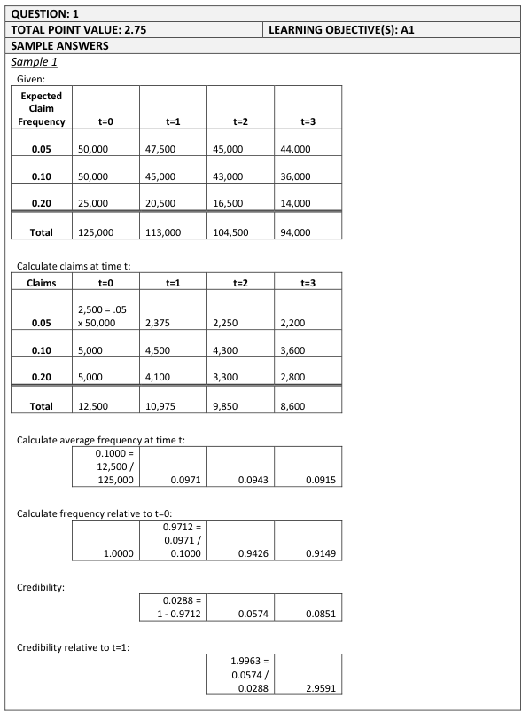
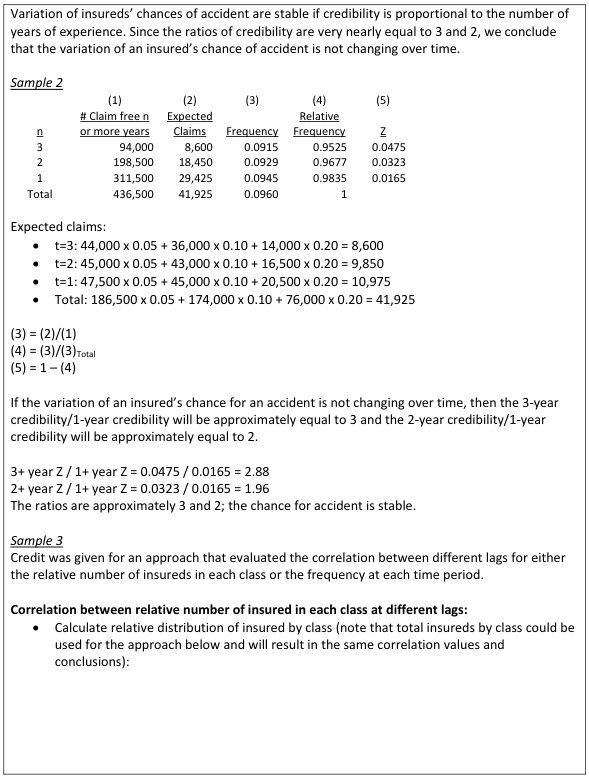
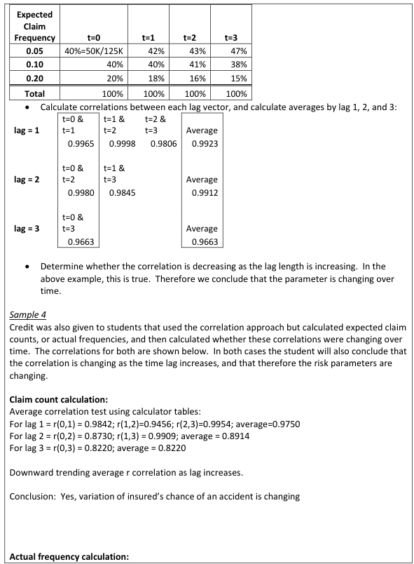
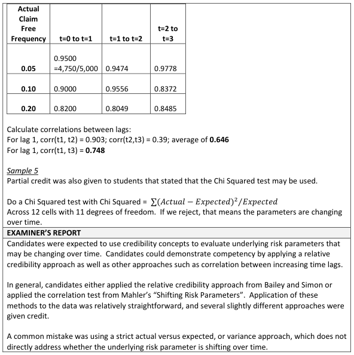

# 2016 Exam 8 - Q1

**Points:** 2.75

## Question

A group of insureds have different expected claim frequencies. The number of insureds claim-free for the past t years is as follows:

| Expected Claim Frequency | t=0 | t=1 | t=2 | t=3 |
| --- | --- | --- | --- | --- |
| 0.05 | 50,000 | 47,500 | 45,000 | 44,000 |
| 0.10 | 50,000 | 45,000 | 43,000 | 36,000 |
| 0.20 | 25,000 | 20,500 | 16,500 | 14,000 |
| Total | 125,000 | 113,000 | 104,500 | 94,000 |

Determine whether the variation of an individual insured's chance for an accident changes over time.

## Solution

This table is clearly related to the table in Appendix 1 of the Bailey & Simon paper. However, the purpose of that table is to demonstrate that with a fixed cohort of risks with constant frequencies, you can give about twice as much individual risk credibility to a risk with 2+ years-claims free compared to a risk with 1+ years claims-free (and about 3 times the credibility for 3+ years). In other words, the lack of variation of an individual insured's chance of an accident is taken as a given in creating that table, rather than learned as a conclusion from the table. So assuming the group of insureds in this question has no one enter or leave the group, then the makeup of the group is constant, and with constant expected frequencies, an individual insured randomly chosen from the group would have the same expected frequency no matter when the insured is chosen in time (note that insureds with claims don't actually leave the group, so they would still be included in calculating the expected frequency for the group). Thus, of course the variation of an individual insured's chance for an accident won't change over time - as mentioned above, this is already assumed when you have a fixed cohort of risks with constant frequencies. It seems like the question writer didn't understand this point, and as such, I believe you'll have to essentially work backwards by seeing whether the 2+ and 3+ year credibilities are 2 and 3 times the 1+ year credibility, and if so, only then do you conclude that the variation of an individual insured's chance of an accident is not changing over time. Given this, I'll show the solution that is consistent with the source paper, and then 1 more based on an alternative interpretation of the numbers given in the problem that is not consistent with the source paper (not sure if the graders will allow it).

SOLUTION 1: Source paper approach

We can interpret the given table such that t=1 means 1+ years claim-free, t=2 means 2+ years claim-free, and t=3 means 3+ years claim-free. In other words, if an insured has made it to time 1 without claims, then that insured might also make it to times 2 or 3 or so on without claims. So really, the numbers given are not EXACTLY t years claim-free, but t or more years claim-free. So if we wanted the number of policies with EXACTLY t years claims-free, we can subtract adjacent columns in the given table. For the 0.05 freq group, this would mean 2,500 insured have exactly 0 years claims-free, 2,500 have exactly 1 year claims-free, 1,000 insureds have exactly 2 years claims-free, and 44,000 insureds have 3+ years claims-free.

# of claims from

| Group | t=0 | t=1 | t=2 | t=3 |
| --- | --- | --- | --- | --- |
| 0.05 | 2,500 | 2,375 | 2,250 | 2,200 |
| 0.1 | 5,000 | 4,500 | 4,300 | 3,600 |
| 0.2 | 5,000 | 4,100 | 3,300 | 2,800 |
| Total | 12,500 | 10,975 | 9,850 | 8,600 |

Formulas

- `K32` = `=C8*$B8`
- `L32` = `=D8*$B8`
- `M32` = `=E8*$B8`
- `N32` = `=F8*$B8`
- `K33` = `=C9*$B9`
- `L33` = `=D9*$B9`
- `M33` = `=E9*$B9`
- `N33` = `=F9*$B9`
- `K34` = `=C10*$B10`
- `L34` = `=D10*$B10`
- `M34` = `=E10*$B10`
- `N34` = `=F10*$B10`
- `K35` = `=SUM(K32:K34)`
- `L35` = `=SUM(L32:L34)`
- `M35` = `=SUM(M32:M34)`
- `N35` = `=SUM(N32:N34)`

| J | K | L | M | N |
| --- | --- | --- | --- | --- |
| Freq | 0.1 | 0.097 | 0.094 | 0.091 |
| Rel Freq to t=0 | 1 | 0.971 | 0.943 | 0.915 |
| Credibility |  | 0.029 | 0.057 | 0.085 |
| Relative Cred |  | 1 | 2.00 | 2.96 |

Formulas

- `K37` = `=K35/C11`
- `L37` = `=L35/D11`
- `M37` = `=M35/E11`
- `N37` = `=N35/F11`
- `K38` = `=K37/$K37`
- `L38` = `=L37/$K37`
- `M38` = `=M37/$K37`
- `N38` = `=N37/$K37`
- `L39` = `=1-L38`
- `M39` = `=1-M38`
- `N39` = `=1-N38`
- `L40` = `=L39/$L39`
- `M40` = `=M39/$L39`
- `N40` = `=N39/$L39`

Since the relative credibilities for t=2 and t=3 are approximately 2 and 3 times the credibility for t=1, the variation of an individual insured's chances for an accident is not changing over time.

SOLUTION 2: Alternative interpretation, inconsistent with source paper

Assume the numbers given represent # of insureds with EXACTLY t years claims-free.

# of claims from

| Group | t=0 | t=1 | t=2 | t=3 |
| --- | --- | --- | --- | --- |
| 0.05 | 2,500 | 2,375 | 2,250 | 2,200 |
| 0.1 | 5,000 | 4,500 | 4,300 | 3,600 |
| 0.2 | 5,000 | 4,100 | 3,300 | 2,800 |
| Total | 12,500 | 10,975 | 9,850 | 8,600 |

Formulas

- `K51` = `=C8*$B8`
- `L51` = `=D8*$B8`
- `M51` = `=E8*$B8`
- `N51` = `=F8*$B8`
- `K52` = `=C9*$B9`
- `L52` = `=D9*$B9`
- `M52` = `=E9*$B9`
- `N52` = `=F9*$B9`
- `K53` = `=C10*$B10`
- `L53` = `=D10*$B10`
- `M53` = `=E10*$B10`
- `N53` = `=F10*$B10`
- `K54` = `=SUM(K51:K53)`
- `L54` = `=SUM(L51:L53)`
- `M54` = `=SUM(M51:M53)`
- `N54` = `=SUM(N51:N53)`

years claim-free

|   | Total | 1+ | 2+ | 3+ |
| --- | --- | --- | --- | --- |
| Freq | 0.09605 | 0.09446 | 0.09295 | 0.09149 |
| Rel Freq | 1 | 0.983 | 0.968 | 0.953 |
| Credibility |  | 0.017 | 0.032 | 0.047 |
| Relative Cred |  | 1 | 1.96 | 2.87 |

Formulas

- `K58` = `=SUM(K54:$N54)/SUM(C11:$F11)`
- `L58` = `=SUM(L54:$N54)/SUM(D11:$F11)`
- `M58` = `=SUM(M54:$N54)/SUM(E11:$F11)`
- `N58` = `=SUM(N54:$N54)/SUM(F11:$F11)`
- `K59` = `=K58/$K58`
- `L59` = `=L58/$K58`
- `M59` = `=M58/$K58`
- `N59` = `=N58/$K58`
- `L60` = `=1-L59`
- `M60` = `=1-M59`
- `N60` = `=1-N59`
- `L61` = `=L60/$L60`
- `M61` = `=M60/$L60`
- `N61` = `=N60/$L60`

Since the relative credibilities for 2+ and 3+ are fairly close to 2 and 3 times the credibility for 1+ years claims-free, the variation of an individual insured's chances for an accident is not changing over time.

## Examiner Report

Examiner report solutions and comments:

