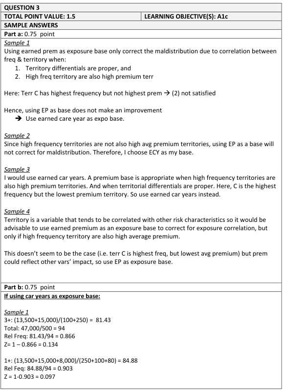
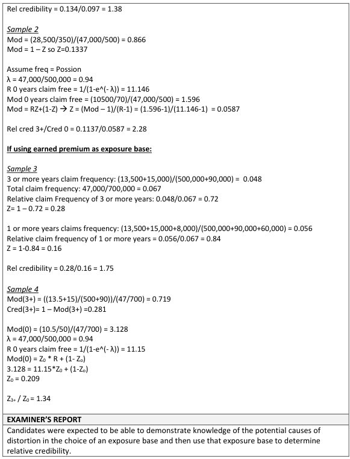
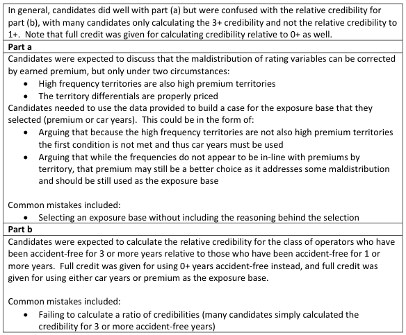

# 2017 Exam 8 - Q3

**Points:** 1.5

## Question

The following data shows the experience of a merit rating plan for private passenger vehicles. The merit rating plan uses multiple rating variables, including territory.

| Number of Accident-Free Years | Earned Car Years (000s) | Earned Premium ($000s) | Number of Incurred Claims |
| --- | --- | --- | --- |
| 5 or More | 250 | 500,000 | 15,000 |
| 3 and 4 | 100 | 90,000 | 13,500 |
| 1 and 2 | 80 | 60,000 | 8,000 |
| 0 | 70 | 50,000 | 10,500 |
| Total | 500 | 700,000 | 47,000 |

| Territory | Frequency | Average Premium |
| --- | --- | --- |
| A | 0.05 | 1,500 |
| B | 0.10 | 2,000 |
| C | 0.15 | 1,250 |

### Part a (0.75 pts)

Recommend and justify an exposure base for this merit rating plan.

## Solution

### Part a

I assume all premiums in this question are on-level. We want to use premium as the base instead of car-years if high frequency territories are also high average premium territories, and if territory rates are proper. In this part, we only need to look at the 2nd table given.

There isn't enough information to know whether territories are priced correctly, but we can see that high frequency territories are not high premium territories, because territory C has the highest frequency but lowest average premium. As such, I would recommend using earned car-years as the base for frequency.

### Part b

The wording of this question says RELATIVE credibility, so based on the usage of this in the source material, I assume they are asking for the 3+ year credibility divided by the 1+ year credibility. That said, this should have been more explicit, and past exam question have been more explicit that we are asking for credibility relative to 1+ years claim-free.

| Group | Freq | Mod | Cred | Relative Cred |
| --- | --- | --- | --- | --- |
| 3+ | 0.0814 | 0.866 | 0.134 | 1.379 |
| 1+ | 0.0849 | 0.903 | 0.097 |  |
| Total | 0.094 |  |  |  |

Formulas

- `K17` = `=SUM(E$8:E9)/(SUM(C$8:C9)*1000)`
- `L17` = `=K17/K$19`
- `M17` = `=1-L17`
- `N17` = `=M17/M18`
- `K18` = `=SUM(E$8:E10)/(SUM(C$8:C10)*1000)`
- `L18` = `=K18/K$19`
- `M18` = `=1-L18`
- `K19` = `=E12/(C12*1000)`

## Examiner Report

### Part b (0.75 pts)

Calculate the relative credibility of an exposure that has been three or more years accident-free using the exposure base from part (a) above.

Examiner report solutions and comments:

