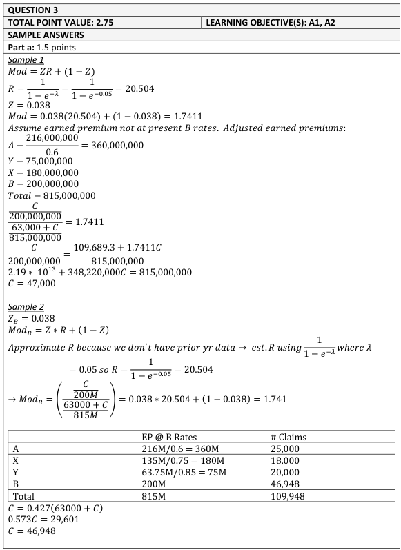
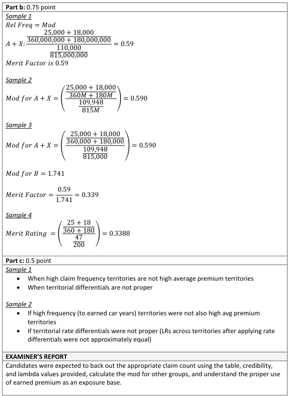
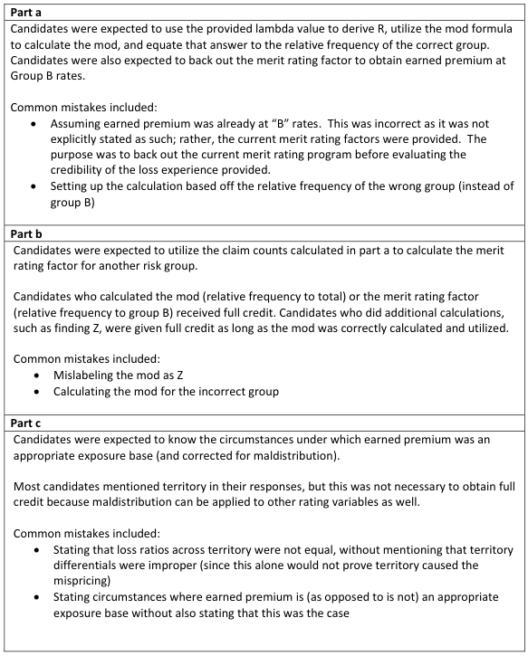

# 2018 Exam 8 - Q3

**Points:** 2.75

## Question

An insurance company has a private passenger auto book of business with the following claims experience:

| Group | Number of Accident-Free Years | Earned Premiums | Current Merit Rating Factor | Number of Claims Incurred |
| --- | --- | --- | --- | --- |
| A | 3 or more | 216,000,000 | 0.60 | 25,000 |
| X | 2 | 135,000,000 | 0.75 | 18,000 |
| Y | 1 | 63,750,000 | 0.85 | 20,000 |
| B | 0 | 200,000,000 | 1.00 | C |
| Total |  | 614,750,000 |  | 63,000 + C |

| B | C |
| --- | --- |
| 0.05 | λ parameter for claim counts, which follow a Poisson distribution |
| 0.038 | Credibility for the new policy period for an insured that has had no claim-free years |

### Part a (1.50 pts)

Calculate C, the number of claims incurred for Group B.

### Part b (0.75 pts)

Calculate the merit rating factor for an exposure that is accident-free for two or more years for the new policy period.

### Part c (0.50 pts)

Briefly explain two circumstances under which using earned premium as the exposure base would not correct for maldistribution.

## Solution

### Part a

**R:** 20.504166 — `=1/(1-EXP(-B14))`

**Mod:** 1.741 — `=M2*B15+(1-B15)`

The premium is given not at B rates, so we need to divide out current relativities to get premium at B rates.

| Group | Prem at B Rates |
| --- | --- |
| A | 360,000,000 |
| X | 180,000,000 |
| Y | 75,000,000 |
| B | 200,000,000 |
| Total | 815,000,000 |

Formulas

- `M10` = `=D8/E8`
- `M11` = `=D9/E9`
- `M12` = `=D10/E10`
- `M13` = `=D11/E11`
- `M14` = `=SUM(M10:M13)`

**1.741 = (C/200) / ((63000+C)/815):** 0.427278 — `=M4/M14*M13`

**C:** 47,001.035178 — `=O16*SUM(F8:F10)/(1-O16)`

### Part b

The wording here is a little odd, as there is no merit rating factor for the A+X category. Instead, there would be an experience mod that would replace the merit rating variable. So I think the question writer meant to ask what the indicated experience mod would be for a risk with 2 or more accident-free years. The answer to that is just the relative frequency for A+X to the total using premium at B rates.

| L | M |
| --- | --- |
| A+X Freq | 0.00008 |
| Total Freq | 0.000135 |

Formulas

- `M25` = `=(F8+F9)/(M10+M11)`
- `M26` = `=SUM(F8:F10,M18)/M14`

**Mod:** 0.5900 — `=M25/M26`

### Part c

Really, because of the wording of this question, there is only 1 main reason, which is that other variables aren't priced properly. The other item from the paper about high frequency territories having high premium is about exposure correlation existing in the first place, not about correcting for it. But I suppose if exposure correlation doesn't exist, then there is nothing to correct.

If other rating variables are not priced properly, then EP would not properly account for exposure correlation with those variables.

If there is no exposure correlation with other rating variables, then there will be no maldistribution issue to correct.

## Examiner Report

Examiner report solutions and comments:

