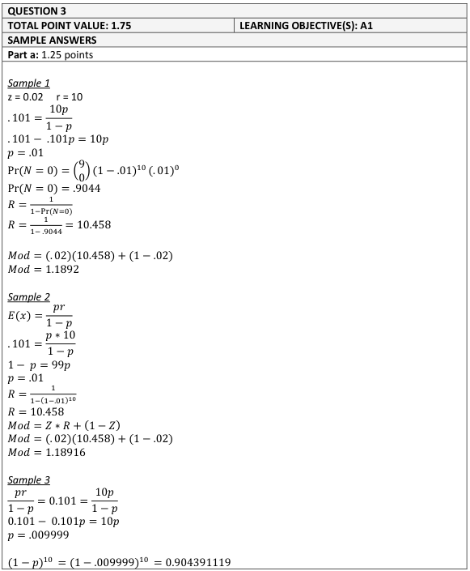
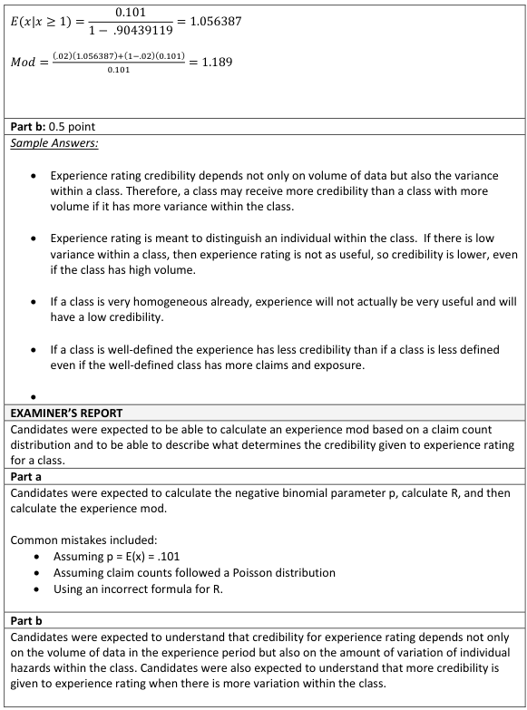
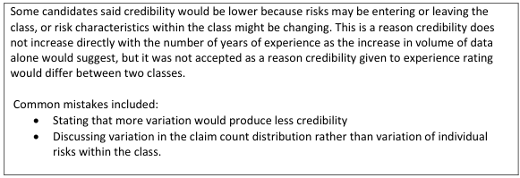

# 2019 Exam 8 - Q3 revised

**Points:** 1.75

## Question

An insurance company has a private passenger auto book of business with an experience modification factor in its rating plan.

Given the following:

| B | C |
| --- | --- |
| 10 | Annual claims for an individual driver follow a negative binomial distribution with r=10 |
| 0.101 | Expected claim frequency for the entire book of business |
| 0.02 | Credibility for the group of risks that have had at least one accident in the last year |

For the negative binomial distribution:

### Part a (1.25 pts)

Calculate the experience modification factor for a policy that has had at least one accident in the last year.

### Part b (0.50 pts)

Describe why a class with a higher volume of claims and more exposures may have less credibility than a class with fewer claims and exposures.

## Solution

### Part a

Pr(X >=1) = 1 - Pr(X = 0) = 1 - [(0+r-1)!/0!(r-1)! * p^0 * (1-p)^r] = 1 - [1 * 1 * (1-p)^r]

R = 1/[1 - (1 - p)^r] = 1/[1 - (1 - p)^10]

We can get p because we know the expected claim frequency will equal 0.101 and we have the negative binomial formula for the mean.

**10p/(1-p)=0.101:** 0.0101 — `=B10/B9`

**p:** 0.0100 — `=N9/(1+N9)`

**R:** 10.459279 — `=1/(1-(1-M11)^B9)`

**Mod:** 1.189 — `=B11*M13+(1-B11)`

### Part b

The question wording asks you to describe why a CLASS may have less credibility, but the model solutions in the examiner's report discuss why an INDIVIDUAL RISK within a class might have less credibility. I'll show answers for both, even though credit was only given for the individual risk assumption (even though that's not what the question wording said).

Solution 1: Talking about individual risk experience rating credibility

Individual risk experience rating credibility is used to distinguish between risks within a class. If the variance between risks in a class is low (i.e., risks within the class are very similar), then experience rating credibility will also be low regardless of the size of the class.

Solution 2: Talking about class credibility

Credibility depends not just on the volume of data, but on the variance of the data. So a class with lots of data could have more variance in loss results than a class with less data, and as such might deserve lower credibility.

## Examiner Report

Examiner report solutions and comments:

