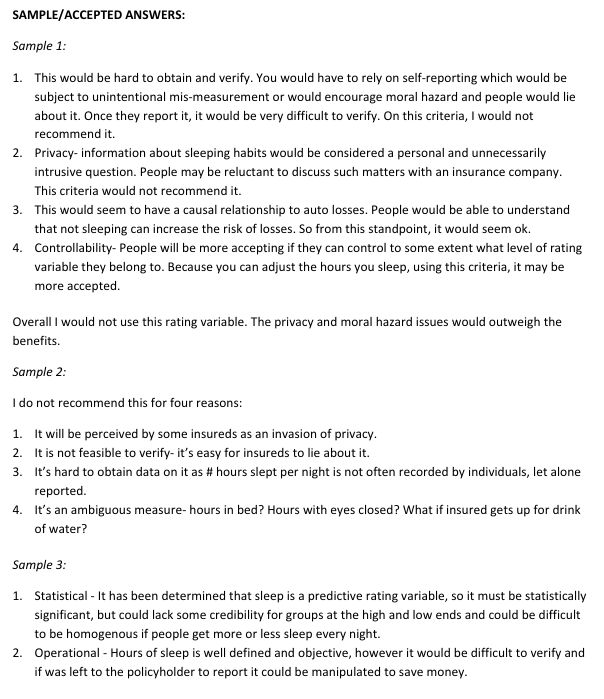
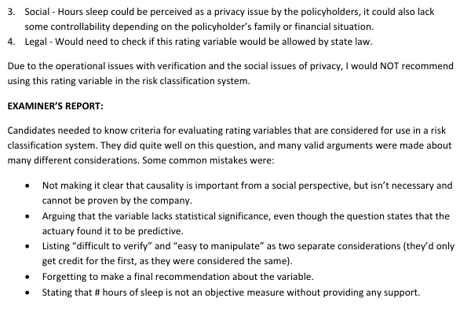

# Spring 2014 Exam 5 - Q6

**Points:** 2.5

## Question

An auto insurance company is designing a risk classification system. The actuary has determined that the number of hours a driver sleeps each night is a predictive rating variable. Recommend whether the company should include this variable in their risk classification system. Justify this recommendation with respect to four relevant considerations.

## Solution

I would not include this variable in the rating plan for the following reasons:

Any 4 of:

- The data would be difficult to obtain and verify. You would have to rely on self-reporting,

which would be subject to inaccurate reporting or moral hazard.

- This would likely be considered an invasion of privacy, so people would be reluctant to share

this information.

- This does seem to be reasonable from a causality standpoint, as it makes sense that less sleep

would lead to less attentiveness when driving. However, this benefit is outweighed by the other negatives of using this variable.

- This variable is somewhat controllable, as some people will be able to sleep more hours in order

to get a lower rate. However, this benefit is outweighed by the other negatives of using this variable.

- The definition of hours of sleep can be ambiguous. For example, what if the insured gets up for

a drink of water? What if the insured gets a different amount of sleep on different nights of the week?

- The rating variable might not be allowed by state law.
- Since the variable has been determined to be predictive, it is a statistically significant variable.

However, it might have low credibility for groups at the high and low number of hours of sleep. Also, if people get different hours of sleep each night, the groupings may not be homogeneous.

## Examiner Report

Examiner report solutions and comments:

