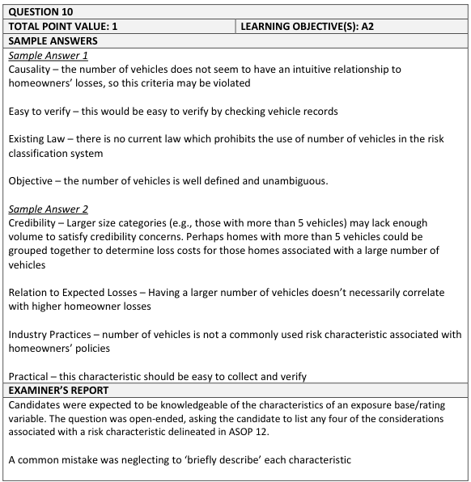

# Fall 2016 Exam 5 - Q10

**Points:** 1

## Question

A homeowners insurance company is considering utilizing number of vehicles in the household as an additional risk characteristic within its risk classification system.

Briefly discuss the appropriateness of adding this risk characteristic to the company's risk classification system using four considerations from the Actuarial Standard of Practice No. 12: Risk Classification (for All Practice Areas).

## Solution

Any 4 items below:

Considerations worded as they appear exactly in ASOP 12:

- Relationship of Risk Characteristics and Expected Outcomes: If # of vehicles in the household

relates to expected cost differences, it would be appropriate to use.

- Causality: It is not intuitive that more vehicles would cause more homeowners losses, but

causality is not a requirement to implement the variable.

- Objectivity: # of vehicles in the household can be defined objectively, which is desirable. There

are practical questions about how to define this. For instance, is it relevant if the vehicles are driven at all or just parked? While some of this is not obvious, you could in theory end up with an objective definition.

- Practicality: If it is inexpensive to accurately obtain vehicle data from insureds, it will be

practical. You can also talk about insured manipulation here, or the challenges of getting accurate information over time as the insureds buy/sell cars.

- Applicable Law: The variable would need to be allowed by law to use in homeowners rating

(this is unclear).

- Industry Practices: It would be unusual to use vehicles in homeowners pricing, which might

turn off customers.

- Business Practices: There isn't a clear answer for this one, so mine is just one example. If the

company's operations would be impacted by use of this variable (e.g., requiring UW review), then it may not be worth implementing.

Other reasonable considerations (some overlap with above list):

- Privacy: Insureds would likely not feel their privacy is violated with this variable.
- Verifiable/Manipulation: It might be difficult to verify this data if it will be self-reported by

insureds (and thus perhaps manipulated).

- Inexpensive to administer: The cost of implementing this variable needs to be considered, e.g.,

does DMV data need to be purchased for each risk, and is this cost worth it?

- Affordability: Does implementing this variable create affordability issues for some insureds,

which might be against public policy?

- Controllability: Insureds can choose whether to purchase cars, which is good. You could also

argue that insureds must have cars in order to get to work, so practically speaking it is not really within their control.

## Examiner Report

Examiner report solutions and comments:

