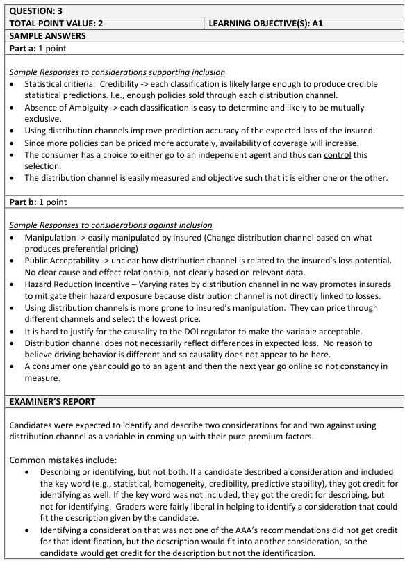
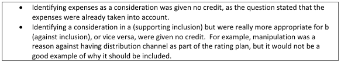

# 2016 Exam 8 - Q3 revised

**Points:** 2

## Question

A private passenger automobile insurer sells policies through two distribution channels:

independent insurance agents and directly to consumers via the internet.

The company's rates already incorporate expense differentials between the two channels but the head of sales has asked their actuary to file different pure premium factors for the two groups.

The actuary wishes to evaluate the acceptability of the request using the Actuarial Standard of Practice No. 12: Risk Classification (for All Practice Areas).

### Part a (1.00 pts)

Identify and briefly describe two considerations supporting inclusion of distribution channel in the pure premium factors.

### Part b (1.00 pts)

Identify and briefly describe two considerations against inclusion of distribution channel in the pure premium factors.

## Solution

### Part a

Any 2 of:

- Relationship of Risk Characteristics & Expected Outcomes: Using pure premium

differences between distribution channels would reflect expected cost differences between those policies.

- Practicality: Since the insurer already knows what distribution channel is used by an

insured, there would be no additional cost of obtaining this information to use in the class plan.

- Credibility: Each classification is likely large enough to produce credible statistical

predictions (i.e., there are enough policies sold through each distribution channel).

- Homogeneity: Risks that purchase through the same distribution channel may be similar in

their expected pure premiums, in which case grouping them together would produce a more accurate risk classification plan.

- Objectivity: The distribution channel used by an insured is clearly and objectively defined

and is readily verifiable.

- Law: It is likely legal to use distribution channel in rating.

### Part b

Any 2 of:

- Causality: Where an insured purchases their insurance doesn't seem causally related to

their loss potential. As such, it doesn't seem fair that the same risk should pay more based on where they purchased the policy.

- Objectivity: Insureds can manipulate which distribution channel they use in order to get a

cheaper rate.

- Industry Practices: It is not common to use distribution channel in reflecting pure premium

differences. If it is common, then it can be used as an advantage in part (a).

## Examiner Report

Examiner report solutions and comments:

