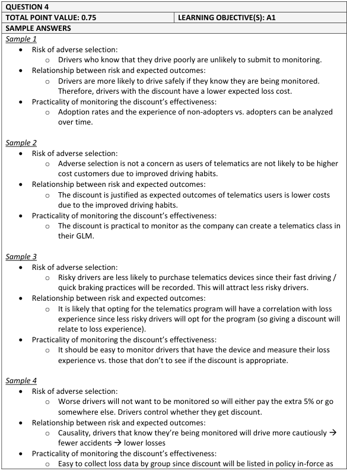
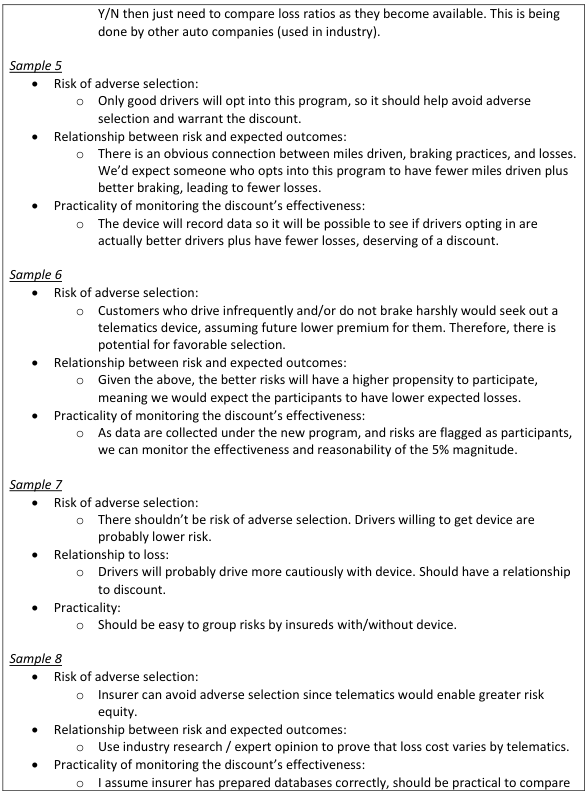
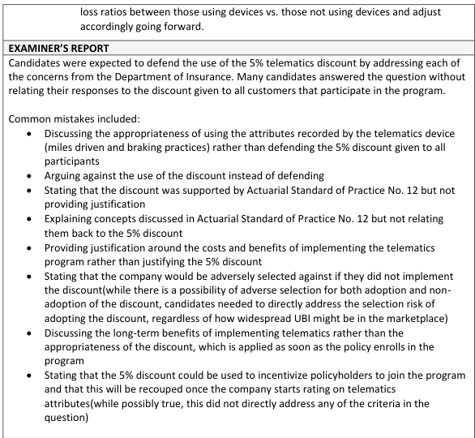

# 2018 Exam 8 - Q4

**Points:** 0.75

## Question

An insurance company is launching a new telematics program for their private passenger automobile book of business. Telematics devices record various attributes such as miles driven and braking practices. Management decided to give a 5% discount to all customers that participate in the program. The Department of Insurance questions the filing and wants the company to address the following potential concerns:

- Risk of adverse selection
- Relationship between risk and expected outcomes
- Practicality of monitoring the discount's effectiveness

Defend the use of the discount by briefly addressing each of the concerns in light of Actuarial Standard of Practice No. 12, Risk Classification.

## Solution

It isn't specified whether the company will also be using the information gathered from the devices in rating or risk selection as part of the initial filing. Since this isn't mentioned, I'll assume this information is not yet being used, and for now the device is simply providing additional data for the insurer to potentially use in the future. Given that this problem has only 0.75 points and has 3 concerns to address, it seems like the answers should be succinct, even though a lot could be written about each point. Discussion points might include the usefulness of the data being collected for rating or risk selection, the self-selection impact of people who sign up for the program, and any behavioral changes created by these devices (e.g., beeping when going over the speed limit). The answers below are meant to be examples, and would not be comprehensive.

- Risk of adverse selection: The devices allow the insurer to collect more data to use in future

rating and risk selection, which will help the insurer create better segmentation (and prevent adverse selection).

- Relationship between risk and expected outcomes: There may be a self-selection effect that only

lower risk drivers sign up for the program since they know their driving data will be monitored more closely.

- Practicality of monitoring the discount's effectiveness:

This wording is a bit confusing. Practicality as a criterion in ASOP 12 focuses on the cost of classification, which in this case might relate to the cost of the telematics devices (assuming the insurer paid for them). But the discount's effectiveness (from the DOI perspective) sounds more like whether the discount is cost justified, which would largely relate to the loss experience of risks in this program. So it isn't clear what the question writer was thinking here. I'll take the latter interpretation about loss experience of risks in the program.

It will be easy to separately track the loss experience of risks in this program and evaluate whether the discount of 5% continues to be cost-justified in future periods.

## Examiner Report

Examiner report solutions and comments:

