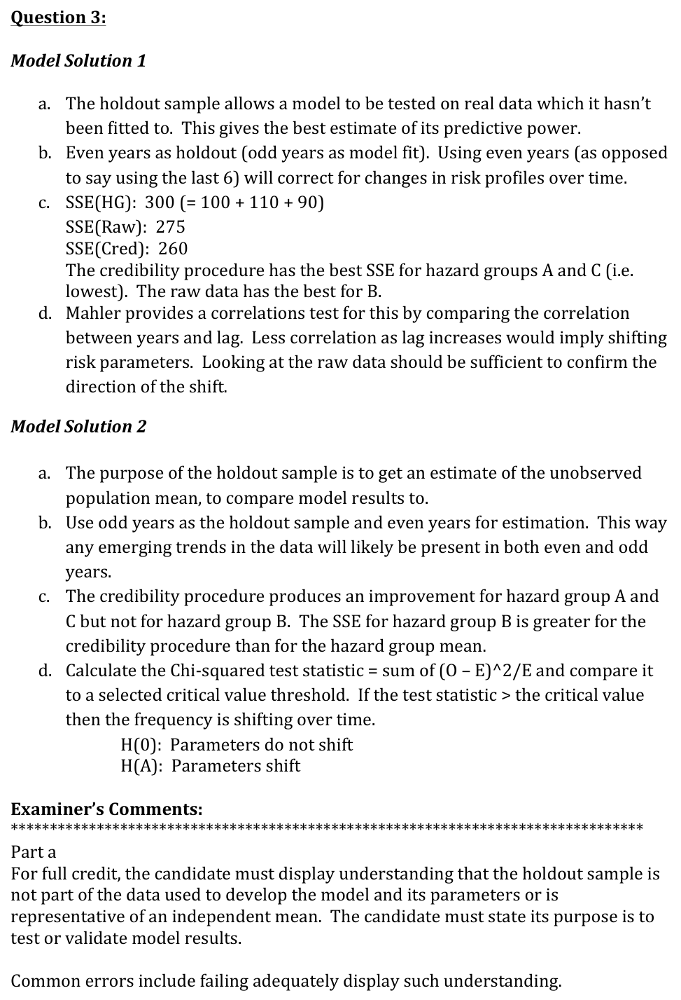
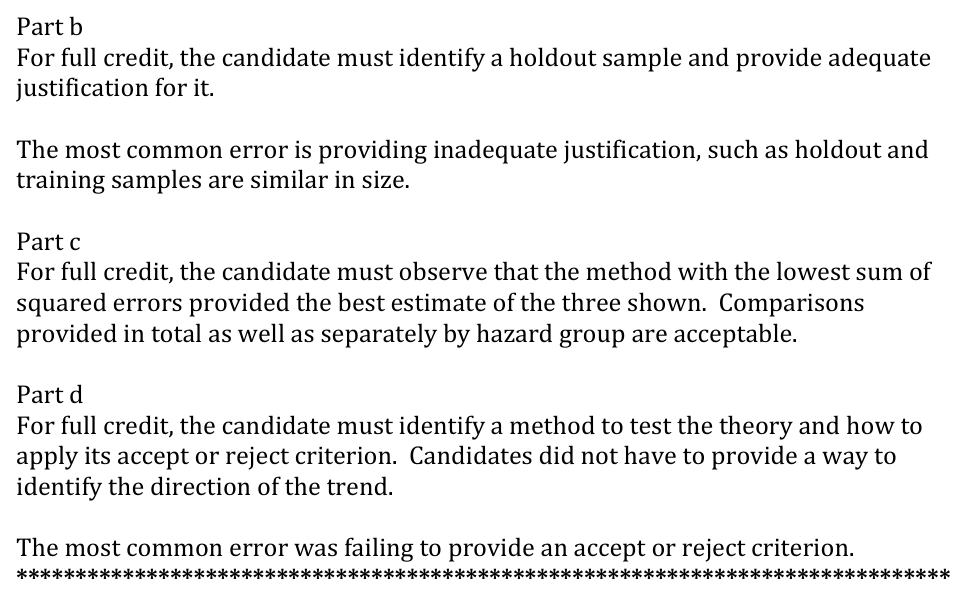

# 2013 Exam 8 - Q3

**Points:** 1.75

## Question

An actuary is creating a workers compensation classification rating plan. The actuary has access to frequency data from years 2002-2012 for fatal claims, which he believes may have low credibility.

After developing and testing a multivariate credibility procedure, the actuary finds the following results:

Sum of Squared Prediction Errors - Fatal Claims

| Hazard Group | Prediction based on Hazard Group | Prediction based on raw data less the holdout sample | Prediction based on credibility procedure |
| --- | --- | --- | --- |
| A | 100 | 90 | 80 |
| B | 110 | 70 | 105 |
| C | 90 | 115 | 75 |

### Part a (0.25 pts)

Briefly describe the purpose of a holdout sample.

### Part b (0.50 pts)

Justify an appropriate holdout sample from the available frequency data for the actuary to use in the classification analysis.

### Part c (0.50 pts)

Discuss what the actuary's predicted results imply about his credibility procedure.

### Part d (0.50 pts)

Suppose the actuary suspects that there may be an intrinsic downward trend in frequencies of fatal claims between 2002 and 2012 due to improved safety in his clients' workplaces. Propose a way for the actuary to test this theory.

## Solution

### Part a

A holdout sample is a split of the original dataset that was not used to build the model and is instead used for testing the predictive power of the model.

### Part b

An appropriate holdout sample would be to use the odd years of data (i.e., 2003, 2005, 2007, 2009, and 2011). Then the even years would be used to build the model. This will make sure both datasets are equally impacted by development and trends over time.

Using even years instead of odd would also be acceptable, as would splitting risks randomly between datasets.

### Part c

I assume the SSE for the Hazard Group and credibility procedure are also "less the holdout sample."

The credibility procedure results in the lowest SSE for Hazard Groups A and C, but using the raw data results in the lowest SSE for Hazard Group B. Overall, the credibility procedure produces the lowest total SSE of 260 (sum across HGs) compared to the Hazard Group total SSE of 300 or the raw data SSE of 275.

### Part d

We can use either of the tests described in Mahler for whether risk parameters are changing over time (chi-squared or correlation of years). Note that the Hazard Groups would be analogous to the baseball teams in the Mahler paper. I'll mention a chi-squared test. Note that there are 11 years of data in the dataset from 2002 to 2012 (assuming it includes 2002 and 2012).

You could apply a chi-squared test by calculating the following test statistic for each Hazard Group:

test statistic = sum over 11 years(Exposures*(ActualFreq-Expected Freq)^2/Expected Freq)

The Expected Frequency could just be the mean frequency of the entire 11 year dataset.

If the test statistic is greater than a chi-squared value with 10 degrees of freedom at an acceptable percentage level, then you can conclude that frequency is shifting over time. (You would then just need to confirm that this is a downward shift and not an upward shift by looking at the data.)

## Examiner Report

Examiner report solutions and comments:

