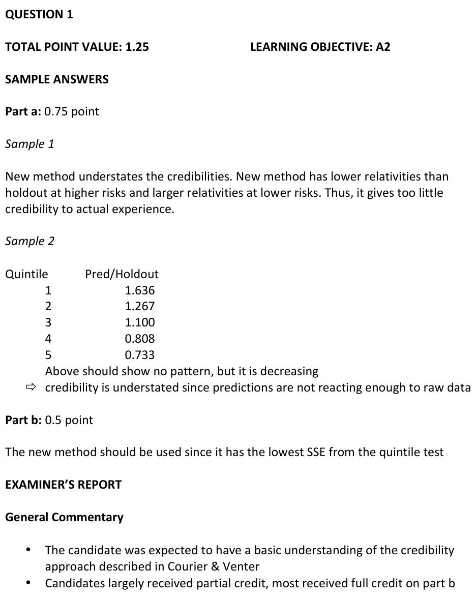
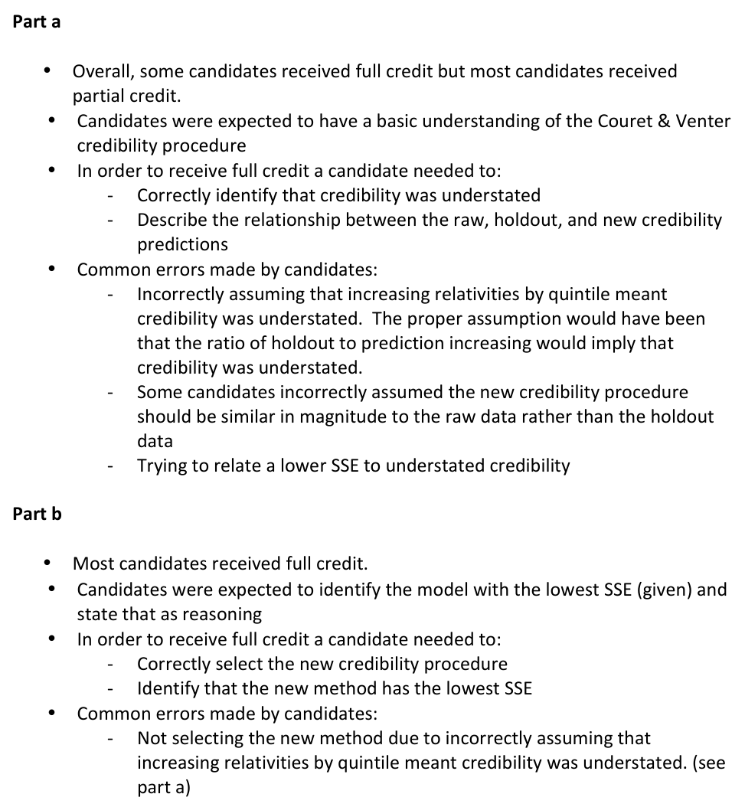

# 2014 Exam 8 - Q1

**Points:** 1.25

## Question

An actuary has devised a new method to assign credibility to observations of severity relativities by state. In order to test the validity of the method, the following quintile test has been prepared. The actuary has split the data into two distinct partitions: Test and Holdout. Test data was used to predict the credibility-adjusted relativities of the holdout data.

| Quintile | Holdout Relativity | Prediction Based on Countrywide Average | Prediction Based on Raw Test Data | Prediction Based on New Credibility Procedure |
| --- | --- | --- | --- | --- |
| 1 | 0.55 | 1.00 | 0.25 | 0.90 |
| 2 | 0.75 | 1.00 | 0.40 | 0.95 |
| 3 | 0.90 | 1.00 | 0.85 | 0.99 |
| 4 | 1.30 | 1.00 | 1.40 | 1.05 |
| 5 | 1.50 | 1.00 | 2.10 | 1.10 |
| Mean | 1.00 | 1.00 | 1.00 | 1.00 |

Sum of Squared Errors — 0.6150 — 0.5850 — 0.3931

### Part a (0.75 pts)

Describe whether this new method overstates or understates the credibility of the state relativities.

### Part b (0.50 pts)

Discuss whether the new method or the countrywide average should be used to determine state relativities.

## Solution

### Part a

This analysis is trying to see if states have different severities than the countrywide average severity. States are being grouped into quintiles, so each state will fall into a single quintile. For each state, severity relativities are calculated by dividing the state severity by the countrywide severity. States would be analogous to the classes in the Couret & Venter paper, and the country would represent the (only) hazard group.

The new procedure essentially will calculate credibility-weighted severity relativities, with credibility balanced between the raw state relativities for the test data and the countrywide relativity of 1. The key here is to recognize that the new procedure column is a credibility-weighting of the raw data column and the countrywide column. This problem is a bit related to the concept of credibility given by an experience rating plan.

For states with low severity relativities, the new procedure estimates state relativities that are too high relative to the holdout data (e.g., 0.90 > 0.55), so the procedure gives too little credibility to the raw data estimates (e.g., 0.25) and too much credibility to the countrywide estimate (1.00).

Similarly, for states with high severity relativities, the new procedure estimates state relativities that are too low relative to the holdout data (e.g., 1.10 < 1.50), so the procedure again gives too little credibility to the raw data estimates (e.g., 2.10) and too much credibility to the countrywide estimate (1.00).

Therefore, the new procedure consistently understates the credibility of the raw state relativity data.

### Part b

Since the SSE when predicting holdout data using the credibility procedure is lower than the SSE for the countrywide average (and the raw data), the new credibility procedure will be more accurate and should be used to predict state relativities.

## Examiner Report

Examiner report solutions and comments:

