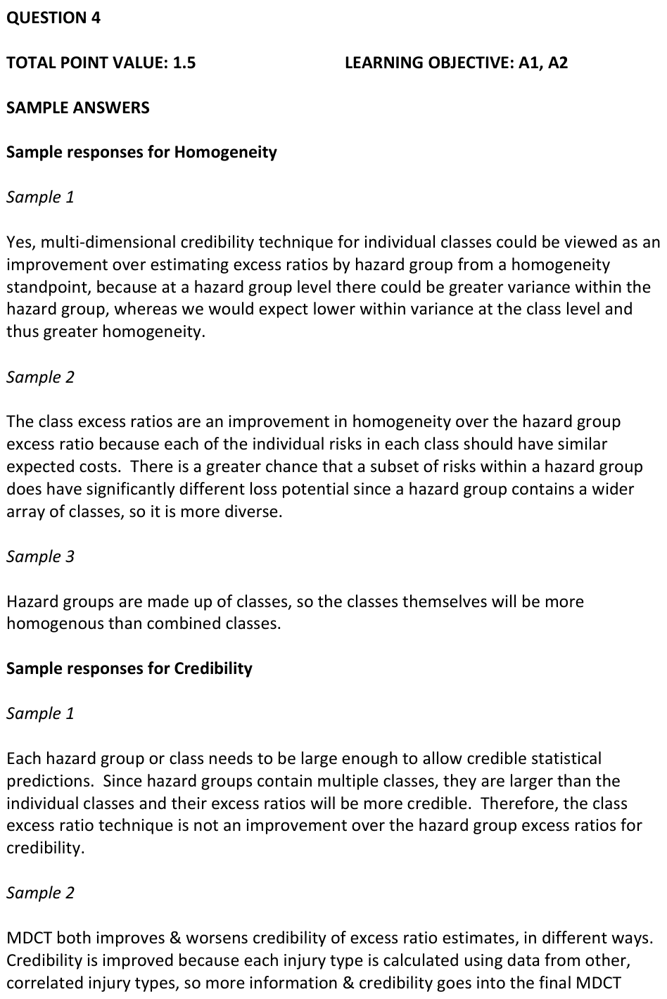
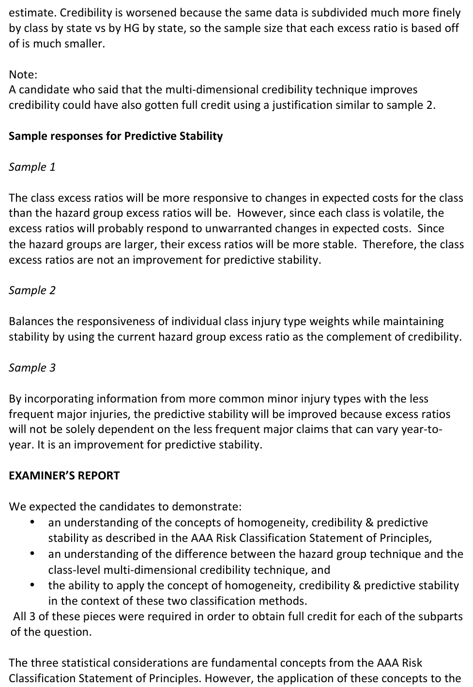
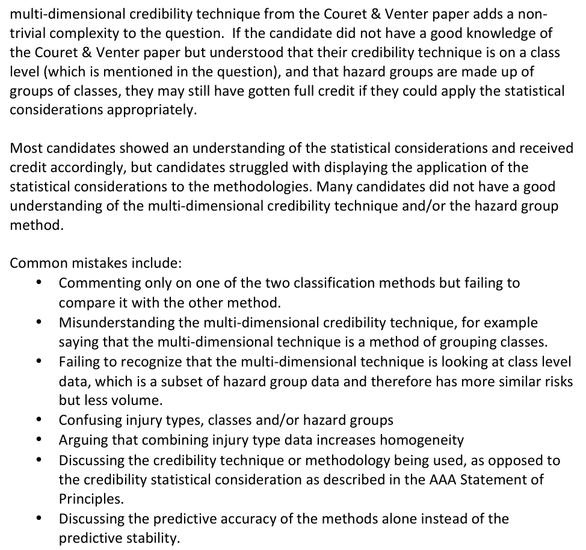

# 2014 Exam 8 - Q4

**Points:** 1.5

## Question

One approach for estimating excess ratios by individual class in workers compensation insurance is to use a multi-dimensional credibility technique.

According to each of the three statistical considerations listed below, explain whether this technique is an improvement over estimating excess ratios by hazard group:

i. Homogeneity

ii. Credibility

iii. Predictive Stability

## Solution

i. Using the multi-dimensional credibility technique will result in excess ratios by class, instead of

excess ratios by hazard group (a group of classes). The risks within a class will be more homogeneous than the risks within a group of classes.

ii. You could have argued that credibility is either increased or decreased using the multi-dimensional

procedure without discussing the other perspective and have received full credit. This solution discusses both sides.

The multi-dimensional credibility technique both improves and worsens credibility of excess ratio estimates, in different ways. Credibility is improved because excess ratios for each injury type are calculated using data from other correlated injury types, so more information and credibility goes into the estimates. Credibility is worsened because the same data is subdivided much more finely by class instead of by hazard group, so the sample size that each excess ratio is based off of is much smaller.

iii. Again, this could be argued both ways. This solution discusses both sides.

The multi-dimensional credibility technique both improves and worsens predictive stability, in different ways. Predictive stability is improved because data from more common minor injury types is included and these claims are more stable from year-to-year than the less frequent major injury types. Predictive stability is worsened because class level data is used, and the claims for each class will be more volatile from year-to-year than the claims at the hazard group level.

## Examiner Report

Examiner report solutions and comments:

