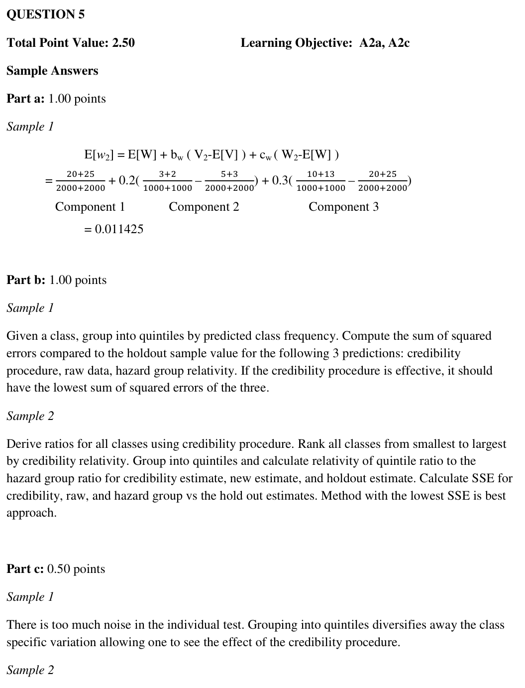
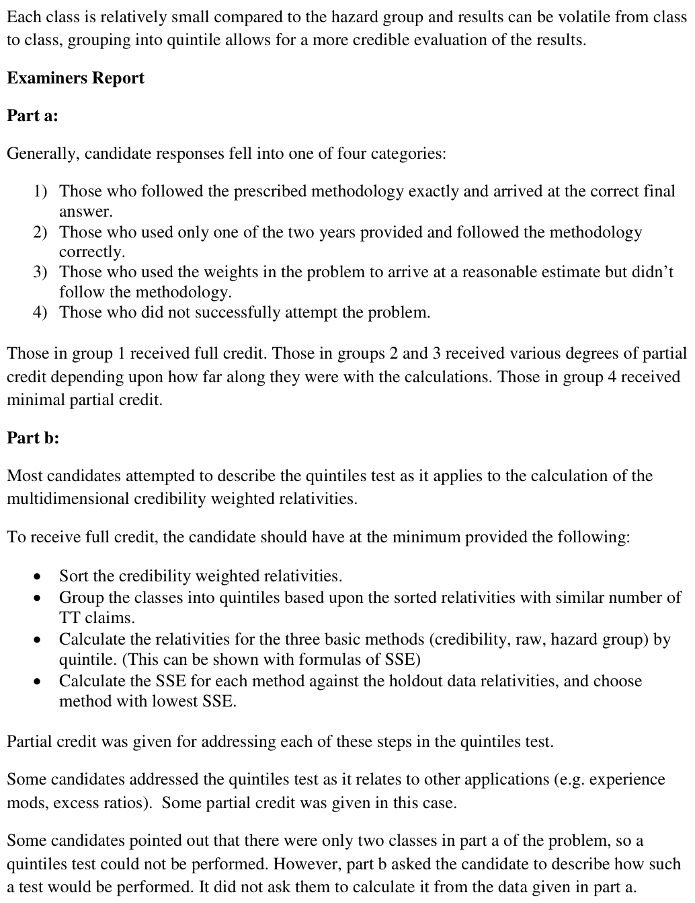
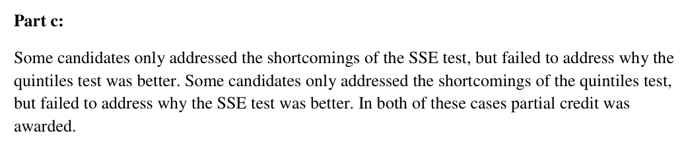

# 2015 Exam 8 - Q5

**Points:** 2.5

## Question

An actuary estimated the loss cost for workers compensation insurance using a multi-dimensional credibility method.

Given the following:

- There were 2 classes in Hazard Group X.
- There were no major or minor permanent partial losses.
- Premium information was not available.
- Holdout sample of odd years was used as a proxy of the true mean.

Claim Count by Injury Type for Hazard Group X

|   | Even Year 1 |   |   | Even Year 2 |   |   |
| --- | --- | --- | --- | --- | --- | --- |
| Class | Fatal (F) | Permanent Total (PT) | Temporary Total (TT) | Fatal (F) | Permanent Total (PT) | Temporary Total (TT) |
| Class 1 | 2 | 10 | 1,000 | 1 | 12 | 1,000 |
| Class 2 | 3 | 10 | 1,000 | 2 | 13 | 1,000 |
| Total | 5 | 20 | 2,000 | 3 | 25 | 2,000 |

Optimal Weights for Estimation of Permanent Total Injury Ratio

| Fatal | Permanent Total |
| --- | --- |
| 0.2 | 0.3 |

### Part a (1.00 pts)

Determine the ratio of permanent total injury to temporary total injury for Class 2 using a multi-dimensional credibility method.

### Part b (1.00 pts)

Fully describe the steps involved in performing a quintile test to evaluate the actuary's work.

### Part c (0.50 pts)

Briefly describe one shortcoming of the individual class sum of squared errors test and briefly describe why the quintiles test is a better way to evaluate the actuary's work.

## Solution

### Part a

Here we just use the credibility formula without the major and minor terms. The weights given are the credibilities we need to use. In the paper, they vary by class, so here we can just assume they are the appropriate credibilities for class 2 (as we have no other choice).

| B | C |
| --- | --- |
| W_h | 0.01125 |
| W_2 | 0.0115 |
| V_h | 0.002 |
| V_2 | 0.0025 |

Formulas

- `C41` = `=(D18+G18)/(E18+H18)`
- `C42` = `=(D17+G17)/(E17+H17)`
- `C43` = `=(C18+F18)/(E18+H18)`
- `C44` = `=(C17+F17)/(E17+H17)`

**w^est_2:** 0.011425 — `=C41+D23*(C44-C43)+E23*(C42-C41)`

### Part b

A quintiles test seems to make no sense here, as we can't split 2 classes into 5 quintile buckets. Nevertheless, put down an answer that best describes the test you could do.

I'll assume the HG has at least 5 classes so we can use quintiles.

The following is done separately for each injury type and hazard group:

i Sort injury type relativities from the credibility procedure for all classes in the hazard group in increasing order. ii Group the classes into quintiles based on the sorted relativities. Each quintile should have about the same number of TT claims. iii Calculate the weighted average injury type relativity across all classes within each quintile and within the hazard group. Do this step for each of the 3 methods and for the holdout sample using their respective relativities. iv Calculate the SSE for each method as:

SSE=sum across quintiles(Step3Relativity_quintile / Step3Relativity_HG - Step3HoldoutRelativity_quintile / Step3HoldoutRelativity_HG)^2 v The method with the lowest SSE is deemed best for that particular injury type and all classes in that hazard group.

### Part c

Any 1 of:

- Class level data by year is volatile. Grouping classes into quintiles helps reduce some of the

volatility in the data.

- Relative incidence ratios are impacted by unknown covariates, with levels varying between

odd and even years. Normalizing each dataset by hazard group as C&V did for the quintiles test makes the even and odd datasets more directly comparable.

## Examiner Report

Examiner report solutions and comments:

