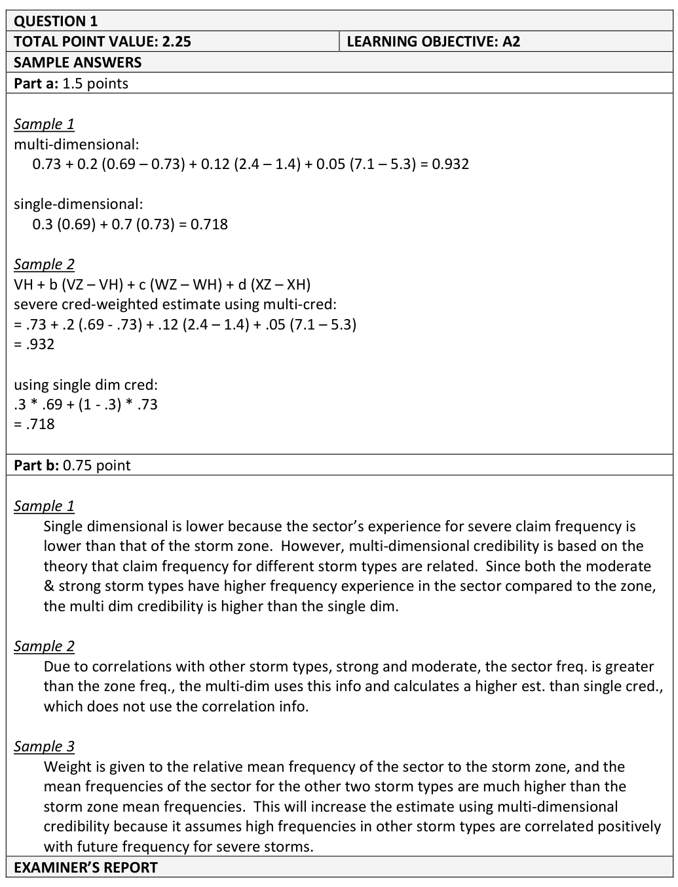
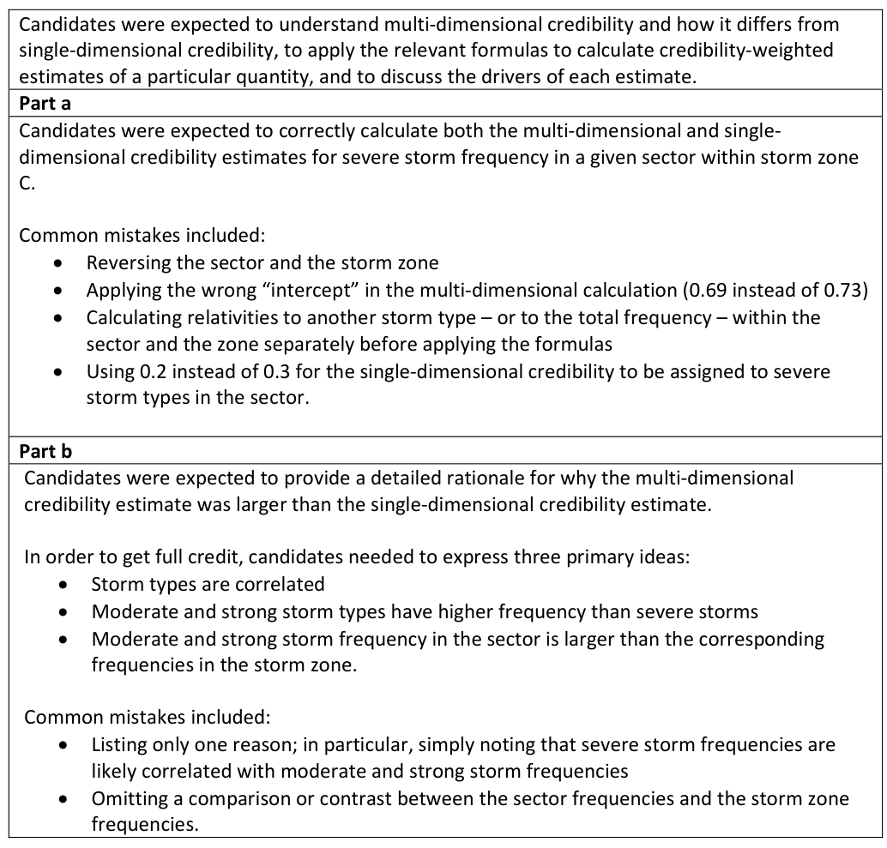

# 2019 Exam 8 - Q1

**Points:** 2.25

## Question

An insurer uses five geographical Storm Zones (A, B, C, D, and E) in their rating plan. The insurer refines their rating plan using the following approach:

- Divide each Storm Zone into numerous geographical sectors.
- For each geographical sector and storm type, calculate the observed storm frequency as number

of storms per year. ◦ There are three storm types defined as Moderate, Strong, and Severe storms.

The insurer performs two credibility procedures to produce estimates of the respective storm frequencies in each sector. The first is a multi-dimensional credibility procedure and the second is a single-dimensional credibility procedure (utilizing only a single storm type).

### Part a (1.50 pts)

The multi-dimensional credibility results for a particular sector in Storm Zone C for Severe storms are given in the table below.

| Storm Type | Coefficient | Storm Zone Mean Frequency | Sector Mean Frequency |
| --- | --- | --- | --- |
| Intercept | not provided |  |  |
| Moderate | 0.05 | 5.30 | 7.10 |
| Strong | 0.12 | 1.40 | 2.40 |
| Severe | 0.20 | 0.73 | 0.69 |

0.30 — The single-dimensional credibility factor

Calculate the mean frequency estimate of Severe storms for each of the two credibility procedures.

### Part b (0.75 pts)

Fully explain why the single-dimensional credibility estimate in part (a) above is lower than the multi-dimensional credibility estimate.

## Solution

### Part a

This question is analogous to the Couret & Venter analysis. The Storm Zones here are like hazard groups, the geographical sectors are like classes, and the storm types are like injury types. A difference though is that we aren't taking a ratio in this case like the ratio to TT claim counts in C&V. The storm frequencies are defined as integers (number of storms), so the table in the question with mean frequencies that are non-integers must be the means over several years. The question at the end though should have been more specific to say that the estimates we are making are to be used for the particular sector in Storm Zone C. The intercept row in the table is a bit confusing, and "not provided" makes it seem like we need to figure out something that is missing. In the C&V credibility formulas, there is no intercept term needed. It seems like this is not much work for the point value.

| B | D |
| --- | --- |
| Single-dimensional | 0.718 |
| Multi-dimensional | 0.932 |

Formulas

- `D46` = `=B26*E24+(1-B26)*D24`
- `D47` = `=D24+C24*(E24-D24)+C23*(E23-D23)+C22*(E22-D22)`

### Part b

The multi-dimensional credibility estimate is higher because the sector frequencies are significantly higher than the zone frequencies for both strong and moderate storms, and the multi-dimensional credibility procedure gives some weight to these higher results, which pulls up the overall prediction. The multi-dimensional model presumes that the Moderate and Strong storm types could have potentially been Severe, so higher incidence of the other storm types means higher potential for Severe storms as well. The single-dimensional estimate only considers the Severe storms directly.

## Examiner Report

Examiner report solutions and comments:

