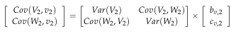

# Practice Problem 5

## Question

You are given the following claim count data for Workers Compensation claims:

|   | Year 1 Counts |   |   | Year 2 Counts |   |   | Total Counts |   |   |
| --- | --- | --- | --- | --- | --- | --- | --- | --- | --- |
| Class | Fatal | PT | TT | Fatal | PT | TT | Fatal | PT | TT |
| 1 | 1 | 13 | 167 | 2 | 14 | 167 | 3 | 27 | 334 |
| 2 | 1 | 17 | 250 | 1 | 18 | 250 | 2 | 35 | 500 |
| HG | 2 | 30 | 417 | 3 | 32 | 417 | 5 | 62 | 834 |

- Classes 1 and 2 are the only classes in the hazard group.
- Fatal, PT, and TT are the only injury types.
- Both years of data are used for the modeling dataset.

Answer the following questions based on the multi-dimensional credibility procedure as presented by Couret & Venter.

### Part a

Estimate the Expected Process Variance for the ratio of Fatal claim counts to TT claim counts for the hazard group.

### Part b

Estimate the Variance of Hypothetical Means for the ratio of Fatal claim counts to TT claim counts for the hazard group.

### Part c

Estimate the covariance between the ratios of Fatal claim counts to TT claim counts and PT claim counts to TT claim counts for the hazard group.

### Part d

You are additionally given:

0.000058 — Variance of the ratio of PT claim counts to TT claim counts for class 2

Estimate the credibilities to assign to class 2 for the estimation of the population ratio of Fatal claim counts to TT claim counts.

### Part e

Estimate the population ratio of Fatal claims counts to TT claim counts for class 2.

## Solution

### Part a

First we need to calculate the Fatal count ratios to TT. Then we can calculate the numerator terms of the EPV.

Count Ratios to TT

| Class i | V_i,1 | V_i,2 | V_i | m_i,1(V_i,1-V_i)^2 | m_i,2(V_i,2-V_i)^2 |
| --- | --- | --- | --- | --- | --- |
| 1 | 0.005988 | 0.011976 | 0.008982 | 0.0015 | 0.0015 |
| 2 | 0.004 | 0.004 | 0.004 | 0 | 0 |
| Total |  |  |  | 0.0015 | 0.0015 |

Formulas

- `C48` = `=C8/E8`
- `D48` = `=F8/H8`
- `E48` = `=I8/K8`
- `F48` = `=E8*(C48-E48)^2`
- `I48` = `=H8*(D48-E48)^2`
- `C49` = `=C9/E9`
- `D49` = `=F9/H9`
- `E49` = `=I9/K9`
- `F49` = `=E9*(C49-E49)^2`
- `I49` = `=H9*(D49-E49)^2`
- `F50` = `=SUM(F48:F49)`
- `I50` = `=SUM(I48:I49)`

**EPV:** 0.0015 — `=(F50+I50)/(COUNT(B48:B49)*(2-1))`

### Part b

**V_h:** 0.005995 — `=I10/K10`

**Numerator:** 0.0035 — `=K8*(E48-C54)^2+K9*(E49-C54)^2-(COUNT(B48:B49)-1)*C52`

**Denominator:** 400.479616 — `=K10-(1/K10)*(K8^2+K9^2)`

**VHM:** 0.000009 — `=MAX(C56/C58,0)`

### Part c

Now we first need to get the PT count ratios but only at the total level.

| B | C |
| --- | --- |
| W_1 | 0.080838 |
| W_2 | 0.07 |
| W_h | 0.074341 |

Formulas

- `C64` = `=J8/K8`
- `C65` = `=J9/K9`
- `C66` = `=J10/K10`

**Cov(V,W):** 0.000013 — `=(K8*(E48-C54)*(C64-C66)+K9*(E49-C54)*(C65-C66))/K10`

### Part d

Remember that VHM = Cov(V,v). The only value we don't have (besides the credibilities) is Var (V_2) , which we can quickly calculate from the EPV and VHM values.

**Var(V_2):** 0.0000117 — `=C52/K9+C60`

Our matrix equation will be:

| B | C | D | E | F | G | H |
| --- | --- | --- | --- | --- | --- | --- |
| 0.000009 | = | 0.0000117 | *b_v,2 | + | 0.000013 | *c_v,2 |
| 0.000013 | = | 0.000013 | *b_v,2 | + | 0.0000575 | *c_v,2 |

Formulas

- `B80` = `=C60`
- `D80` = `=C73`
- `G80` = `=C68`
- `B81` = `=C68`
- `D81` = `=C68`
- `G81` = `=B34`

From here, we can solve this using matrix functions or using a system of equations:

Solution 1: Use Matrix functions

| B | C | D | F | G | H |
| --- | --- | --- | --- | --- | --- |
| Matrix: | 0.0000117 | 0.000013 | Inverse: | 114,373.909426 | -25,787.69055 |
|  | 0.0000130 | 0.000058 |  | -25,787.69055 | 23,205.611013 |

Formulas

- `C87` = `=D80`
- `D87` = `=G80`
- `G87` = `={MINVERSE(C87:D88)}`
- `C88` = `=D81`
- `D88` = `=G81`

| B | C |
| --- | --- |
| b_v,2 | 0.657563 |
| c_v,2 | 0.077209 |

Formulas

- `C90` = `={MMULT(ANCHORARRAY(G87),B80:B81)}`

Solution 2: Solve system of equations:

Multiply 2nd equation by -(0.0000117 / 0.000013) and add to 1st equation:

-0.000003 — `=-D80/D81*B81+B80` — -0.000039 — `=-D80/D81*G81+G80`

**c_v,2:** 0.077209 — `=C97/D97`

Plug this into 1st equation and solve for b v,2 :

**b_v,2:** 0.657563 — `=(B80-G80*C99)/D80`

### Part e

**v^est_2:** 0.004348 — `=C54+C103*(E49-C54)+C99*(C65-C66)`
