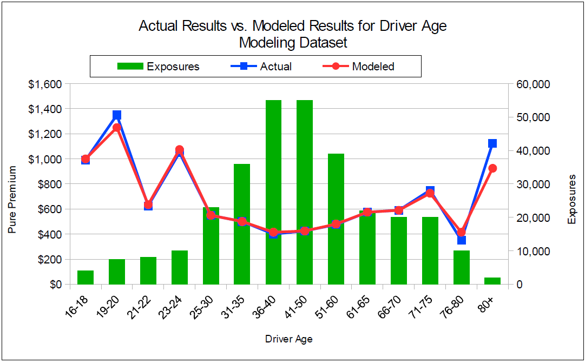
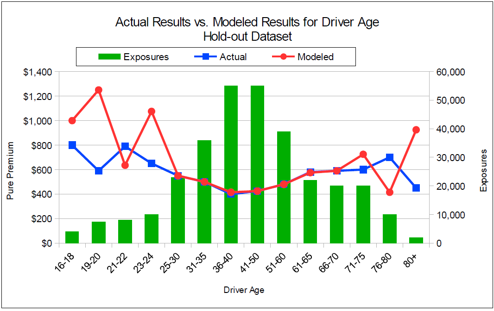

# 2010 Exam 5 - Q36

**Points:** 1

## Question

Company XYZ applied generalized linear modeling to its personal auto data. Graphs of the actual and modeled pure premiums by the driver groupings were produced by the analysis. The first graph is a plot of the values using the modeling dataset. The second graph is a plot of the values using a hold-out dataset. The modeling dataset and the hold-out dataset have the same number of exposures.

Explain whether or not the model appears to be appropriate.

## Solution

For the middle ages with lots of exposures, the model appears fine. However, for the younger and older ages with fewer exposures, the model appears to predict the same fluctuations (the "noise") from the modeling dataset for the holdout dataset. This is an indication that the model is overfit to the modeling dataset, and as such, it is not appropriate for use in predicting pure premiums for other datasets (particularly for the younger and older ages).

